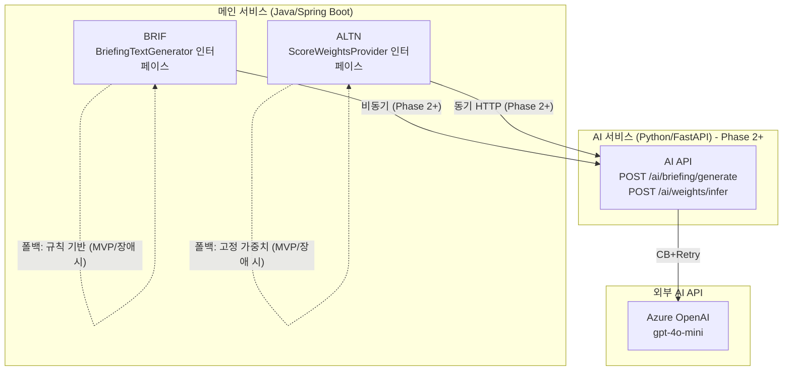

# AI 서비스 아키텍처 설계서

> 작성자: 한승우/마법사 (AI 엔지니어)
> 작성일: 2026-02-23
> 프로젝트: travel-planner — 여행 중 실시간 일정 최적화 가이드 앱
> 참조: architecture.md, ai-pattern-evaluation.md, userstory.md, 핵심솔루션.md

---

## 개요

이 문서는 논리 아키텍처 설계서(`logical-architecture.md`)에 반영될 AI 서비스 섹션의 상세 설계를 정의한다. AI 서비스의 경계, 인터페이스 추상화 전략, 통신 방식, 폴백 전략, Phase별 진화 로드맵을 다룬다.

**설계 철학**: AI는 데이터가 있을 때 비로소 가치가 있다. MVP에서 AI 없이 동작하되, AI 전환을 위한 인터페이스 추상화와 학습 데이터 수집 파이프라인을 지금 만든다.

---

## 1. AI 서비스 식별 및 경계 정의

### 1.1 AI 활용 기능 식별

유저스토리 및 핵심솔루션에서 AI가 핵심 가치를 제공하거나 향후 AI로 전환될 기능을 식별한다.

| 기능 | UFR | 핵심솔루션 | AI 역할 | 현재 구현 | 전환 시기 |
|------|-----|-----------|--------|---------|---------|
| **브리핑 총평 생성** | UFR-BRIF-010 [T5] | S04 | 자연어 총평 텍스트 생성 | 규칙 기반 템플릿 | Phase 2 |
| **대안 카드 가중치** | UFR-ALTN-010 [T2] | S06 | 사용자 선택 피드백 기반 가중치 학습 | 고정 가중치 (w1=0.5, w2=0.3, w3=0.2) | Phase 2 |
| **상태 배지 판정** | UFR-MNTR-020 [T1] | S05 | 복합 데이터 기반 상태 확률 판정 | 규칙 기반 임계값 판정 | Phase 3 |
| **AI 자동 일정 재조정** | (MVP 범위 외) | S03 | LLM Agent + Tool Use | 미구현 | Phase 3 |

### 1.2 AI 서비스 경계 정의

MVP에서 AI 서비스는 독립 배포 단위로 존재하지 않는다. 그러나 AI로 전환될 기능의 인터페이스 경계를 지금 정의하여, 메인 서비스(Java/Spring Boot)가 구현체에 의존하지 않도록 한다.

```
┌─────────────────────────────────────────────────────────────┐
│                    메인 서비스 (Java/Spring Boot)              │
│                                                              │
│  ┌─────────────────┐    ┌──────────────────────────────┐    │
│  │  BRIF Service   │───▶│  BriefingTextGenerator       │    │
│  └─────────────────┘    │  <<interface>>               │    │
│                         │  + generate(ctx): BriefText  │    │
│  ┌─────────────────┐    └──────────────┬───────────────┘    │
│  │  ALTN Service   │         ┌─────────┴──────────┐         │
│  └─────────────────┘         │                    │         │
│         │                    ▼                    ▼         │
│         ▼            RuleBasedGenerator    LLMGenerator     │
│  ┌──────────────┐    (MVP: 템플릿 엔진)   (Phase 2: AI 서비스) │
│  │ ScoreWeights │                                            │
│  │ <<interface>>│                                            │
│  └──────────────┘                                            │
│   FixedWeights     LearnedWeights                            │
│  (MVP: 고정값)    (Phase 2: ML 모델)                          │
└─────────────────────────────────────────────────────────────┘

                              │ Phase 2+
                              ▼
┌─────────────────────────────────────────────────────────────┐
│                  AI 서비스 (Python/FastAPI)                    │
│                                                              │
│  POST /ai/briefing/generate                                  │
│  POST /ai/weights/infer                                      │
│  POST /ai/schedule/replan  (Phase 3)                        │
└─────────────────────────────────────────────────────────────┘
```

**경계 결정 기준**:

1. **핵심 가치 기여도**: 총평 생성(UFR-BRIF-010)과 대안 가중치(UFR-ALTN-010)는 서비스 핵심 가치(S04/S06)에 직결. AI 서비스 바운디드 컨텍스트로 식별.
2. **기술 스택 이질성**: AI 추론 서비스는 Python/FastAPI + ML 라이브러리 필요. Java/Spring Boot와 분리.
3. **독립 스케일링**: Phase 2 LLM 호출은 GPU 메모리 집약적. 메인 서비스와 리소스 풀 분리 필요.
4. **외부 AI API 의존성**: Azure OpenAI API 호출은 Circuit Breaker + Rate Limiting 전용 처리 필요.

### 1.3 AI 서비스 책임 범위

**AI 서비스 (Python/FastAPI)의 책임**:
- LLM API 호출 및 응답 후처리
- ML 모델 추론 (가중치 학습/예측)
- 프롬프트 구성 및 구조화 출력 처리
- AI 응답 캐싱 (동일 맥락 30분 TTL)

**메인 서비스 (Java/Spring Boot)의 책임**:
- AI 서비스 호출 여부 결정 (구독 티어 분기)
- AI 서비스 폴백 처리 (템플릿/규칙 기반 대체)
- AI 요청 Rate Limiting (사용자 티어별 LLM 호출 한도)
- AI 응답 데이터 검증 및 저장

---

## 2. MVP vs Phase 2+ 인터페이스 추상화 전략

### 2.1 브리핑 총평 생성 인터페이스

총평 생성 로직은 외부 호출 가능한 인터페이스로 추상화한다 (UFR-BRIF-010 [T5] 반영).

```java
// 메인 서비스 (Java/Spring Boot)

/**
 * 브리핑 총평 생성 인터페이스
 * MVP: RuleBasedBriefingGenerator 구현체 사용
 * Phase 2: LLMBriefingGenerator 구현체로 교체 (메인 서비스 코드 변경 없음)
 */
public interface BriefingTextGenerator {
    BriefingText generate(BriefingContext context);
}

// BriefingContext: 수집 데이터 구조체
// - placeStatus: PlaceStatus (영업상태/혼잡도/날씨/이동시간)
// - statusLevel: StatusLevel (SAFE / CAUTION / DANGER)
// - riskItems: List<RiskItem> (위험 항목 목록)
// - subscriptionTier: SubscriptionTier (FREE / TRIP_PASS / PRO)

// MVP 구현체: 규칙 기반 템플릿
@Component
@ConditionalOnProperty(name = "ai.briefing.provider", havingValue = "rule", matchIfMissing = true)
public class RuleBasedBriefingGenerator implements BriefingTextGenerator {
    public BriefingText generate(BriefingContext ctx) {
        if (ctx.getStatusLevel() == SAFE) {
            return BriefingText.of("현재까지 모든 항목 정상입니다. 예정대로 출발하세요.");
        }
        String riskSummary = ctx.getRiskItems().stream()
            .map(RiskItem::getLabel)
            .collect(joining(", "));
        return BriefingText.of(riskSummary + "이(가) 감지되었습니다. 대안을 확인해보세요.");
    }
}

// Phase 2 구현체: AI 서비스 HTTP 호출
@Component
@ConditionalOnProperty(name = "ai.briefing.provider", havingValue = "llm")
public class LLMBriefingGenerator implements BriefingTextGenerator {
    public BriefingText generate(BriefingContext ctx) {
        // AI 서비스 (Python/FastAPI) HTTP POST 호출
        // Circuit Breaker + Fallback 내장
    }
}
```

**전환 방법**: `application.yml`의 `ai.briefing.provider` 값을 `rule` → `llm`으로 변경. 메인 서비스 재배포만으로 전환 완료. 브리핑 서비스 비즈니스 로직 코드 변경 없음.

### 2.2 대안 카드 가중치 인터페이스

대안 정렬 가중치는 Phase 2에서 사용자 선택 피드백 기반 ML 모델로 교체된다 (UFR-ALTN-010 [T2] 반영).

```java
// 가중치 인터페이스
public interface ScoreWeightsProvider {
    ScoreWeights getWeights(WeightsContext context);
}

// WeightsContext: 가중치 결정에 필요한 맥락
// - userId: String (Phase 2: 개인화 가중치)
// - category: PlaceCategory
// - timeOfDay: LocalTime

// MVP 구현체: 고정 가중치
@Component
@ConditionalOnProperty(name = "ai.weights.provider", havingValue = "fixed", matchIfMissing = true)
public class FixedScoreWeightsProvider implements ScoreWeightsProvider {
    public ScoreWeights getWeights(WeightsContext ctx) {
        return ScoreWeights.of(
            distanceWeight: 0.5,   // w1: 거리 우선
            ratingWeight: 0.3,     // w2: 평점
            congestionWeight: 0.2  // w3: 혼잡도
        );
    }
}

// Phase 2 구현체: ML 모델 기반 가중치
@Component
@ConditionalOnProperty(name = "ai.weights.provider", havingValue = "ml")
public class MLScoreWeightsProvider implements ScoreWeightsProvider {
    public ScoreWeights getWeights(WeightsContext ctx) {
        // AI 서비스 (Python/FastAPI) HTTP POST 호출
        // 사용자 선택 이력 기반 개인화 가중치 반환
    }
}
```

### 2.3 AI 학습 데이터 수집 인터페이스 (MVP 필수)

Phase 2 ML 모델 학습을 위해 MVP에서 반드시 수집해야 할 데이터:

| 데이터 | 수집 위치 | UFR | 보존 기간 |
|--------|---------|-----|---------|
| 상태 판정 이력 (`status_history`) | UFR-MNTR-020 [T4] | append-only, 6개월+ | AI 상태 판정 모델 학습셋 |
| `confidence_score` 컬럼 예약 | UFR-MNTR-020 [T1] | NULL 초기화 | AI 모델 출력값 저장 예약 |
| 대안 카드 노출 스냅샷 | UFR-ALTN-020 [T3] | 분석 이벤트 | 가중치 학습 레이블 |
| 대안 카드 채택/미채택 | UFR-ALTN-030 | 분석 이벤트 | 가중치 학습 레이블 |
| 브리핑 열람 여부 및 열람-발송 간격 | UFR-BRIF-050 | 분석 이벤트 | 타이밍 최적화 |

---

## 3. AI 서비스 통신 방식

### 3.1 통신 방식 결정 원칙

| 조건 | 통신 방식 | 근거 |
|------|---------|------|
| 사용자 응답에 AI 결과가 즉시 필요 | **동기 (HTTP)** | 대기 UX 허용 가능 (로딩 스피너) |
| AI 처리 시간이 응답 타이밍에 영향 | **비동기 (Queue)** | LLM 응답 2~10초, Push 발송 타이밍 민감 |
| 배치 처리, 사전 생성 | **비동기 (Queue)** | 실시간 응답 불필요 |

### 3.2 브리핑 총평 생성 통신 방식

**Phase 2 비동기 처리 설계** (LLM 도입 시):

```
[브리핑 트리거] 출발 30분 전
      │
      ▼ (1) 비동기 작업 등록
[Azure Service Bus Queue]
      │
      ▼ (2) LLM Worker 처리 (Python/FastAPI)
[AI 서비스]
  ├── (3a) 캐시 조회 (동일 맥락 캐시 HIT)
  │         └── 캐시 응답 즉시 반환
  └── (3b) 캐시 MISS → Azure OpenAI API 호출
            └── 응답 캐시 저장 (TTL: 30분)
      │
      ▼ (4) 결과 저장
[PostgreSQL: briefings 테이블]
      │
      ▼ (5) FCM Push 발송
[FCM] 출발 15~20분 전 도달 목표

총 허용 처리 시간: 30분(트리거) - 15분(Push 목표) = 15분 여유
LLM 실제 처리 시간: 2~10초 → 여유 충분
```

**통신 방향**: BRIF Service → AI Service (비동기, Azure Service Bus)
**데이터 전달**: BriefingContext (수집 데이터 구조체, 경량 JSON)

### 3.3 대안 카드 가중치 추론 통신 방식

**Phase 2 동기 처리 설계**:

```
[여행자 "대안 보기" 탭]
      │
      ▼ (1) 동기 HTTP 요청
[ALTN Service (Java)]
      │
      ├── (2a) 가중치 캐시 조회 (사용자 ID + 카테고리 기반)
      │         캐시 TTL: 1시간 (개인 선호는 단기 내 변화 없음)
      │         └── 캐시 HIT → 가중치 반환 (<5ms)
      │
      └── (2b) 캐시 MISS → AI 서비스 동기 HTTP 호출
                [AI Service (Python/FastAPI)]
                  POST /ai/weights/infer
                  └── ML 모델 추론 (<100ms 목표)
      │
      ▼ (3) 가중치 적용 대안 정렬
[대안 카드 3장 반환] 3초 SLA 내 완료

가중치 추론 허용 시간: 3초(전체 SLA) - 2초(Places API 조회) = 1초 이내
ML 추론 목표: <100ms (경량 모델, CPU 추론)
```

**통신 방향**: ALTN Service → AI Service (동기, HTTP REST)
**응답 타임아웃**: 500ms (초과 시 고정 가중치 폴백)

### 3.4 통신 방식 요약

| 기능 | Phase | 통신 방식 | 소비자 서비스 | AI 엔드포인트 | 타임아웃 |
|------|:-----:|---------|------------|------------|:------:|
| 브리핑 총평 생성 | MVP | 동기 (메서드 호출, 인터페이스) | BRIF | 내부 (RuleBasedGenerator) | N/A |
| 브리핑 총평 생성 | Phase 2 | 비동기 (Azure Service Bus) | BRIF | `POST /ai/briefing/generate` | 15분 |
| 대안 가중치 추론 | MVP | 동기 (메서드 호출, 인터페이스) | ALTN | 내부 (FixedWeightsProvider) | N/A |
| 대안 가중치 추론 | Phase 2 | 동기 (HTTP REST) | ALTN | `POST /ai/weights/infer` | 500ms |
| AI 자동 일정 재조정 | Phase 3 | 비동기 (Azure Service Bus) | SCHD | `POST /ai/schedule/replan` | 30분 |

---

## 4. 폴백 전략

### 4.1 폴백 계층 구조

AI 장애 시 서비스 연속성을 보장하는 3계층 폴백 구조:

```
계층 1: AI 캐시 응답
  └── 동일 맥락의 이전 AI 응답이 캐시에 있으면 즉시 반환
  └── TTL: 브리핑 총평 30분, 가중치 1시간

계층 2: 규칙 기반 폴백 (템플릿/고정값)
  └── AI 서비스 장애 또는 캐시 MISS 시
  └── MVP 구현체와 동일한 로직으로 즉시 응답

계층 3: Graceful Degradation
  └── 규칙 기반도 실패 시 (극히 예외적 상황)
  └── 총평: "현재 상태 정보를 불러오는 중입니다."
  └── 가중치: 하드코딩된 기본값 (0.5/0.3/0.2) 직접 적용
```

### 4.2 브리핑 총평 생성 폴백

Circuit Breaker 임계값: 3회/30초 실패 → OPEN 상태 전환

```
[AI 서비스 호출]
      │
      ├── Circuit Breaker CLOSED (정상)
      │     └── Azure OpenAI API 호출
      │           ├── 성공 → AI 응답 반환 + 캐시 저장
      │           └── 실패 → Retry (최대 2회, 지수 백오프)
      │                  └── 재시도 실패 → Circuit Breaker 실패 카운트 +1
      │
      ├── Circuit Breaker OPEN (3회/30초 초과)
      │     └── 즉시 폴백: RuleBasedBriefingGenerator 호출
      │           └── "현재까지 모든 항목 정상입니다." 또는
      │               "{위험항목}이(가) 감지되었습니다."
      │
      └── 폴백도 실패 (규칙 엔진 예외)
            └── Graceful Degradation: "현재 상태 정보를 확인 중입니다."

핵심 원칙: 총평이 없어도 브리핑은 반드시 생성된다.
영업상태/날씨/혼잡도/이동시간 4가지 정보가 있으면 총평 없이도 발송.
```

| 상태 | 총평 내용 | 브리핑 발송 여부 |
|------|---------|:-----------:|
| AI 정상 | LLM 생성 맞춤 총평 | O |
| AI 장애 + 캐시 HIT | 캐시된 AI 응답 | O |
| AI 장애 + 캐시 MISS | 규칙 기반 템플릿 총평 | O |
| 모든 폴백 실패 | Graceful Degradation 문구 | O (총평 제외 4개 항목만) |

### 4.3 대안 카드 가중치 폴백

Circuit Breaker 임계값: 5회/1분 실패 → OPEN 상태 전환

```
[AI 서비스 가중치 요청]
      │
      ├── 캐시 HIT (<5ms)
      │     └── 캐시 가중치 반환 (TTL: 1시간)
      │
      ├── 캐시 MISS + Circuit Breaker CLOSED
      │     ├── 타임아웃: 500ms
      │     ├── 성공 → ML 가중치 반환 + 캐시 저장
      │     └── 실패 (타임아웃/오류) → FixedScoreWeightsProvider 폴백
      │
      └── Circuit Breaker OPEN
            └── 즉시 폴백: FixedScoreWeightsProvider (0.5/0.3/0.2)

사용자 체감 영향: 개인화 가중치 대신 기본 가중치 적용.
대안 카드 3장은 정상 생성됨. 3초 SLA 유지.
```

### 4.4 외부 AI API (Azure OpenAI) 폴백 전략

| 장애 유형 | AI 서비스 반응 | 메인 서비스 반응 | 사용자 체감 |
|---------|-------------|-------------|---------|
| API 일시 오류 (5xx) | Retry 2회 (1s, 2s 지수 백오프) | 재시도 대기 | 총평 약 3초 지연 |
| API Rate Limit (429) | Rate Limiting 큐 대기 | 캐시 조회 우선 | 캐시 있으면 무영향 |
| API 장애 (Circuit Open) | 즉시 실패 반환 | RuleBased 폴백 | 템플릿 총평 제공 |
| API 응답 품질 이상 | 구조화 출력 검증 실패 | RuleBased 폴백 | 템플릿 총평 제공 |
| 토큰 한도 초과 | 요청 거부 | RuleBased 폴백 + Rate Limit 알림 | 템플릿 총평 제공 |

---

## 5. Phase별 AI 서비스 진화 로드맵

### 5.1 Phase 1: MVP (Sprint 1~3, 5~8주)

**목표**: AI 없이 동작하되, AI 전환 기반을 만든다.

```
아키텍처 구조:
메인 서비스 (Java/Spring Boot, 모놀리스)
  ├── BRIF: RuleBasedBriefingGenerator (인터페이스 구현)
  ├── ALTN: FixedScoreWeightsProvider (인터페이스 구현)
  └── MNTR: confidence_score NULL 초기화, status_history append-only
```

**Phase 1 핵심 작업**:

| 작업 | 목적 | 담당 서비스 |
|------|------|-----------|
| `BriefingTextGenerator` 인터페이스 정의 | Phase 2 LLM 전환 기반 | BRIF |
| `ScoreWeightsProvider` 인터페이스 정의 | Phase 2 ML 전환 기반 | ALTN |
| `confidence_score` 컬럼 NULL 초기화 | AI 모델 출력 저장 예약 [T1] | MNTR |
| `status_history` append-only 설계 | AI 학습 데이터셋 6개월+ 보존 [T4] | MNTR |
| 대안 카드 선택 이벤트 스냅샷 저장 | ML 가중치 학습 레이블 [T3] | ALTN |
| 브리핑 열람 분석 이벤트 | LLM 타이밍 최적화 데이터 | BRIF |

**Phase 1 인프라**: AI 서비스 독립 배포 없음. 모든 AI 로직이 메인 서비스 내 인터페이스 구현체로 존재.

### 5.2 Phase 2: AI 서비스 도입 (MVP 이후 3~4개월)

**전환 조건**:
- 상태 판정 이력 6개월 이상 누적 완료
- 대안 카드 선택 이력 1,000건 이상 누적 (ML 학습 최소 데이터셋)
- Pro 구독자 대상 LLM 총평 A/B 테스트 계획 수립

**목표**: LLM 기반 총평 생성, 사용자 선택 기반 가중치 자동 학습.

```
아키텍처 구조:
메인 서비스 (Java/Spring Boot, 모놀리스)
  ├── BRIF: LLMBriefingGenerator (Phase 2 구현체 활성화)
  │         ├── Pro 티어 → AI 서비스 비동기 HTTP 호출
  │         └── Free 티어 → RuleBasedBriefingGenerator (폴백 겸용)
  └── ALTN: MLScoreWeightsProvider (Phase 2 구현체 활성화)
            ├── 캐시 HIT → 캐시 가중치
            └── 캐시 MISS → AI 서비스 동기 HTTP 호출 (500ms 타임아웃)

AI 서비스 (Python/FastAPI, 독립 배포 — Azure Container Apps)
  ├── POST /ai/briefing/generate
  │     └── Azure OpenAI API (gpt-4o-mini, temperature=0.3, max_tokens=100)
  ├── POST /ai/weights/infer
  │     └── 경량 ML 모델 (scikit-learn or Azure ML endpoint)
  └── 공통: AI 응답 캐시 (Azure Cache for Redis, TTL 30분)
```

**Phase 2 LLM 비용 제어**:

```
Layer 1 - AI 응답 캐시
  동일 맥락(장소 + 날씨 + 혼잡도 + 이동시간 조합) 응답 재사용
  예상 캐시 히트율: 40~60% (출퇴근/식사 시간대 패턴 반복)
  캐시 키: hash(place_id + status_level + risk_items + tier)

Layer 2 - 구독 티어별 Rate Limiting (Azure API Management)
  Free 티어: LLM 호출 없음 → RuleBasedGenerator 적용
  Trip Pass: 일 3회 LLM 총평
  Pro: 무제한 LLM 총평

Layer 3 - Bulkhead (LLM 전용 커넥션 풀 분리)
  LLM 호출 전용 스레드 풀: 10개
  일반 API 스레드 풀과 격리 → LLM 지연이 Places API 조회에 영향 없음
```

**Phase 2 비용 추정**:

| 항목 | 계산 | 월 비용 |
|------|------|:------:|
| 총평 생성 1회 | ~200 input + 50 output tokens (gpt-4o-mini) | $0.00015/회 |
| 일 10,000 Pro 브리핑 (캐시 50% 적용) | 5,000회 × $0.00015 | $0.75/일 |
| 월 비용 | $0.75 × 30일 | **~$22.5/월** |
| Free 티어 LLM 호출 | 0회 | $0 |

Pro 구독료($9.99/월 기준) 대비 AI 비용 비율: 구독자 100명 기준 약 2.3%. 수익성 확보.

### 5.3 Phase 3: AI 자동 일정 재조정 엔진 (Phase 2 이후 6개월+)

**전환 조건**:
- Phase 2 LLM 총평 사용자 만족도 측정 완료
- 사용자 선호 프로파일 데이터 6개월 이상 누적
- 완전 마이크로서비스 전환 완료

**목표**: LLM Agent가 도구를 통해 일정을 자동 재조정하는 S03 핵심 솔루션 구현.

```
아키텍처 구조:
AI 서비스 (Python/FastAPI, Azure Container Apps)
  └── POST /ai/schedule/replan
        [LLM Agent (Azure OpenAI)]
          ├── tool: search_places(category, location, radius)
          │         → PLCE Service REST API 호출
          ├── tool: get_travel_time(origin, destination)
          │         → MNTR Service REST API 호출
          ├── tool: check_schedule_conflict(schedule, new_place)
          │         → SCHD Service REST API 호출 (읽기 전용)
          └── tool: propose_schedule_change(schedule_id, changes)
                    → 제안만 반환 (실제 수정 권한 없음)

보안 원칙: LLM이 직접 일정을 수정하지 않는다.
  제안(propose) → 사용자 확인 → 사용자 승인 → SCHD Service 수정
  감사 로그: 모든 LLM 도구 호출 및 사용자 승인 이력 보존

RAG 개인화:
  사용자 과거 방문 장소, 선택 패턴, 선호 카테고리 → Azure AI Search (벡터 검색)
  재조정 요청 시 개인화 컨텍스트 RAG 주입 → 개인 맞춤 일정 재조정
```

### 5.4 Phase별 진화 요약

```
MVP (현재)          Phase 2 (3~4개월 후)      Phase 3 (6개월+ 후)
─────────────       ────────────────────      ─────────────────────
규칙 기반 총평        LLM 기반 총평 (Pro)         AI 자동 일정 재조정
고정 가중치           ML 가중치 자동 학습           RAG 개인화 추천
데이터 수집 시작       AI 서비스 독립 배포           LLM Agent + Tool Use
인터페이스 추상화      비동기 LLM 처리              Azure AI Search 연동

AI 없이 동작         AI가 UX를 개선               AI가 핵심 차별점
데이터를 만드는 시기    AI 가치를 검증하는 시기        AI가 경쟁우위가 되는 시기
```

---

## 6. 논리 아키텍처 반영 사항

이 설계서의 내용을 `logical-architecture.md`에 반영할 때 포함해야 할 항목:

### 6.1 핵심 컴포넌트 테이블 추가

| 컴포넌트 | 책임 |
|---------|------|
| **AI 서비스** (Phase 2+) | LLM 기반 총평 생성, ML 가중치 추론, 향후 자동 일정 재조정 |

### 6.2 서비스 간 통신 전략 추가

- BRIF → AI 서비스: 비동기 (Azure Service Bus, Phase 2+)
- ALTN → AI 서비스: 동기 HTTP (500ms 타임아웃, Phase 2+)
- AI 서비스 → Azure OpenAI: 동기 HTTP + Circuit Breaker + Retry

### 6.3 다이어그램 반영 원칙



---

## 마법사의 설계 총평

이 설계의 핵심은 **"지금 인터페이스를 정의하고, 나중에 구현을 교체한다"**는 원칙이다.

MVP에서 AI 서비스를 배포하지 않는 이유는 두 가지다. 첫째, 학습 데이터가 없다. 둘째, 검증되지 않은 LLM 응답이 핵심 가치(안심감)를 훼손할 수 있다. 규칙 기반 템플릿은 예측 가능하다.

그러나 인터페이스 없이 규칙 로직을 BRIF 서비스 안에 박아 넣으면, Phase 2에서 LLM 전환 비용이 3배가 된다. `BriefingTextGenerator` 인터페이스 하나가 그 비용을 막는다.

폴백 전략에서 한 가지를 강조한다. **"AI가 죽어도 브리핑은 반드시 나간다."** 총평이 없어도, 영업상태/날씨/혼잡도/이동시간 4가지가 있으면 사용자는 출발 여부를 판단할 수 있다. AI는 UX를 개선하는 도구지, 서비스의 생존 조건이 아니다.
