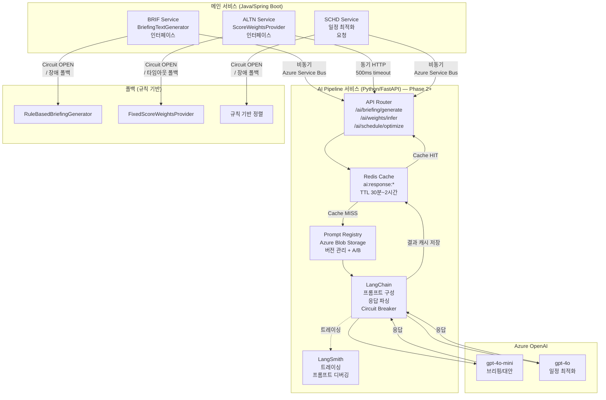
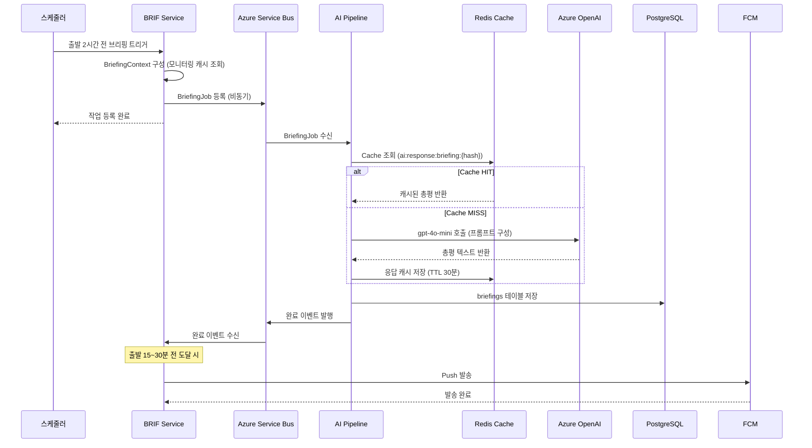
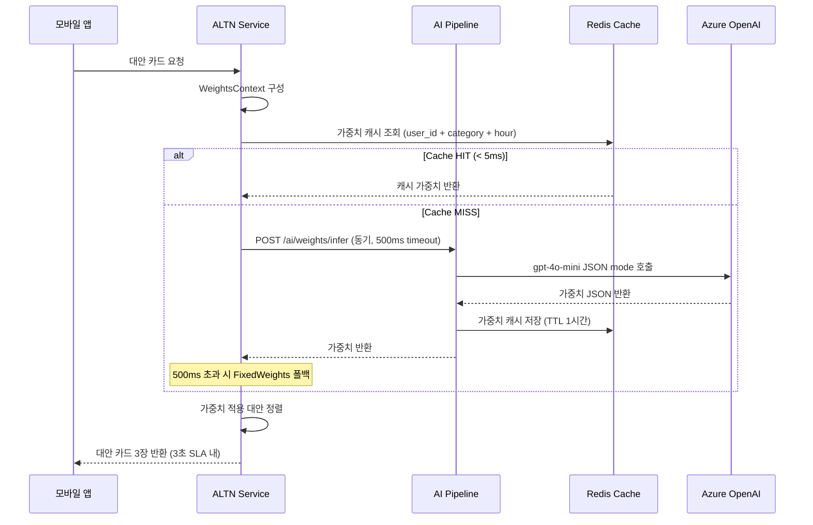

# AI 서비스 설계서

> 작성자: 한승우/마법사 (AI 엔지니어)
> 작성일: 2026-02-23
> 프로젝트: travel-planner — 여행 중 실시간 일정 최적화 가이드 앱
> 참조: ai-service-architecture.md, ai-pattern-evaluation.md, high-level-architecture.md

---

## 개요

이 문서는 travel-planner의 AI 기능 설계를 상세히 기술한다. MVP에서는 AI API를 사용하지 않고 규칙 기반으로 처리하며, Phase 2부터 Python/FastAPI 기반 AI Pipeline 서비스를 도입하여 LangChain + Azure OpenAI를 활용한 AI 전환을 단계적으로 수행한다.

**설계 철학**: AI는 데이터가 있을 때 비로소 가치가 있다. 지금은 인터페이스를 정의하고, 데이터를 쌓고, AI 전환 기반을 만드는 시간이다.

---

## 1. AI 기능 확인 및 우선순위

### 1.1 식별된 AI 기능 목록

이전 단계(ai-service-architecture.md, ai-pattern-evaluation.md)에서 식별된 AI 전환 대상 기능 4개:

| # | 기능 | 서비스 | UFR | 핵심솔루션 | 현재 구현 | AI 전환 방식 |
|---|------|--------|-----|-----------|---------|------------|
| 1 | **브리핑 총평 생성** | BRIF | UFR-BRIF-010 [T5] | S04 | RuleBasedBriefingGenerator (템플릿 엔진) | LLMBriefingGenerator |
| 2 | **대안 점수 계산** | ALTN | UFR-ALTN-010 [T2] | S06 | FixedScoreWeightsProvider (고정 가중치) | MLScoreWeightsProvider |
| 3 | **여행 일정 최적화** | SCHD | UFR-SCHD-060 (Phase 2) | S03 | 규칙 기반 정렬 | AI 기반 최적 경로 추천 |
| 4 | **실시간 상태 분석** | MNTR | UFR-MNTR-020 [T1] | S05 | 임계값 기반 규칙 판정 | ML 기반 이상 탐지 |

### 1.2 우선순위 정리

```
P1 (Phase 2 필수) ────────────────────────────────────────
  1. 브리핑 총평 생성  — 사용자 직접 체감. Pro 구독 핵심 가치.
  2. 대안 점수 계산    — 개인화 추천 품질. 대안 카드 CTR 개선.

P2 (Phase 2 선택) ────────────────────────────────────────
  3. 여행 일정 최적화  — 복잡한 추론 필요. 사용자 데이터 누적 후 도입.

P3 (Phase 3 이후) ────────────────────────────────────────
  4. 실시간 상태 분석  — ML 학습 데이터 6개월+ 필요. 정밀도 검증 필수.
```

우선순위 결정 기준:
- **비즈니스 임팩트**: 사용자 직접 체감 여부, 구독 전환율 기여
- **데이터 준비 상태**: MVP 누적 데이터로 학습 가능 여부
- **기술 복잡도**: 구현 난이도 및 운영 안정성 확보 기간

### 1.3 MVP vs 향후 구분

| 단계 | 기간 | 기술 방식 | AI 서비스 배포 |
|------|------|---------|:------------:|
| **MVP (Phase 1)** | 현재 | 규칙 기반 (인터페이스 추상화 완료) | 없음 |
| **Phase 2** | MVP 이후 3~6개월 | AI Pipeline 서비스 구축, 브리핑/대안 AI 전환 | O (Python/FastAPI) |
| **Phase 3** | Phase 2 이후 6~12개월 | 일정 최적화 AI, RAG 도입, ML 이상 탐지 | O (확장) |

---

## 2. AI 모델 선정

### 2.1 Azure OpenAI 기반 모델 선정

모든 LLM 호출은 Azure OpenAI를 통해 수행한다. Direct OpenAI API 미사용 (Azure 보안/컴플라이언스 정책 준수).

| 기능 | 모델 | 선정 이유 | temperature | max_tokens |
|------|------|---------|:-----------:|:---------:|
| 브리핑 총평 생성 | **gpt-4o-mini** | 비용 효율, 짧은 텍스트 생성 충분, 한국어 품질 우수 | 0.3 | 150 |
| 대안 점수 계산 | **gpt-4o-mini** | 구조화 출력(JSON mode) 안정적, 수치 계산 충분 | 0.1 | 200 |
| 일정 최적화 | **gpt-4o** | 복잡한 멀티스텝 추론 필요, 장거리 의존성 처리 | 0.2 | 1000 |

### 2.2 모델 폴백 체인

Azure OpenAI 할당량 초과 또는 모델 장애 시 자동 폴백:

```
브리핑 총평:  gpt-4o-mini  →  규칙 기반 (RuleBasedBriefingGenerator)
대안 점수:    gpt-4o-mini  →  규칙 기반 (FixedScoreWeightsProvider)
일정 최적화:  gpt-4o       →  gpt-4o-mini  →  규칙 기반 정렬
```

폴백 트리거 조건:
- HTTP 429 (Rate Limit 초과)
- HTTP 503/504 (서비스 불가)
- 응답 타임아웃 (브리핑 5초, 대안 500ms, 일정 10초)
- JSON 파싱 실패 (구조화 출력 검증 실패)

### 2.3 모델 버전 관리

| 설정 항목 | 값 | 비고 |
|---------|---|-----|
| API Version | `2024-10-01-preview` | Azure OpenAI GA 최신 버전 |
| Deployment 명명 규칙 | `{model}-{env}` | 예: `gpt-4o-mini-prod` |
| 모델 업그레이드 정책 | 블루/그린 배포 | 트래픽 10% → 50% → 100% 단계적 전환 |

---

## 3. AI API 연동 설계

### 3.1 Azure OpenAI 연결 설정

```yaml
# application-ai.yml (Phase 2 활성화)
azure:
  openai:
    endpoint: https://{resource-name}.openai.azure.com/
    api-version: 2024-10-01-preview
    # Managed Identity 인증 (API Key 미사용)
    authentication: managed-identity
    deployments:
      briefing: gpt-4o-mini-prod
      alternative: gpt-4o-mini-prod
      schedule: gpt-4o-prod
```

**인증 방식**: Azure Managed Identity (System-assigned)
- API Key를 코드/환경변수에 저장하지 않음
- Azure Container Apps에 Managed Identity 부여 → Azure OpenAI 리소스 RBAC 할당
- 로컬 개발: `az login` + DefaultAzureCredential 자동 사용

### 3.2 기능별 요청/응답 JSON 스키마

#### 브리핑 총평 생성

```json
// POST /ai/briefing/generate (AI Pipeline → Azure OpenAI)
// 요청 (BriefingRequest)
{
  "schedule_id": "sch_abc123",
  "place_id": "place_xyz789",
  "place_name": "도쿄 스카이트리",
  "status_level": "CAUTION",
  "risk_items": [
    { "type": "WEATHER", "label": "강수 확률 80%", "severity": "HIGH" },
    { "type": "CONGESTION", "label": "혼잡도 높음", "severity": "MEDIUM" }
  ],
  "weather": { "condition": "RAIN", "precipitation_prob": 80, "temp_celsius": 18 },
  "congestion_level": "HIGH",
  "operating_status": "OPEN",
  "travel_minutes": 25,
  "subscription_tier": "PRO",
  "locale": "ko"
}

// 응답 (BriefingResponse)
{
  "summary": "강수 확률 80%로 우산 필수. 혼잡도가 높아 대기 시간이 길 수 있습니다.",
  "tone": "CAUTION",
  "generated_at": "2026-02-23T10:30:00Z",
  "model_used": "gpt-4o-mini",
  "tokens_used": { "prompt": 187, "completion": 42, "total": 229 }
}
```

#### 대안 점수 계산

```json
// POST /ai/weights/infer (AI Pipeline → Azure OpenAI)
// 요청 (WeightsRequest)
{
  "user_id": "usr_def456",
  "context": {
    "place_category": "RESTAURANT",
    "time_of_day": "12:30",
    "weather_condition": "RAIN",
    "current_status_level": "DANGER"
  },
  "user_history_summary": {
    "preferred_categories": ["CAFE", "MUSEUM"],
    "avg_distance_preference_km": 0.8,
    "selection_count": 23
  }
}

// 응답 (WeightsResponse) — JSON mode 강제
{
  "weights": {
    "distance": 0.45,
    "rating": 0.35,
    "congestion": 0.20
  },
  "reasoning": "우천 시 이동 거리 민감도 증가. 평점 가중치 상향.",
  "confidence": 0.82,
  "model_used": "gpt-4o-mini",
  "tokens_used": { "prompt": 203, "completion": 67, "total": 270 }
}
```

#### 일정 최적화

```json
// POST /ai/schedule/optimize (AI Pipeline → Azure OpenAI)
// 요청 (ScheduleOptimizeRequest)
{
  "schedule_id": "sch_abc123",
  "user_id": "usr_def456",
  "current_places": [
    { "order": 1, "place_id": "p1", "name": "신주쿠 교엔", "duration_min": 90, "status": "SAFE" },
    { "order": 2, "place_id": "p2", "name": "도쿄 스카이트리", "duration_min": 120, "status": "DANGER" },
    { "order": 3, "place_id": "p3", "name": "아사쿠사", "duration_min": 60, "status": "CAUTION" }
  ],
  "constraints": {
    "start_time": "09:00",
    "end_time": "18:00",
    "total_budget_minutes": 480
  },
  "optimization_goal": "MINIMIZE_RISK"
}

// 응답 (ScheduleOptimizeResponse)
{
  "optimized_places": [
    { "order": 1, "place_id": "p1", "name": "신주쿠 교엔", "duration_min": 90 },
    { "order": 2, "place_id": "p3", "name": "아사쿠사", "duration_min": 60 },
    { "order": 3, "place_id": "p2", "name": "도쿄 스카이트리", "duration_min": 120 }
  ],
  "reasoning": "위험도 높은 스카이트리를 오후로 이동. 아침 혼잡 피하고 상황 개선 대기.",
  "confidence": 0.78,
  "model_used": "gpt-4o",
  "tokens_used": { "prompt": 412, "completion": 198, "total": 610 }
}
```

### 3.3 Rate Limiting 설정

| 서비스 | 모델 | TPM 한도 | RPM 한도 | 비고 |
|--------|------|:-------:|:-------:|-----|
| 브리핑 총평 | gpt-4o-mini | 500K | 3,000 | Azure APIM 정책 적용 |
| 대안 점수 | gpt-4o-mini | 200K | 1,000 | 동기 요청, 낮은 한도 |
| 일정 최적화 | gpt-4o | 100K | 500 | Pro 티어 전용 |

TPM 초과 시 처리:
- 브리핑: 큐 대기 → 처리 시간창 내 재처리 (15분 여유)
- 대안: 즉시 규칙 기반 폴백 (500ms SLA 유지)
- 일정: 사용자에게 "잠시 후 재시도" 안내

### 3.4 에러 핸들링

#### Circuit Breaker (Resilience4j)

```java
// AI Pipeline 서비스 호출 Circuit Breaker 설정 (Java/Spring Boot)
resilience4j:
  circuitbreaker:
    instances:
      ai-briefing:
        failureRateThreshold: 50          # 50% 실패율 → OPEN
        slowCallRateThreshold: 80         # 80% 느린 호출 → OPEN
        slowCallDurationThreshold: 5s     # 5초 초과 = 느린 호출
        permittedNumberOfCallsInHalfOpenState: 3
        slidingWindowSize: 10
        waitDurationInOpenState: 30s      # 30초 후 HALF-OPEN 시도
      ai-weights:
        failureRateThreshold: 50
        slowCallDurationThreshold: 500ms
        waitDurationInOpenState: 15s
```

#### 재시도 전략

```java
resilience4j:
  retry:
    instances:
      ai-briefing:
        maxAttempts: 3
        waitDuration: 1s
        enableExponentialBackoff: true
        exponentialBackoffMultiplier: 2   # 1s → 2s → 4s
        retryExceptions:
          - java.net.SocketTimeoutException
          - org.springframework.web.client.HttpServerErrorException
        ignoreExceptions:
          - com.travel.ai.exception.AiRateLimitException  # 429는 재시도 불필요
      ai-weights:
        maxAttempts: 2
        waitDuration: 100ms               # 짧은 재시도 (500ms SLA 내)
```

### 3.5 비용 최적화

#### Redis AI 응답 캐싱

```
캐시 키 설계:
  브리핑: ai:response:briefing:{SHA256(place_id + status_level + risk_items_sorted)}
  대안:   ai:response:weights:{user_id}:{place_category}:{floor(hour/1)}  (1시간 슬롯)
  일정:   ai:response:schedule:{SHA256(schedule_id + place_ids_sorted + constraints)}

TTL 설정:
  브리핑 총평:  30분  (장소 상태 변화 주기 고려)
  대안 가중치:  1시간 (개인 선호 단기 변화 없음)
  일정 최적화:  2시간 (일정 구조 자주 변경 안 됨)
```

#### 배치 처리 (브리핑 사전 생성)

```
스케줄러: 출발 2시간 전 브리핑 사전 생성 시작
  ├── 출발 2시간 전: 모니터링 데이터 수집 + AI 브리핑 생성 요청 (큐 등록)
  ├── 출발 1시간 전: AI 결과 DB 저장 완료 확인 (폴백 처리)
  └── 출발 15~30분 전: FCM Push 발송

사전 생성 효과:
  - LLM 지연(2~10초)이 Push 발송 타이밍에 영향 없음
  - 동시 다발 LLM 호출 분산 (출발 시간 집중 완화)
  - 캐시 사전 워밍업으로 온디맨드 응답 속도 향상
```

#### Prompt Caching

Azure OpenAI의 자동 프롬프트 캐싱 활용:
- 시스템 프롬프트 1,024 토큰 이상: 자동 캐싱 적용 (50% 비용 할인)
- 설계 원칙: 시스템 프롬프트를 길고 안정적으로 유지, 가변 데이터는 사용자 메시지에만 포함

---

## 4. 프롬프트 설계

### 4.1 브리핑 총평 프롬프트 (brif-summary-system-v1.0)

#### 시스템 프롬프트

```
당신은 해외 자유여행자를 위한 전문 여행 컨시어지입니다.
여행 중 실시간 상황 데이터를 분석하여 출발 전 간결한 총평을 작성합니다.

[작성 원칙]
1. 총평은 반드시 50자 이내로 작성합니다.
2. 여행자가 즉시 판단할 수 있는 핵심 정보만 포함합니다.
3. 불안감을 조성하지 않되, 위험 요소는 명확히 전달합니다.
4. 구체적 수치(강수 확률 %, 대기 시간)를 포함하면 신뢰도가 높아집니다.
5. 문장은 "-입니다", "-하세요" 형태의 정중한 어투를 유지합니다.

[상태 수준별 총평 톤]
- SAFE: 안심, 예정대로 출발 권장
- CAUTION: 주의 사항 안내, 준비 권고
- DANGER: 명확한 위험 경고, 대안 확인 권장

[금지 사항]
- "인공지능", "AI", "분석 결과" 등의 기술 용어 사용 금지
- 확인되지 않은 정보에 대한 추측 금지
- 50자를 초과하는 총평 금지
```

#### 사용자 프롬프트 템플릿

```
다음 여행 장소의 현재 상태를 바탕으로 출발 전 총평을 작성해주세요.

장소: {place_name}
현재 상태: {status_level_label}
이동 소요 시간: {travel_minutes}분

감지된 위험 항목:
{risk_items_formatted}

날씨: {weather_description} (기온 {temp_celsius}°C)
혼잡도: {congestion_label}
영업 상태: {operating_status_label}

총평 (50자 이내):
```

#### 변수 정의표

| 변수명 | 타입 | 예시값 | 소스 |
|--------|------|--------|------|
| `{place_name}` | String | 도쿄 스카이트리 | PLCE 서비스 |
| `{status_level_label}` | String | 주의 필요 | MNTR → BRIF |
| `{travel_minutes}` | Integer | 25 | Google Directions API |
| `{risk_items_formatted}` | String | - 강수 확률 80% (높음)\n- 혼잡도 높음 (중간) | MNTR 서비스 |
| `{weather_description}` | String | 비 예보 | OpenWeatherMap |
| `{temp_celsius}` | Integer | 18 | OpenWeatherMap |
| `{congestion_label}` | String | 높음 | Google Places |
| `{operating_status_label}` | String | 영업 중 | Google Places |

### 4.2 대안 점수 프롬프트 (altn-score-system-v1.0)

#### 시스템 프롬프트

```
당신은 여행 중 대안 장소 추천 시스템의 가중치 계산 엔진입니다.
사용자 맥락과 현재 상황을 분석하여 대안 장소 정렬 가중치를 JSON 형식으로 반환합니다.

[가중치 항목]
- distance: 현재 위치에서의 이동 거리 (값이 클수록 가까운 장소 우선)
- rating: 장소 평점 (값이 클수록 평점 높은 장소 우선)
- congestion: 혼잡도 (값이 클수록 덜 혼잡한 장소 우선)

[제약 조건]
- 세 가중치의 합은 반드시 1.0이어야 합니다.
- 각 가중치는 0.1 이상 0.7 이하입니다.
- 반드시 JSON 형식으로만 응답합니다.

[응답 형식]
{
  "weights": {
    "distance": <float>,
    "rating": <float>,
    "congestion": <float>
  },
  "reasoning": "<조정 이유 30자 이내>"
}
```

#### Few-shot 예제

```json
// 예제 1: 우천 상황
입력: { "weather": "RAIN", "category": "RESTAURANT", "time": "12:30" }
출력: {
  "weights": { "distance": 0.55, "rating": 0.30, "congestion": 0.15 },
  "reasoning": "우천 시 이동 거리 최소화 우선"
}

// 예제 2: 맑은 날씨 관광지
입력: { "weather": "CLEAR", "category": "TOURIST_SPOT", "time": "10:00" }
출력: {
  "weights": { "distance": 0.30, "rating": 0.50, "congestion": 0.20 },
  "reasoning": "좋은 날씨, 평점 높은 명소 우선"
}

// 예제 3: 저녁 식사 혼잡
입력: { "weather": "CLEAR", "category": "RESTAURANT", "time": "19:00", "congestion": "HIGH" }
출력: {
  "weights": { "distance": 0.35, "rating": 0.25, "congestion": 0.40 },
  "reasoning": "저녁 식사 시간 혼잡 회피 우선"
}
```

#### JSON mode 설정

```python
# AI Pipeline (Python/FastAPI)
response = client.chat.completions.create(
    model="gpt-4o-mini-prod",
    response_format={"type": "json_object"},  # JSON mode 강제
    messages=[...],
    temperature=0.1,   # 수치 계산은 낮은 온도
    max_tokens=200
)
```

### 4.3 일정 최적화 프롬프트 (schd-optimize-system-v1.0)

#### 시스템 프롬프트 (Chain-of-Thought)

```
당신은 여행 일정 최적화 전문가입니다.
실시간 상태 데이터를 기반으로 여행 일정의 방문 순서를 최적화합니다.

[최적화 과정 — 반드시 순서대로 사고하세요]

STEP 1: 현황 파악
  - 각 장소의 현재 상태 수준(SAFE/CAUTION/DANGER) 확인
  - 위험 요소 종류 파악 (날씨/혼잡도/영업상태)

STEP 2: 위험 분석
  - DANGER 장소: 즉시 재배치 필요 여부 판단
  - CAUTION 장소: 시간대 이동으로 개선 가능 여부 검토

STEP 3: 최적화 방안 도출
  - 총 이동 시간 최소화
  - 위험 장소를 상황 개선 예상 시간대로 이동
  - 시간 제약(start_time ~ end_time) 준수
  - 각 장소 최소 체류 시간 유지

STEP 4: 최적화 결과 검증
  - 총 소요 시간이 제약 내인지 확인
  - 장소 누락 없는지 확인
  - 동선 흐름이 자연스러운지 검토

[응답 형식]
반드시 JSON으로만 응답합니다. 사고 과정은 "reasoning" 필드에 요약합니다.
```

### 4.4 프롬프트 버전 관리

#### 저장소 구조 (Azure Blob Storage)

```
prompts/
  brif-summary-system/
    v1.0.json       ← 현재 프로덕션
    v1.1.json       ← A/B 테스트 중
    v2.0.json       ← 개발 중
  altn-score-system/
    v1.0.json       ← 현재 프로덕션
  schd-optimize-system/
    v1.0.json       ← 현재 프로덕션
```

#### 프롬프트 버전 메타데이터 스키마

```json
{
  "prompt_id": "brif-summary-system",
  "version": "1.0",
  "status": "PRODUCTION",       // DEVELOPMENT / STAGING / PRODUCTION / DEPRECATED
  "created_at": "2026-02-23",
  "created_by": "마법사",
  "model_target": "gpt-4o-mini",
  "description": "브리핑 총평 생성 시스템 프롬프트 v1.0",
  "ab_test": {
    "enabled": false,
    "variant_id": null,
    "traffic_split": null
  },
  "system_prompt": "...",
  "user_prompt_template": "...",
  "variables": [...]
}
```

#### A/B 테스트 지원

```python
# AI Pipeline: 프롬프트 버전 라우팅
def get_prompt_version(prompt_id: str, user_id: str) -> str:
    ab_config = prompt_registry.get_ab_config(prompt_id)
    if not ab_config.enabled:
        return ab_config.production_version

    # 사용자 ID 해시 기반 안정적 트래픽 분할
    user_bucket = int(hashlib.md5(user_id.encode()).hexdigest(), 16) % 100
    if user_bucket < ab_config.variant_traffic_pct:
        return ab_config.variant_version
    return ab_config.production_version
```

---

## 5. AI 기능 아키텍처

### 5.1 AI Pipeline 전체 흐름도



### 5.2 기능별 시퀀스

#### 브리핑 총평 생성 (비동기, Phase 2)



#### 대안 점수 계산 (동기, Phase 2)



### 5.3 AI 서비스 디렉토리 구조 (Python/FastAPI)

```
ai-pipeline/
├── app/
│   ├── main.py                          # FastAPI 앱 진입점
│   ├── config/
│   │   ├── settings.py                  # 환경 설정 (Pydantic BaseSettings)
│   │   └── azure_auth.py                # Managed Identity 인증
│   ├── api/
│   │   ├── v1/
│   │   │   ├── briefing.py              # POST /ai/briefing/generate
│   │   │   ├── weights.py               # POST /ai/weights/infer
│   │   │   └── schedule.py              # POST /ai/schedule/optimize
│   │   └── health.py                    # GET /health, GET /ready
│   ├── chains/
│   │   ├── briefing_chain.py            # LangChain 브리핑 생성 체인
│   │   ├── weights_chain.py             # LangChain 가중치 추론 체인
│   │   └── schedule_chain.py            # LangChain 일정 최적화 체인
│   ├── prompts/
│   │   ├── registry.py                  # Azure Blob Storage 프롬프트 로더
│   │   ├── versioning.py                # 버전 관리 및 A/B 라우팅
│   │   └── templates/                   # 로컬 기본 프롬프트 (Blob 없을 때 폴백)
│   │       ├── brif-summary-system-v1.0.json
│   │       ├── altn-score-system-v1.0.json
│   │       └── schd-optimize-system-v1.0.json
│   ├── cache/
│   │   ├── redis_client.py              # Azure Cache for Redis 연결
│   │   └── cache_service.py             # 캐시 키 생성 및 TTL 관리
│   ├── models/
│   │   ├── briefing.py                  # BriefingRequest/Response Pydantic 모델
│   │   ├── weights.py                   # WeightsRequest/Response Pydantic 모델
│   │   └── schedule.py                  # ScheduleOptimizeRequest/Response 모델
│   ├── middleware/
│   │   ├── auth.py                      # JWT 검증 미들웨어
│   │   ├── rate_limit.py                # 요청 레이트 리밋
│   │   └── logging.py                   # 구조화 로깅 (Azure Monitor)
│   └── monitoring/
│       ├── langsmith.py                 # LangSmith 트레이싱 설정
│       └── metrics.py                   # Prometheus 메트릭 수집
├── tests/
│   ├── unit/
│   │   ├── test_briefing_chain.py
│   │   ├── test_weights_chain.py
│   │   └── test_prompt_registry.py
│   └── integration/
│       ├── test_briefing_api.py
│       └── test_cache_behavior.py
├── Dockerfile
├── pyproject.toml
└── README.md
```

**핵심 의존성**:
```toml
# pyproject.toml
[tool.poetry.dependencies]
python = "^3.12"
fastapi = "^0.115"
langchain = "^0.3"
langchain-openai = "^0.2"
azure-identity = "^1.19"
redis = "^5.2"
pydantic-settings = "^2.7"
langsmith = "^0.2"
```

---

## 6. RAG 설계

### 6.1 현재 적용 여부

**MVP / Phase 2: RAG 미적용**

RAG 도입을 검토할 Phase 3 조건:
- 여행 가이드북 데이터, 사용자 리뷰 데이터 확보 (수십만 건 이상)
- 단순 LLM 호출로 해결되지 않는 개인화 품질 문제 확인
- RAG 운영 비용 대비 사용자 만족도 향상 검증

### 6.2 Phase 3 RAG 아키텍처 검토안

```
데이터 소스:
  - 여행 가이드북 텍스트 (정제 후 청크 분할)
  - 사용자 리뷰 데이터 (Google Places API 리뷰)
  - 사용자 방문 이력 및 선택 패턴

벡터 저장소 후보:
  - Azure AI Search (벡터 인덱스): Azure 네이티브, 관리형, RBAC 통합
  - pgvector (PostgreSQL 확장): 기존 DB 활용, 비용 효율
  → 결정: Phase 3 진입 시 데이터 규모 기반 재평가

활용 시나리오:
  - 일정 최적화 시 사용자 유사 선호 이력 RAG 주입
  - 브리핑 총평에 해당 장소 관련 팁 정보 추가
  - 대안 추천 시 사용자 취향 유사 벡터 검색
```

---

## 7. Function Calling / MCP / MAS

### 7.1 Function Calling (Phase 2+)

Phase 2 브리핑 총평 생성에서는 단순 텍스트 생성이므로 Function Calling 불필요.

**Phase 3 일정 재조정 엔진에서 Function Calling 적용**:

LLM이 직접 일정을 수정하지 않고, 도구 호출을 통해 시스템이 수정한다.

```python
# Phase 3: LangChain Tool Use 설계
tools = [
    StructuredTool(
        name="search_nearby_places",
        description="현재 위치에서 카테고리별 주변 장소 검색",
        func=plce_service_client.search_nearby,
        args_schema=SearchNearbyPlacesInput
    ),
    StructuredTool(
        name="get_travel_time",
        description="두 장소 간 이동 시간 조회",
        func=mntr_service_client.get_travel_time,
        args_schema=GetTravelTimeInput
    ),
    StructuredTool(
        name="check_place_status",
        description="장소의 현재 상태(영업/혼잡/날씨) 조회",
        func=mntr_service_client.check_status,
        args_schema=CheckPlaceStatusInput
    ),
    StructuredTool(
        name="propose_schedule_change",
        description="일정 변경 제안 생성 (실제 수정 아님, 사용자 확인 후 반영)",
        func=schedule_proposal_service.create_proposal,
        args_schema=ScheduleChangeProposalInput
    )
]
# LLM이 직접 일정 수정 도구는 제공받지 않음 → 보안 원칙
```

**보안 원칙**: LLM은 읽기/제안 도구만 보유. 실제 데이터 변경은 사용자 확인 후 메인 서비스가 수행.

### 7.2 MCP / MAS

**Phase 3 검토 항목으로 유보**:

| 기술 | 현재 상태 | Phase 3 검토 조건 |
|------|---------|-----------------|
| MCP (Model Context Protocol) | 해당 없음 | 외부 도구 통합 복잡도 증가 시 |
| MAS (Multi-Agent System) | 해당 없음 | 자율 여행 계획 수립 기능 확장 시 |

현재 아키텍처에서 LangChain Agent + Tool Use로 충분히 커버 가능.

---

## 8. 성능 및 비용 최적화

### 8.1 토큰 사용량 예측 및 월간 비용

| 기능 | 모델 | 입력 토큰 | 출력 토큰 | 일 호출 수 | 캐시 적용 후 실호출 | 1회 비용 | 월간 비용 |
|------|------|:--------:|:--------:|:---------:|:-----------------:|:-------:|:--------:|
| 브리핑 총평 | gpt-4o-mini | 200 | 50 | 10,000 | 5,000 (50% HIT) | $0.000150 | **~$22.5** |
| 대안 가중치 | gpt-4o-mini | 210 | 70 | 5,000 | 2,000 (60% HIT) | $0.000168 | **~$10.1** |
| 일정 최적화 | gpt-4o | 420 | 200 | 500 | 400 (20% HIT) | $0.008000 | **~$96** |
| **합계** | | | | | | | **~$128.6/월** |

가격 기준: gpt-4o-mini $0.15/1M input + $0.60/1M output, gpt-4o $2.50/1M input + $10.00/1M output (2026-02 기준)

**수익성 검토**:
- Pro 구독($9.99/월) 기준 AI 비용 손익분기: Pro 구독자 약 1,300명
- Free 티어: LLM 호출 없음 → 규칙 기반 처리

### 8.2 캐싱 전략

| 캐시 키 패턴 | TTL | 예상 HIT율 | 절감 효과 |
|------------|:---:|:---------:|---------|
| `ai:response:briefing:{hash}` | 30분 | 40~60% | 동일 장소 동시간대 여행자 공유 |
| `ai:response:weights:{uid}:{cat}:{hour}` | 1시간 | 60~70% | 개인 선호 단기 안정성 |
| `ai:response:schedule:{hash}` | 2시간 | 20~30% | 일정 변경 빈도 낮음 |

### 8.3 배치 처리 (브리핑 사전 생성)

```
출발 2시간 전  → 브리핑 생성 작업 큐 등록
출발 1.5시간 전 → LLM 호출 완료 목표 (여유 30분)
출발 1시간 전  → DB 저장 확인, 폴백 처리 완료
출발 30분 전   → 최종 상태 갱신 (모니터링 최신 데이터 반영)
출발 15~20분 전 → FCM Push 발송

총 처리 여유: 100분 (LLM 실제 처리: 2~10초)
```

---

## 9. 모니터링 및 품질 관리

### 9.1 AI 서비스 핵심 메트릭

| 메트릭 | 측정 방법 | 정상 기준 | 경고 임계값 | 심각 임계값 |
|--------|---------|:--------:|:---------:|:---------:|
| AI 응답 성공률 | (성공 수 / 전체 요청) × 100 | > 99% | < 95% | < 90% |
| 브리핑 생성 레이턴시 | P95 응답 시간 | < 5초 | > 8초 | > 15초 |
| 대안 가중치 레이턴시 | P99 응답 시간 | < 200ms | > 400ms | > 500ms |
| Circuit Breaker 상태 | CLOSED / HALF-OPEN / OPEN | CLOSED | HALF-OPEN | OPEN |
| 토큰 사용량 | 일간 총 토큰 | 예산 이내 | 예산 80% | 예산 초과 |
| JSON 파싱 실패율 | (파싱 실패 수 / 전체) × 100 | < 0.1% | > 1% | > 5% |
| 캐시 HIT율 | Cache HIT / 전체 조회 | > 40% | < 30% | < 10% |
| 폴백 발동율 | 폴백 수 / 전체 요청 | < 1% | > 5% | > 10% |

### 9.2 LangSmith 연동

```python
# AI Pipeline: LangSmith 트레이싱 설정
import langsmith
from langsmith.run_helpers import traceable

os.environ["LANGCHAIN_TRACING_V2"] = "true"
os.environ["LANGCHAIN_PROJECT"] = "travel-planner-ai"
os.environ["LANGCHAIN_ENDPOINT"] = "https://api.smith.langchain.com"

@traceable(name="briefing-generation", tags=["production", "briefing"])
async def generate_briefing(request: BriefingRequest) -> BriefingResponse:
    ...
```

LangSmith 활용:
- **프롬프트 디버깅**: 입력/출력 전체 추적, 토큰 사용량 시각화
- **트레이싱**: Chain 단계별 실행 시간, 에러 위치 식별
- **평가**: 프롬프트 버전별 응답 품질 점수 비교 (A/B 테스트 지원)
- **데이터셋**: 실패 사례 자동 수집 → 프롬프트 개선 피드백 루프

### 9.3 A/B 테스트 프레임워크

```
테스트 단위: 프롬프트 버전 (v1.0 vs v1.1)
트래픽 분할: 사용자 ID 해시 기반 (안정적 배정)
평가 지표:
  - 브리핑 열람율 (Push 수신 → 앱 오픈 전환율)
  - 브리핑 열람 후 출발 결정율 (출발 실행 여부)
  - 대안 카드 채택율 (AI 가중치 vs 고정 가중치)
  - 사용자 평점 (별점 피드백, 선택적)

통계 유의성: p < 0.05, 최소 샘플 500명/variant
```

### 9.4 장애 대응 시나리오

| 시나리오 | 감지 방법 | 자동 대응 | 수동 대응 |
|---------|---------|---------|---------|
| Azure OpenAI 전체 장애 | Circuit Breaker OPEN | 전체 규칙 기반 폴백 자동 전환 | 인시던트 등록, 복구 모니터링 |
| 특정 모델 할당량 소진 | HTTP 429 + 메트릭 | 하위 모델 폴백 체인 실행 | 할당량 증설 요청 |
| 프롬프트 품질 저하 | JSON 파싱 실패율 급증 | 이전 버전 프롬프트 자동 롤백 | LangSmith 분석 → 프롬프트 수정 |
| 캐시 서버 장애 | Redis 연결 타임아웃 | 캐시 스킵 → 직접 LLM 호출 | Redis 인스턴스 재시작 |
| AI 서비스 컨테이너 장애 | Health Check 실패 | Azure Container Apps 자동 재시작 | 로그 분석, 근본 원인 파악 |
| 토큰 예산 초과 | 일간 토큰 한도 도달 | Rate Limit 발동, 폴백 전환 | 예산 조정 또는 다음 날 재활성화 |

---

## 10. HighLevel 아키텍처 일치성 검증

### 10.1 기존 산출물 대비 검증 항목

| 검증 항목 | 기존 산출물 (high-level-architecture.md) | 본 설계서 | 일치 여부 |
|---------|----------------------------------------|---------|:--------:|
| AI 서비스 스택 | Python/FastAPI + LangChain + Azure OpenAI | Python/FastAPI + LangChain + Azure OpenAI | O |
| MVP AI 미사용 | AI API 미사용, 규칙 기반 | 규칙 기반 구현체 (MVP) | O |
| Phase 2 독립 배포 | Azure Container Apps | Azure Container Apps | O |
| 인증 방식 | Managed Identity | Azure Managed Identity (System-assigned) | O |
| 비동기 통신 | Azure Service Bus | Azure Service Bus (브리핑 총평) | O |
| 동기 통신 | REST HTTP | REST HTTP (대안 가중치, 500ms timeout) | O |
| Circuit Breaker | Resilience4j | Resilience4j (Java 메인 서비스) | O |
| 캐시 | Azure Cache for Redis | Redis (ai:response:* 패턴) | O |
| 폴백 전략 | 규칙 기반 자동 폴백 | 3계층 폴백 (캐시 → 규칙 기반 → Graceful) | O (확장) |
| LLM 모델 | gpt-4o-mini (총평/대안), gpt-4o (일정) | 동일 | O |
| 데이터 수집 (MVP) | status_history append-only, 선택 이력 | 인터페이스 추상화 + 데이터 수집 파이프라인 | O |
| RAG | Phase 3 검토 | Phase 3 검토 (Azure AI Search + pgvector 후보) | O |
| 모니터링 | Azure Monitor | Azure Monitor + LangSmith | O (확장) |

**불일치 항목**: 없음. 본 설계서는 기존 HighLevel 아키텍처의 AI 관련 항목을 상세화한 것이며, 모든 핵심 결정 사항이 일치한다.

### 10.2 ai-service-architecture.md 대비 확장 사항

본 설계서가 ai-service-architecture.md 대비 추가로 상세화한 항목:

| 항목 | ai-service-architecture.md | 본 설계서 (ai-service-design.md) |
|------|--------------------------|--------------------------------|
| 프롬프트 내용 | 설계 방향만 기술 | 실제 시스템 프롬프트 + 템플릿 + 변수 정의 |
| JSON 스키마 | 구조 언급 | 실제 요청/응답 JSON 예시 |
| 비용 계산 | 추정치 제시 | 기능별 상세 토큰 예측 + 월간 비용 표 |
| 모니터링 메트릭 | 항목 나열 | 정상/경고/심각 임계값 정의 |
| 디렉토리 구조 | 개략적 언급 | 실제 파일 구조 + 의존성 |
| A/B 테스트 | 언급 | 구체적 평가 지표 + 코드 설계 |

---

## 11. 구현 우선순위 및 일정

### 11.1 Phase 1 (MVP): 규칙 기반 인터페이스 구현

**기간**: 현재 ~ MVP 출시 (Sprint 1~3, 5~8주)

| 작업 | 서비스 | 우선순위 | 목적 |
|------|--------|:-------:|-----|
| `BriefingTextGenerator` 인터페이스 정의 + `RuleBasedBriefingGenerator` 구현 | BRIF | 필수 | Phase 2 LLM 전환 기반 |
| `ScoreWeightsProvider` 인터페이스 정의 + `FixedScoreWeightsProvider` 구현 | ALTN | 필수 | Phase 2 ML 전환 기반 |
| `confidence_score` 컬럼 NULL 초기화 (MNTR DB 스키마) | MNTR | 필수 | AI 모델 출력값 저장 예약 |
| `status_history` append-only 테이블 설계 | MNTR | 필수 | AI 학습 데이터 6개월+ 보존 |
| 대안 카드 선택/미선택 이벤트 수집 | ALTN | 필수 | ML 가중치 학습 레이블 |
| 브리핑 열람 분석 이벤트 수집 | BRIF | 권장 | LLM 타이밍 최적화 데이터 |

**산출물**: 인터페이스 코드, AI 전환을 위한 추상화 계층, 학습 데이터 수집 파이프라인

### 11.2 Phase 2 (3~6개월): AI Pipeline 서비스 구축

**전환 조건** (모두 충족 시 시작):
- 대안 카드 선택 이력 1,000건 이상 누적
- Pro 구독자 50명 이상 확보
- LLM A/B 테스트 계획 수립 완료

| 마일스톤 | 기간 | 작업 내용 |
|---------|------|---------|
| M1: AI Pipeline 기반 구축 | 3개월차 | FastAPI 서버, LangChain 통합, Azure OpenAI 연동, Redis 캐싱 |
| M2: 브리핑 총평 AI 전환 | 4개월차 | LLMBriefingGenerator 구현, A/B 테스트 시작 (Pro 10%) |
| M3: 대안 가중치 AI 전환 | 5개월차 | MLScoreWeightsProvider 구현, 개인화 가중치 점진적 확대 |
| M4: 안정화 및 비용 최적화 | 6개월차 | 캐시 HIT율 최적화, 프롬프트 개선, LangSmith 대시보드 구축 |

**산출물**: AI Pipeline 서비스 (Python/FastAPI), LLM 기반 총평, 개인화 가중치, LangSmith 모니터링

### 11.3 Phase 3 (6~12개월): 일정 최적화 AI + RAG 도입

**전환 조건**:
- Phase 2 LLM 총평 사용자 만족도 4.0/5.0 이상 달성
- 사용자 방문 이력 6개월 이상 누적
- 완전 마이크로서비스 전환 완료

| 마일스톤 | 기간 | 작업 내용 |
|---------|------|---------|
| M5: 일정 최적화 AI | 7~9개월차 | gpt-4o CoT 프롬프트, Function Calling 도구 정의, 사용자 확인 플로우 |
| M6: RAG 파이프라인 구축 | 9~10개월차 | 벡터 저장소 선택, 데이터 임베딩, 검색 품질 평가 |
| M7: 개인화 RAG 통합 | 10~12개월차 | 사용자 선호 벡터 인덱싱, 일정 추천에 RAG 주입 |
| M8: ML 이상 탐지 | 12개월차+ | MNTR 서비스 confidence_score AI 계산, 앙상블 모델 |

**산출물**: LLM Agent + Tool Use 일정 재조정 엔진, RAG 개인화 추천, ML 기반 상태 분석

---

## 마법사의 설계 총평

이 설계서는 세 가지 원칙으로 만들어졌다.

**첫째, AI는 지금 필요 없다.** MVP에서 LLM을 붙이는 건 비싸고 느린 규칙 엔진을 만드는 것이다. 브리핑 총평은 50자짜리 텍스트다. 규칙 기반 템플릿이 더 빠르고 예측 가능하다. 지금은 인터페이스를 정의하고 데이터를 쌓는 시간이다.

**둘째, 인터페이스가 전환 비용을 결정한다.** `BriefingTextGenerator`와 `ScoreWeightsProvider` 인터페이스 두 개가 Phase 2 AI 전환 비용을 80% 줄인다. 이 두 줄을 MVP에서 만들지 않으면 Phase 2에서 비즈니스 로직 전체를 건드려야 한다.

**셋째, 폴백이 AI보다 중요하다.** Circuit Breaker가 열려도, 토큰 한도가 초과해도, 프롬프트가 이상한 결과를 내도, 브리핑은 반드시 나가야 한다. AI는 UX를 개선하는 도구지 서비스의 생존 조건이 아니다. 3계층 폴백 구조가 그 원칙을 지킨다.

Azure OpenAI + LangChain + LangSmith 조합은 이 규모에서 검증된 스택이다. 직접 Azure OpenAI SDK를 쓰는 것보다 LangChain 추상화가 프롬프트 버전 관리, A/B 테스트, 트레이싱에서 운영 비용을 낮춘다. 단, LangChain 업데이트 속도가 빠르므로 버전 고정(`langchain==0.3.x`)은 필수다.
