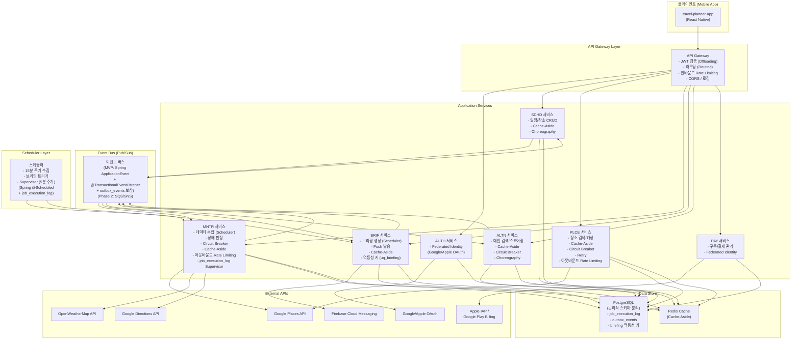
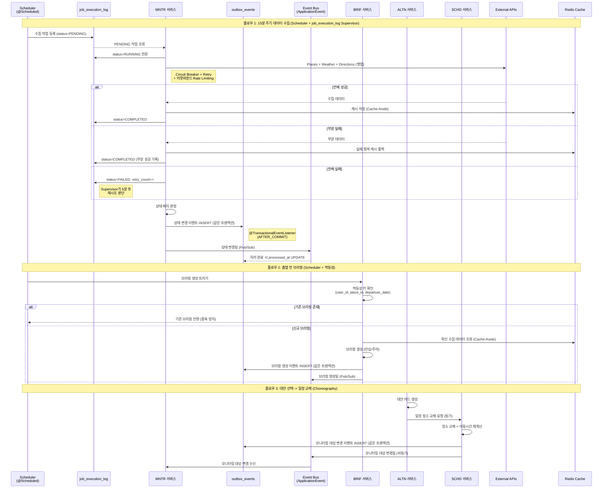

# 아키텍처 패턴 선정 설계서

> 작성자: 아키 (소프트웨어 아키텍트)
> 작성일: 2026-02-22
> 수정일: 2026-02-23 (리뷰 반영 v2)
> 근거: 유저스토리 29 UFR + 10 NFR, 이벤트 스토밍 8개 유저플로우, 핵심 솔루션 3개, UI/UX 설계서
> 프로젝트 프로파일: MVP/스타트업
> 관련 서비스: AUTH, SCHD, PLCE, MNTR, BRIF, ALTN, PAY (7개 마이크로서비스)

---

## 1. 요구사항 분석 결과

### 1.1 기능적 요구사항 요약

이벤트 스토밍 8개 유저플로우와 유저스토리 29 UFR에서 도출한 서비스별 핵심 기능 요구사항이다.

| 서비스 | 핵심 기능 | 관련 UFR | 특성 |
|--------|----------|----------|------|
| **AUTH** | 소셜 로그인(Google/Apple), JWT 발급, 온보딩 | UFR-AUTH-010 | 동기 처리, 외부 IdP 연동 |
| **SCHD** | 여행/일정/장소 CRUD, 장소 교체, 이동시간 재계산 | UFR-SCHD-005~070 | 동기+비동기 혼합, 핵심 Aggregate |
| **PLCE** | Google Places API 연동, 장소 검색, 캐싱 | UFR-PLCE-010~030 | 외부 API 의존, 높은 읽기 비율 |
| **MNTR** | 15분 주기 데이터 수집, 상태 배지 판정, 상태 변경 알림 | UFR-MNTR-010~050 | 스케줄러 기반, 이벤트 발행, 외부 API 3개 병렬 호출 |
| **BRIF** | 브리핑 생성(안심/주의), 멱등성, 티어 확인, Push 발송 | UFR-BRIF-010~060 | 스케줄러 트리거, FCM 연동, 멱등성 보장 |
| **ALTN** | 대안 장소 검색, 스코어링, 반경 확장 폴백, 카드 생성 | UFR-ALTN-010~050 | 파이프라인 처리(3~5초), 구독 티어 분기 |
| **PAY** | 인앱 결제(Apple IAP/Google Play), 구독 관리 | UFR-PAY-010 | 외부 결제 플랫폼 연동, 토큰 재발급 |

### 1.2 비기능적 요구사항 요약

| 구분 | 요구사항 ID | 핵심 내용 | 수치 기준 |
|------|-----------|----------|----------|
| **성능** | NFR-PERF-010 | 사용자 대면 API p95 응답시간 | 2초 이내 |
| **성능** | NFR-PERF-020 | 대안 검색 전체 파이프라인 | 정상 3초, 최대 5초 |
| **성능** | NFR-PERF-030 | 브리핑 생성~Push 발송 지연 | 10초 이내 |
| **보안** | NFR-SEC-010 | JWT 기반 인증, 구독 티어 인가 | API Gateway 레벨 검증 |
| **보안** | NFR-SEC-020 | 위치정보 보호, GDPR 준수 | 여행 종료 후 30일 보유 |
| **접근성** | NFR-UX-010 | WCAG 2.1 AA, 색상+아이콘 조합 | 색상만으로 정보 전달 금지 |
| **접근성** | NFR-UX-020 | Mobile First 설계 | 375x667 최소 해상도 |
| **확장성** | NFR-SCAL-010 | 모듈 분리 가능성 | 인터페이스 기반 간접 의존 |
| **확장성** | NFR-SCAL-020 | 도시 확장 | 5개 -> 15개+ |
| **안정성** | NFR-REL-010 | 외부 API 장애 내성 | 부분 실패 허용, 서킷 브레이커 |

### 1.3 이벤트 스토밍 분석

#### 서비스 경계 (Bounded Context)

이벤트 스토밍 결과 7개 서비스가 명확한 경계를 가진다.

| 서비스 | Aggregate | 주요 이벤트 | 통신 방식 |
|--------|-----------|-----------|----------|
| AUTH | User, Token | 로그인 완료됨, 토큰 발급됨 | 동기 (인증은 즉시 응답 필요) |
| SCHD | Trip, Schedule, Place | 일정 생성됨, 장소 추가됨, 장소 교체됨, 모니터링 대상 등록됨 | 동기+비동기 혼합 |
| PLCE | Place, PlaceCache | 장소 검색 결과 반환됨, 장소 상세 조회 완료됨 | 동기 (사용자 검색 응답) |
| MNTR | MonitoringTarget, CollectedData, StatusBadge | 수집 데이터 갱신됨, 상태 변경됨, 상태 변경 알림 발행됨 | 비동기 (이벤트 기반) |
| BRIF | Briefing | 안심/주의 브리핑 생성됨, Push 알림 발송됨 | 비동기 (스케줄러 트리거) |
| ALTN | AlternativeCard, SearchContext | 대안 카드 생성됨, 대안 카드 채택됨 | 동기+비동기 혼합 |
| PAY | Subscription, Payment | 구독 변경됨, 결제 완료됨 | 동기 (결제 즉시 반영) |

#### 이벤트 흐름 분석

```
일정 등록(SCHD) --[모니터링 대상 등록됨]--> 데이터 수집(MNTR) --[수집 데이터 갱신됨]--> 상태 판정(MNTR)
    |                                                                                      |
    |                                                [상태 변경됨]                          |
    |                                                     |                                |
    |                                          +----------+----------+                     |
    |                                          |                     |                     |
    |                                   상태 변경 알림(Push)    배지 갱신(UI)              |
    |                                                                                      |
    +--[출발 15~30분 전]--> 브리핑 생성(BRIF) --[브리핑 생성됨]--> Push 발송(BRIF)         |
                                |                                      |                   |
                                +--[주의 브리핑]--> 대안 검색(ALTN) <--+                   |
                                                        |                                  |
                                                 [대안 카드 채택됨]                        |
                                                        |                                  |
                                                 장소 교체(SCHD) --[모니터링 대상 변경됨]-->+
```

#### 커맨드/쿼리 패턴 분석

| 패턴 | 비율 | 서비스 | 특징 |
|------|:----:|--------|------|
| **읽기 우세** | 80%+ | MNTR (배지 조회), SCHD (일정표 조회) | 높은 조회 빈도, 캐싱 효과 큼 |
| **쓰기 우세** | 70%+ | MNTR (데이터 수집, 상태 판정) | 15분 주기 배치 쓰기 |
| **균형** | 50:50 | ALTN (검색+채택), BRIF (생성+조회) | 파이프라인형 처리 |

#### 분산 트랜잭션 분석

| 트랜잭션 | 관련 서비스 | 일관성 요구 | 패턴 후보 |
|----------|-----------|:----------:|----------|
| 대안 선택 -> 일정 교체 -> 모니터링 변경 | ALTN, SCHD, MNTR | 최종 일관성 | Saga/Choreography |
| 브리핑 생성 -> 티어 확인 -> Push 발송 | BRIF, PAY | 최종 일관성 | Choreography |
| 구독 변경 -> 토큰 재발급 | PAY, AUTH | 강한 일관성 | 동기 호출 |

### 1.4 기술적 도전과제 식별

유저스토리, 이벤트 스토밍, 핵심 솔루션, UI/UX를 통합 분석하여 식별한 도전과제이다.

| # | 도전과제 | 출처 | 심각도 | 관련 서비스 |
|:-:|---------|------|:------:|-----------|
| TC-01 | **외부 API 장애 내성**: Google Places/OpenWeatherMap/Google Directions 3개 API 부분 실패 시 캐시 폴백, 3회 연속 실패 시 회색 상태 전환 | NFR-REL-010, UFR-MNTR-010 P3/P20 | 높음 | MNTR, PLCE |
| TC-02 | **실시간 데이터 수집 스케줄링**: 방문 2시간 전~15분 주기 데이터 수집, 병렬 API 호출(2초 타임아웃) | UFR-MNTR-010 P2 | 높음 | MNTR |
| TC-03 | **서비스 간 이벤트 기반 통신**: 일정 변경 시 모니터링 대상 변경, 상태 변경 시 알림 트리거 등 비동기 이벤트 흐름 | 이벤트 스토밍 전체 | 높음 | 전체 |
| TC-04 | **대안 검색 파이프라인 성능**: 장소 검색 -> 상태 확인 -> 스코어링 -> 카드 생성 전체 3초(최대 5초) 이내 | NFR-PERF-020, UFR-ALTN-010 | 높음 | ALTN, PLCE, MNTR |
| TC-05 | **브리핑 멱등성 보장**: 동일 장소+동일 출발시간 브리핑 중복 생성 방지. **멱등성 키**: `(user_id, place_id, DATE(scheduled_departure_time))` 복합 유니크 제약으로 동일 사용자-장소-출발일 기준 중복 방지 | UFR-BRIF-020 P21 | 중간 | BRIF |
| TC-06 | **구독 티어 기반 기능 분기**: Free/Trip Pass/Pro별 기능 접근 제어, 토큰 클레임 기반 | NFR-SEC-010, UFR-BRIF-030 P19 | 중간 | BRIF, ALTN, PAY, AUTH |
| TC-07 | **다중 외부 시스템 통합**: Google OAuth, Apple Sign In, Google Places, OpenWeatherMap, Google Directions, FCM, Apple IAP, Google Play Billing | 전체 UFR | 높음 | 전체 |
| TC-08 | **모듈 분리 가능성 확보**: 7개 서비스를 논리적 모듈로 분리, 인터페이스 기반 간접 의존, MVP에서는 모놀리스 내 모듈 | NFR-SCAL-010 | 중간 | 전체 |
| TC-09 | **장소 데이터 캐싱 최적화**: 동일 장소 반복 조회 시 API 호출 최소화, 브리핑 생성 시 5분 이내 캐시 재사용 | UFR-PLCE-020, UFR-BRIF-010 U7 | 중간 | PLCE, MNTR |
| TC-10 | **분산 트랜잭션 관리**: 대안 선택 -> 일정 교체 -> 모니터링 변경 크로스서비스 트랜잭션 | UFR-SCHD-040, UFR-ALTN-030 | 중간 | ALTN, SCHD, MNTR |

---

## 2. 패턴 후보 스크리닝

### 2.1 카테고리-도전과제 매핑

42개 클라우드 디자인 패턴을 8개 카테고리별로 도전과제에 매핑한다.

| 카테고리 | 패턴 수 | 관련 도전과제 | 관련성 | 판정 |
|----------|:------:|-------------|:------:|:----:|
| **DB 성능 개선** | 1 | (해당 없음) MVP 규모에서 DB 샤딩 불필요 | 낮음 | **제외** |
| **읽기 최적화** | 4 | TC-09(캐싱), TC-04(파이프라인 성능) | 높음 | **포함** |
| **핵심업무 집중** | 6 | TC-07(다중 외부 시스템), TC-08(모듈 분리) | 높음 | **포함** |
| **안정적 현대화** | 2 | (해당 없음) 레거시 시스템 없음 | 낮음 | **제외** |
| **효율적 분산처리** | 13 | TC-03(이벤트 통신), TC-10(분산 트랜잭션), TC-02(스케줄링), TC-05(멱등성) | 높음 | **포함** |
| **안정성** | 6 | TC-01(외부 API 장애 내성), TC-04(파이프라인 성능) | 높음 | **포함** |
| **보안** | 3 | TC-06(구독 티어 인가) | 중간 | **포함** |
| **운영** | 7 | TC-08(모듈 분리), TC-07(외부 시스템 설정) | 중간 | **부분 포함** |

### 2.2 카테고리별 후보 패턴 선별

#### 읽기 최적화 (4개 중 2개 선별)

| 패턴 | 관련 도전과제 | 선별 사유 |
|------|-------------|----------|
| **Cache-Aside** | TC-09, TC-04 | 장소 데이터 캐싱, 브리핑 생성 시 캐시 재사용 필수 |
| ~~Index Table~~ | - | NoSQL 인덱스 최적화, MVP에서 RDB 사용으로 불필요 |
| ~~Materialized View~~ | - | 복잡한 뷰 미리 생성, MVP 규모에서 과도 |
| ~~CQRS~~ | - | 읽기/쓰기 분리, MVP 규모에서 복잡도 대비 효과 미미. Phase 2에서 재검토 |

#### 핵심업무 집중 (6개 중 2개 선별)

| 패턴 | 관련 도전과제 | 선별 사유 |
|------|-------------|----------|
| **Gateway Routing** | TC-07, TC-08 | 단일 진입점으로 7개 서비스 라우팅 |
| **Gateway Offloading** | TC-06, TC-07 | JWT 검증, 인증, 로깅 등 횡단관심사를 게이트웨이로 분리 |
| ~~Gateway Aggregation~~ | - | MVP에서 BFF 패턴 불필요, 단일 모바일 클라이언트 |
| ~~Backends for Frontends~~ | - | 단일 프론트엔드(모바일 앱)만 존재 |
| ~~Sidecar~~ | - | 컨테이너 기반 배포 시 유용하나 MVP 단독 배포에서 과도 |
| ~~Ambassador~~ | - | 네트워크 프록시 패턴, MVP에서 과도한 인프라 복잡도 |

> Gateway Routing + Gateway Offloading을 통합하여 **API Gateway 패턴**으로 선정한다.

#### 효율적 분산처리 (13개 중 4개 선별)

| 패턴 | 관련 도전과제 | 선별 사유 |
|------|-------------|----------|
| **Publisher-Subscriber** | TC-03 | 서비스 간 이벤트 기반 비동기 통신의 핵심 패턴 |
| **Choreography** | TC-03, TC-10 | 중앙 조정자 없이 각 서비스가 이벤트 구독/반응 |
| **Scheduler Agent Supervisor** | TC-02 | 15분 주기 데이터 수집, 브리핑 트리거 스케줄링. **MVP 구현**: Spring `@Scheduled` + `job_execution_log` 테이블 기반 간소화된 Supervisor (상세 구현은 5장 참고) |
| **Asynchronous Request-Reply** | TC-04 | 대안 검색 파이프라인의 비동기 처리 |
| ~~Saga~~ | TC-10 | 분산 트랜잭션 관리에 유용하나, MVP에서 Choreography로 충분. Phase 2 재검토 |
| ~~Compensating Transaction~~ | - | Saga의 보상 트랜잭션, MVP에서 과도 |
| ~~Priority Queue~~ | - | 우선순위 큐, MVP 규모에서 단순 FIFO로 충분 |
| ~~Queue-Based Load Leveling~~ | - | 부하 분산 큐, MVP 트래픽에서 불필요 |
| ~~Sequential Convoy~~ | - | 순서 보장 처리, MVP에서 해당 요구사항 없음 |
| ~~Claim Check~~ | - | 대용량 메시지 분리, MVP에서 메시지 크기 이슈 없음 |
| ~~Competing Consumers~~ | - | 병렬 소비자, MVP 규모에서 단일 소비자로 충분 |
| ~~Pipes and Filters~~ | - | 모듈화 파이프라인, Choreography로 대체 가능 |
| ~~Leader Election~~ | - | 분산 리더 선출, MVP 단일 인스턴스에서 불필요 |

#### 안정성 (6개 중 3개 선별)

| 패턴 | 관련 도전과제 | 선별 사유 |
|------|-------------|----------|
| **Circuit Breaker** | TC-01 | 외부 API 장애 시 빠른 실패, 캐시 폴백 전환 핵심 |
| **Retry** | TC-01 | 일시적 오류 시 재시도, Circuit Breaker와 조합 |
| **Rate Limiting** | TC-07 | **인바운드**: API Gateway에서 클라이언트 요청 빈도 제한. **아웃바운드**: 외부 API 호출 빈도 제한(resilience4j RateLimiter)으로 비용 제어. 두 방향 모두 필요 |
| ~~Throttling~~ | - | Rate Limiting과 유사, MVP에서 하나만 선택 |
| ~~Bulkhead~~ | - | 자원 풀 격리, MVP 단일 인스턴스에서 과도 |
| ~~Event Sourcing~~ | - | 이벤트 소싱, MVP에서 구현 복잡도 과도. Phase 3 재검토 |

#### 보안 (3개 중 1개 선별)

| 패턴 | 관련 도전과제 | 선별 사유 |
|------|-------------|----------|
| **Federated Identity** | TC-06 | 소셜 로그인(Google/Apple) 외부 IdP 위임 필수 |
| ~~Gatekeeper~~ | - | API Gateway의 JWT 검증으로 대체 가능 |
| ~~Valet Key~~ | - | 리소스 직접 접근 토큰, MVP에서 해당 시나리오 없음 |

#### 운영 (7개 중 2개 선별)

| 패턴 | 관련 도전과제 | 선별 사유 |
|------|-------------|----------|
| **Health Endpoint Monitoring** | TC-01, TC-07 | 서비스 및 외부 API 상태 점검 필수 |
| **External Configuration Store** | TC-07, TC-08 | 상태 판정 임계값, 도시별 설정 중앙 관리 (U5 반영) |
| ~~Geodes~~ | - | 글로벌 분산 배치, MVP에서 단일 리전 |
| ~~Deployment Stamps~~ | - | 멀티 테넌트 격리, MVP에서 불필요 |
| ~~Compute Resource Consolidation~~ | - | 자원 통합, MVP에서 이미 단일 배포 단위 |
| ~~Static Content Hosting~~ | - | 정적 콘텐츠 호스팅, 모바일 앱에서 CDN은 별도 인프라 |
| ~~Edge Workload Configuration~~ | - | 엣지 컴퓨팅, MVP에서 해당 없음 |

### 2.3 스크리닝 결과

- **후보 패턴 수**: 42개 -> **14개**
- **제외된 카테고리**: DB 성능 개선(1개), 안정적 현대화(2개) = 총 3개 패턴 카테고리 레벨 제외
- **카테고리 내 제외**: 25개 패턴 (도전과제 미매핑 또는 MVP 과도)

**최종 후보 14개 패턴**:

| # | 패턴명 | 카테고리 | 관련 도전과제 |
|:-:|--------|---------|-------------|
| 1 | Cache-Aside | 읽기 최적화 | TC-09, TC-04 |
| 2 | Gateway Routing | 핵심업무 집중 | TC-07, TC-08 |
| 3 | Gateway Offloading | 핵심업무 집중 | TC-06, TC-07 |
| 4 | Publisher-Subscriber | 효율적 분산처리 | TC-03 |
| 5 | Choreography | 효율적 분산처리 | TC-03, TC-10 |
| 6 | Scheduler Agent Supervisor | 효율적 분산처리 | TC-02 |
| 7 | Asynchronous Request-Reply | 효율적 분산처리 | TC-04 |
| 8 | Circuit Breaker | 안정성 | TC-01 |
| 9 | Retry | 안정성 | TC-01 |
| 10 | Rate Limiting | 안정성 | TC-07 |
| 11 | Federated Identity | 보안 | TC-06 |
| 12 | Health Endpoint Monitoring | 운영 | TC-01, TC-07 |
| 13 | External Configuration Store | 운영 | TC-07, TC-08 |
| 14 | ~~CQRS~~ (Phase 2 대기) | 읽기 최적화 | TC-09 |

> 참고: Gateway Routing + Gateway Offloading은 **API Gateway**로 통합 평가한다.
> CQRS는 Phase 2 후보로 대기하며 이번 평가에서는 참고용으로만 포함한다.

---

## 3. 패턴 선정 매트릭스 (평가표)

### 3.1 프로젝트 프로파일 및 가중치

**프로젝트 프로파일: MVP/스타트업**

| 기준 | 가중치 | 근거 |
|------|:------:|------|
| 기능 적합성 | **35%** | 핵심 솔루션(S04/S05/S06) 직접 해결 능력 최우선 |
| 성능 효과 | **10%** | MVP 초기 트래픽 낮아 성능 최적화 우선순위 낮음 |
| 운영 용이성 | **25%** | 소규모 팀(7명)의 운영 부담 최소화 필수 |
| 확장성 | **5%** | MVP 검증 후 확장, 현재는 최소한의 확장성만 확보 |
| 보안 적합성 | **10%** | 위치정보 보호, JWT 인증 등 기본 보안 필수 |
| 비용 효율성 | **15%** | 스타트업 예산 제약, 외부 API 비용 관리 중요 |

### 3.2 정량적 평가 매트릭스

| 패턴 | 기능 적합성<br/>(35%) | 성능 효과<br/>(10%) | 운영 용이성<br/>(25%) | 확장성<br/>(5%) | 보안 적합성<br/>(10%) | 비용 효율성<br/>(15%) | **가중 총점** |
|------|:---:|:---:|:---:|:---:|:---:|:---:|:---:|
| **API Gateway** (Routing+Offloading) | 9 x 0.35 = 3.15 | 7 x 0.10 = 0.70 | 8 x 0.25 = 2.00 | 9 x 0.05 = 0.45 | 9 x 0.10 = 0.90 | 7 x 0.15 = 1.05 | **8.25** |
| **Cache-Aside** | 9 x 0.35 = 3.15 | 9 x 0.10 = 0.90 | 9 x 0.25 = 2.25 | 7 x 0.05 = 0.35 | 6 x 0.10 = 0.60 | 9 x 0.15 = 1.35 | **8.60** |
| **Publisher-Subscriber** | 9 x 0.35 = 3.15 | 7 x 0.10 = 0.70 | 7 x 0.25 = 1.75 | 9 x 0.05 = 0.45 | 6 x 0.10 = 0.60 | 7 x 0.15 = 1.05 | **7.70** |
| **Choreography** | 8 x 0.35 = 2.80 | 6 x 0.10 = 0.60 | 6 x 0.25 = 1.50 | 8 x 0.05 = 0.40 | 5 x 0.10 = 0.50 | 7 x 0.15 = 1.05 | **6.85** |
| **Scheduler Agent Supervisor** | 9 x 0.35 = 3.15 | 7 x 0.10 = 0.70 | 7 x 0.25 = 1.75 | 6 x 0.05 = 0.30 | 5 x 0.10 = 0.50 | 7 x 0.15 = 1.05 | **7.45** |
| **Asynchronous Request-Reply** | 7 x 0.35 = 2.45 | 8 x 0.10 = 0.80 | 6 x 0.25 = 1.50 | 7 x 0.05 = 0.35 | 5 x 0.10 = 0.50 | 6 x 0.15 = 0.90 | **6.50** |
| **Circuit Breaker** | 9 x 0.35 = 3.15 | 8 x 0.10 = 0.80 | 9 x 0.25 = 2.25 | 7 x 0.05 = 0.35 | 7 x 0.10 = 0.70 | 8 x 0.15 = 1.20 | **8.45** |
| **Retry** | 8 x 0.35 = 2.80 | 7 x 0.10 = 0.70 | 9 x 0.25 = 2.25 | 6 x 0.05 = 0.30 | 6 x 0.10 = 0.60 | 8 x 0.15 = 1.20 | **7.85** |
| **Rate Limiting** | 7 x 0.35 = 2.45 | 6 x 0.10 = 0.60 | 8 x 0.25 = 2.00 | 7 x 0.05 = 0.35 | 7 x 0.10 = 0.70 | 9 x 0.15 = 1.35 | **7.45** |
| **Federated Identity** | 9 x 0.35 = 3.15 | 5 x 0.10 = 0.50 | 9 x 0.25 = 2.25 | 7 x 0.05 = 0.35 | 10 x 0.10 = 1.00 | 8 x 0.15 = 1.20 | **8.45** |
| **Health Endpoint Monitoring** | 6 x 0.35 = 2.10 | 5 x 0.10 = 0.50 | 9 x 0.25 = 2.25 | 7 x 0.05 = 0.35 | 5 x 0.10 = 0.50 | 9 x 0.15 = 1.35 | **7.05** |
| **External Configuration Store** | 7 x 0.35 = 2.45 | 5 x 0.10 = 0.50 | 8 x 0.25 = 2.00 | 8 x 0.05 = 0.40 | 5 x 0.10 = 0.50 | 7 x 0.15 = 1.05 | **6.90** |

### 3.3 채점 근거 상세

#### 상위 패턴 채점 근거

**Cache-Aside (8.60점 -- 1위)**
- 기능 적합성 9: 장소 데이터 캐싱(UFR-PLCE-020), 브리핑 Read-Through(UFR-BRIF-010 U7), 외부 API 폴백(P3/P20) 모두 직접 해결
- 운영 용이성 9: Redis 등 표준 캐시 솔루션으로 즉시 구현 가능, 팀 학습 비용 최소
- 비용 효율성 9: 외부 API 호출 횟수 대폭 감소, 직접적 비용 절감

**Circuit Breaker (8.45점 -- 공동 2위)**
- 기능 적합성 9: 외부 API 3개(Places, Weather, Directions) 장애 격리 필수(NFR-REL-010), 3회 연속 실패 -> 회색 상태 전환(P3)
- 운영 용이성 9: resilience4j 등 성숙한 라이브러리로 즉시 적용 가능
- 비용 효율성 8: 장애 시 불필요한 API 호출 방지로 비용 절감

**Federated Identity (8.45점 -- 공동 2위)**
- 기능 적합성 9: 소셜 로그인(Google/Apple) 외부 IdP 위임이 UFR-AUTH-010의 핵심 요구사항
- 보안 적합성 10: OAuth 2.0 표준 기반, 직접 비밀번호 관리 불필요, GDPR 준수 용이
- 운영 용이성 9: Google/Apple SDK 표준 연동, 인증 인프라 자체 구축 불필요

**API Gateway (8.25점 -- 4위)**
- 기능 적합성 9: 7개 서비스 단일 진입점, JWT 검증, 구독 티어 인가, 라우팅 통합
- 보안 적합성 9: API Gateway 레벨 토큰 검증(NFR-SEC-010), HTTPS 종단, CORS 관리
- 확장성 9: 서비스 추가/변경 시 라우팅 규칙만 수정

### 3.4 선정 결과

**총점 6.5점 이상 패턴을 MVP 적용 후보로 선정하되, "없으면 서비스가 안 되는가" 기준을 추가 적용한다.**

> **[리뷰 반영] MVP 패턴 경량화**: Health Endpoint Monitoring(7.05점)과 External Configuration Store(6.90점)는 정량 점수는 기준 이상이나, "없으면 서비스가 안 되는가?" 질문에 **아니오**이므로 Phase 2 초반으로 이동한다. Spring Boot Actuator 기본 헬스체크와 application.yml 설정 파일로 MVP 기간을 커버할 수 있다. MVP는 **9개 핵심 패턴**에 집중하여 구현 범위를 경량화한다.

| 순위 | 패턴 | 총점 | MVP 적용 | 비고 |
|:----:|------|:----:|:--------:|------|
| 1 | **Cache-Aside** | 8.60 | **확정** | 장소 캐싱, API 폴백 핵심 |
| 2 | **Circuit Breaker** | 8.45 | **확정** | 외부 API 장애 내성 핵심 |
| 2 | **Federated Identity** | 8.45 | **확정** | 소셜 로그인 필수 |
| 4 | **API Gateway** | 8.25 | **확정** | 단일 진입점, 인증 오프로딩 |
| 5 | **Retry** | 7.85 | **확정** | Circuit Breaker 보완 |
| 6 | **Publisher-Subscriber** | 7.70 | **확정** | 이벤트 기반 통신 핵심 |
| 7 | **Scheduler Agent Supervisor** | 7.45 | **확정** | 데이터 수집/브리핑 스케줄링 |
| 7 | **Rate Limiting** | 7.45 | **확정** | 외부 API 비용 제어 (인바운드+아웃바운드) |
| 9 | **Choreography** | 6.85 | **확정** | 분산 트랜잭션 이벤트 조율 |
| 10 | **Health Endpoint Monitoring** | 7.05 | **Phase 2** | MVP에서는 Actuator 기본 헬스체크로 대체 |
| 11 | **External Configuration Store** | 6.90 | **Phase 2** | MVP에서는 application.yml + 환경변수로 대체 |
| 12 | **Asynchronous Request-Reply** | 6.50 | **Phase 2** | 대안 검색 비동기화, MVP에서는 동기 파이프라인으로 시작 |

**MVP 선정: 9개 패턴** / Phase 2 대기: 4개 (CQRS, Asynchronous Request-Reply, Health Endpoint Monitoring, External Configuration Store)

### 3.5 선정 근거 요약

MVP/스타트업 프로파일에서 9개 패턴을 선정한 핵심 논리는 다음과 같다.

1. **외부 API 안정성 삼총사** (Cache-Aside + Circuit Breaker + Retry): travel-planner의 핵심 가치가 외부 데이터(날씨, 혼잡도, 영업상태)에 의존하므로, 외부 API 장애 시에도 서비스 연속성을 보장하는 패턴 조합이 필수이다.

2. **이벤트 기반 통신** (Publisher-Subscriber + Choreography): 이벤트 스토밍에서 식별된 "일정 등록 -> 모니터링 시작 -> 상태 변경 -> 알림/브리핑" 흐름이 이벤트 기반 비동기 통신을 요구한다.

3. **진입점 통합과 보안** (API Gateway + Federated Identity): 7개 서비스의 단일 진입점과 소셜 로그인 기반 인증이 MVP 출시의 기본 인프라이다.

4. **자동화 스케줄링** (Scheduler Agent Supervisor): 15분 주기 데이터 수집과 출발 전 브리핑 트리거가 S04/S05의 핵심 메커니즘이다.

5. **외부 API 비용 제어** (Rate Limiting): 스타트업 예산 제약 하에서 인바운드(클라이언트 요청) 및 아웃바운드(외부 API 호출) 양방향 호출 빈도를 제어하여 비용을 관리한다.

> **Phase 2 이동 근거 (Health Endpoint Monitoring, External Configuration Store)**: 두 패턴 모두 운영 품질을 높이는 패턴이지만, "없으면 서비스 자체가 동작하지 않는가?"에 대한 답이 "아니오"이다. MVP 기간에는 Spring Boot Actuator 기본 헬스체크(`/actuator/health`)와 `application.yml` 설정 파일로 동일 목적을 최소한으로 달성할 수 있다. Phase 2 초반에 DB 기반 설정 관리와 외부 API 상태 연동 헬스체크로 고도화한다.

---

## 4. 패턴 조합 검증

### 4.1 시너지 조합

| 조합 | 시너지 효과 | 관련 도전과제 |
|------|------------|-------------|
| **Circuit Breaker + Retry + Cache-Aside** | Retry로 일시적 오류 복구 -> 실패 누적 시 Circuit Breaker가 open -> Cache-Aside로 캐시 폴백 제공. 3계층 장애 대응 전략 완성 | TC-01 |
| **API Gateway + Federated Identity** | Gateway에서 JWT 토큰 검증(Offloading), 인증 실패 시 소셜 로그인 리다이렉트. 보안 횡단관심사 일원화 | TC-06, TC-07 |
| **Publisher-Subscriber + Choreography** | Pub/Sub이 이벤트 전달 인프라, Choreography가 서비스 간 워크플로 조율. 모니터링 -> 알림 -> 브리핑 흐름을 느슨하게 결합 | TC-03, TC-10 |
| **Scheduler Agent Supervisor + Circuit Breaker** | 스케줄러가 수집 작업 디스패치, 외부 API 호출 시 Circuit Breaker 적용. 수집 실패 시 Supervisor(`job_execution_log` 기반)가 재시도/폴백 판단 | TC-02, TC-01 |
| **Rate Limiting (아웃바운드) + Cache-Aside** | 아웃바운드 Rate Limiting이 외부 API 호출 빈도 제한, Cache-Aside가 캐시 히트로 API 호출 자체를 회피. 이중 비용 절감 | TC-07, TC-09 |

### 4.2 충돌 조합

| 조합 | 충돌 원인 | 심각도 | 대응 방안 |
|------|----------|:------:|----------|
| **Choreography + 강한 일관성 요구** | Choreography는 최종 일관성(eventual consistency)만 보장. 대안 선택 -> 일정 교체 간 즉시 일관성 미보장 | 중간 | 대안 선택 -> 일정 교체는 동기 호출로 처리하고, 후속 모니터링 변경만 비동기 이벤트로 분리. 사용자 응답이 필요한 구간은 동기, 후처리는 비동기로 이원화 |
| **Retry + Rate Limiting** | Retry가 실패 시 재시도하면 Rate Limiting 한도를 더 빨리 소진할 수 있음 | 낮음 | Retry에 지수 백오프(exponential backoff) + 지터(jitter) 적용. Rate Limiting 한도의 80% 도달 시 Retry 횟수를 줄이는 적응형 정책 |
| **Circuit Breaker + Scheduler Agent Supervisor** | Circuit Breaker가 open 상태일 때 스케줄러가 계속 수집 작업을 디스패치하면 불필요한 실패 누적 | 낮음 | 스케줄러가 Circuit Breaker 상태를 조회하여, open 상태인 API에 대해서는 수집을 스킵하고 캐시 데이터 사용 |

### 4.3 검증 결론

- 5개 시너지 조합이 식별되었으며, 특히 **Circuit Breaker + Retry + Cache-Aside** 조합이 TC-01(외부 API 장애 내성)을 완전히 해결한다.
- 3개 잠재적 충돌이 식별되었으나, 모두 대응 방안이 명확하고 심각도가 중간~낮음이다.
- **최종 판정: 9개 패턴 조합은 상호 보완적이며, 충돌 위험은 통제 가능하다.**

---

## 5. 트레이드오프 분석

### 5.1 MVP 패턴 트레이드오프 (9개)

| 패턴 | 얻는 것 (Gains) | 잃는 것 (Costs) | 수용 근거 |
|------|----------------|----------------|----------|
| **API Gateway** | 단일 진입점, JWT 검증 오프로딩, 라우팅 중앙 관리, CORS/로깅 통합, **인바운드 Rate Limiting** | 단일 장애점(SPOF) 위험, 게이트웨이 지연 추가(~10ms) | 7개 서비스 개별 인증 구현 대비 운영 비용 95% 절감. SPOF는 클라우드 관리형(AWS ALB/API Gateway) 사용으로 완화 |
| **Cache-Aside** | 외부 API 호출 50~70% 감소, 응답시간 개선, 장애 시 캐시 폴백 | 캐시 무효화 복잡성, 데이터 신선도 관리, 캐시 메모리 비용 | 장소 데이터는 변경 빈도 낮음(일 1~2회). 5분 TTL로 신선도와 비용 균형. 브리핑 U7 요구사항 직접 충족 |
| **Publisher-Subscriber** | 서비스 간 느슨한 결합, 이벤트 기반 확장 용이, 새 구독자 추가 용이 | 이벤트 순서 보장 어려움, 디버깅 복잡도 증가, **인메모리 이벤트 버스 사용 시 이벤트 유실 위험** | MVP에서는 인메모리 이벤트 버스(Spring ApplicationEvent)로 시작. **트랜잭션 경계**: `@TransactionalEventListener(phase = AFTER_COMMIT)` 적용하여 트랜잭션 커밋 후에만 이벤트 발행. **이벤트 유실 복구**: `outbox_events` 테이블 기반 보상 조회 메커니즘 적용 (5.3절 참고). 서비스 분리 시 SQS/SNS로 전환 |
| **Choreography** | 중앙 조정자 없이 느슨한 결합, 서비스 자율성, 단일 장애점 제거 | 전체 플로우 파악 어려움, 순환 의존 위험, 디버깅 복잡 | 대안 선택 -> 일정 교체는 동기, 후속 모니터링 변경만 비동기로 이원화하여 복잡도 제한 |
| **Scheduler Agent Supervisor** | 주기적 작업 안정적 실행, 실패 감지/복구, 작업 상태 추적 | 스케줄러 자체 장애 시 전체 수집 중단, 구현 복잡도 | **MVP 구현**: Spring `@Scheduled` + `job_execution_log` 테이블 기반 간소화된 Supervisor (5.2절 참고). Phase 2에서 분산 스케줄러(CloudWatch Events) 전환 |
| **Circuit Breaker** | 외부 API 장애 빠른 감지, 장애 전파 차단, 시스템 안정성 향상 | 일시적 기능 저하(open 상태), 상태 관리 복잡성 | 외부 API 3개 의존이 핵심이므로 장애 격리 필수. resilience4j로 구현 비용 최소화 |
| **Retry** | 일시적 네트워크 오류 자동 복구, 외부 API 간헐적 실패 대응 | 실패 시 응답 지연 누적, Rate Limiting 한도 소진 가속 | 지수 백오프 + 최대 3회로 제한하여 부작용 최소화. 2초 타임아웃(U4)과 조합 |
| **Rate Limiting** | **인바운드**: 클라이언트 과다 요청 방지(API Gateway). **아웃바운드**: 외부 API 비용 제어(resilience4j RateLimiter), 과다 호출 방지, 시스템 안정성 | API 호출 제한으로 데이터 신선도 저하 가능 | Google Places API 무료 한도(일 1,000회) 관리 필수. 인바운드는 API Gateway에서 클라이언트별 요청 제한, 아웃바운드는 resilience4j `RateLimiter`로 외부 API별 호출 빈도 제한. 캐시와 조합하여 실제 호출 최소화 |
| **Federated Identity** | 사용자 인증 위임으로 보안 향상, 비밀번호 관리 불필요, SSO 경험 | 외부 IdP 의존, IdP 장애 시 로그인 불가 | Google/Apple은 99.99%+ 가용성. 자체 인증 시스템 구축 대비 보안 위험과 비용 대폭 감소 |

### 5.2 Scheduler Agent Supervisor MVP 구현 명세

> **[리뷰 반영]** Spring `@Scheduled`만으로는 Supervisor 역할(실행 상태 추적, 실패 감지, 복구 판단)이 불가하다. MVP에서는 `job_execution_log` 테이블 기반 간소화된 Supervisor를 구현한다.

**`job_execution_log` 테이블 설계**:

```sql
CREATE TABLE job_execution_log (
    id              BIGSERIAL PRIMARY KEY,
    job_type        VARCHAR(50)  NOT NULL,  -- 'MONITORING_COLLECT', 'BRIEFING_TRIGGER'
    job_group_key   VARCHAR(100) NOT NULL,  -- 수집 대상 식별 (e.g., 'city:tokyo:place:abc123')
    status          VARCHAR(20)  NOT NULL,  -- 'PENDING', 'RUNNING', 'COMPLETED', 'FAILED', 'TIMEOUT'
    started_at      TIMESTAMP    NOT NULL DEFAULT NOW(),
    completed_at    TIMESTAMP,
    error_message   TEXT,
    retry_count     INT          NOT NULL DEFAULT 0,
    next_retry_at   TIMESTAMP,
    created_at      TIMESTAMP    NOT NULL DEFAULT NOW()
);

CREATE INDEX idx_job_exec_status ON job_execution_log(job_type, status);
CREATE INDEX idx_job_exec_timeout ON job_execution_log(status, started_at);
```

**Supervisor 동작 흐름**:

1. **Scheduler** (`@Scheduled`): 15분 주기로 수집 대상 목록을 조회하고, 각 대상에 대해 `job_execution_log`에 `PENDING` 상태로 INSERT
2. **Agent** (Worker): `PENDING` 작업을 `RUNNING`으로 전환 후 실제 외부 API 호출 수행
3. **Supervisor** (`@Scheduled`, 5분 주기): `RUNNING` 상태가 타임아웃(3분) 초과한 작업을 `TIMEOUT`으로 전환. `FAILED`/`TIMEOUT` 작업 중 `retry_count < 3`인 항목을 `PENDING`으로 재등록

```
┌─────────────┐     ┌──────────────────┐     ┌──────────────────┐
│  Scheduler  │────>│ job_execution_log│<────│   Supervisor     │
│ (@Scheduled │     │                  │     │  (@Scheduled     │
│  15분 주기) │     │ PENDING          │     │   5분 주기)      │
│             │     │ RUNNING          │     │                  │
│ 수집 대상   │     │ COMPLETED/FAILED │     │ 타임아웃 감지    │
│ 작업 등록   │     │ TIMEOUT          │     │ 재시도 판단      │
└─────────────┘     └──────────────────┘     └──────────────────┘
                           ↑
                    ┌──────┴──────┐
                    │   Agent     │
                    │ (Worker)    │
                    │ 실제 API    │
                    │ 호출 수행   │
                    └─────────────┘
```

### 5.3 인메모리 이벤트 버스 이벤트 유실 복구 전략

> **[리뷰 반영]** Spring ApplicationEvent 기반 인메모리 이벤트 버스는 애플리케이션 장애 시 이벤트가 유실될 수 있다. 트랜잭션 경계를 명확히 하고, Outbox 패턴 기반 보상 조회 메커니즘을 적용한다.

**트랜잭션 경계 원칙**:

```java
// 이벤트 리스너는 반드시 트랜잭션 커밋 후 실행
@TransactionalEventListener(phase = TransactionPhase.AFTER_COMMIT)
public void handleStatusChanged(StatusChangedEvent event) {
    // 트랜잭션이 커밋된 후에만 이벤트 처리 시작
    // -> 롤백된 트랜잭션의 이벤트가 발행되지 않음
}
```

**`outbox_events` 테이블 기반 보상 조회**:

```sql
CREATE TABLE outbox_events (
    id              BIGSERIAL PRIMARY KEY,
    event_type      VARCHAR(100) NOT NULL,  -- 'STATUS_CHANGED', 'BRIEFING_CREATED'
    aggregate_id    VARCHAR(100) NOT NULL,  -- 이벤트 발생 원본 ID
    payload         JSONB        NOT NULL,  -- 이벤트 데이터
    created_at      TIMESTAMP    NOT NULL DEFAULT NOW(),
    processed_at    TIMESTAMP               -- NULL이면 미처리
);

CREATE INDEX idx_outbox_unprocessed ON outbox_events(processed_at) WHERE processed_at IS NULL;
```

**보상 조회 흐름**:

1. **이벤트 발행 시**: 비즈니스 로직과 같은 트랜잭션 내에서 `outbox_events`에 INSERT (`processed_at = NULL`)
2. **이벤트 핸들러 처리 완료 시**: `processed_at`을 현재 시간으로 UPDATE
3. **보상 스케줄러** (`@Scheduled`, 5분 주기): `processed_at IS NULL AND created_at < NOW() - INTERVAL '1 minute'`인 이벤트를 조회하여 재발행

```
┌──────────────────┐     ┌──────────────────┐     ┌──────────────────┐
│  비즈니스 로직   │     │  outbox_events   │     │  보상 스케줄러   │
│  (같은 트랜잭션) │────>│                  │<────│  (5분 주기)      │
│                  │     │ event_type       │     │                  │
│ 1. 상태 변경     │     │ payload          │     │ 미처리 이벤트    │
│ 2. outbox INSERT │     │ processed_at     │     │ 조회 & 재발행    │
└──────────────────┘     └──────────────────┘     └──────────────────┘
         │                       ↑
         │              ┌────────┴────────┐
         └─────────────>│  이벤트 핸들러  │
       ApplicationEvent │  처리 완료 시   │
                        │ processed_at    │
                        │ UPDATE          │
                        └─────────────────┘
```

### 5.4 브리핑 멱등성 키 설계

> **[리뷰 반영]** 동일 사용자-장소-출발일에 대한 브리핑 중복 생성을 DB 레벨에서 방지한다.

**멱등성 키 구성**: `(user_id, place_id, DATE(scheduled_departure_time))`

```sql
-- briefings 테이블에 복합 유니크 제약
ALTER TABLE briefings ADD CONSTRAINT uq_briefing_idempotency
    UNIQUE (user_id, place_id, departure_date);

-- departure_date는 scheduled_departure_time에서 날짜만 추출한 generated column
-- 또는 INSERT 시 계산하여 저장
```

**처리 흐름**:

1. 브리핑 생성 요청 시 `(user_id, place_id, DATE(scheduled_departure_time))` 조합으로 기존 레코드 존재 여부 확인
2. 이미 존재하면 기존 브리핑 반환 (멱등성 보장)
3. 존재하지 않으면 새 브리핑 생성. DB 유니크 제약이 동시 요청 시 중복 방지
4. `INSERT ... ON CONFLICT (user_id, place_id, departure_date) DO NOTHING` 패턴 적용

### 5.5 Phase 2 패턴 트레이드오프

| 패턴 | 얻는 것 (Gains) | 잃는 것 (Costs) | Phase 2 구현 방향 |
|------|----------------|----------------|------------------|
| **Health Endpoint Monitoring** | 서비스 상태 실시간 파악, 외부 API 가용성 사전 감지, Circuit Breaker 상태와 연동 | 헬스체크 엔드포인트 구현/유지 비용, 모니터링 인프라 필요 | Spring Boot Actuator 커스텀 헬스 인디케이터로 외부 API별 상태 노출. Circuit Breaker 상태(open/closed/half-open) 연동 |
| **External Configuration Store** | 재배포 없이 임계값 변경, 도시별 설정 중앙 관리 | 외부 설정 저장소 의존, 설정 동기화 지연 | **DB 기반 설정 관리**: `system_config` 테이블 + 어드민 API로 구현 (8.2절 참고). Phase 3에서 AWS Parameter Store 전환 |

---

## 6. 서비스별 패턴 적용 매핑

| 서비스 | 적용 패턴 | 적용 이유 | 관련 유저스토리 |
|--------|----------|----------|---------------|
| **AUTH** | Federated Identity, API Gateway | 소셜 로그인(Google/Apple) 외부 IdP 위임, Gateway에서 JWT 검증 | UFR-AUTH-010, NFR-SEC-010 |
| **SCHD** | API Gateway, Publisher-Subscriber, Choreography, Cache-Aside | 일정 변경 시 모니터링 대상 변경 이벤트 발행(비동기), 일정표 조회 캐싱 | UFR-SCHD-010~070, UFR-SCHD-040(P12~P14) |
| **PLCE** | Cache-Aside, Circuit Breaker, Retry, Rate Limiting (아웃바운드) | Google Places API 캐싱/장애 내성/비용 제어 | UFR-PLCE-010~030, NFR-REL-010 |
| **MNTR** | Scheduler Agent Supervisor, Circuit Breaker, Retry, Cache-Aside, Publisher-Subscriber, Rate Limiting (아웃바운드) | 15분 주기 수집 스케줄링(`job_execution_log` 기반 Supervisor), 외부 API 3개 장애 내성, 상태 변경 이벤트 발행 | UFR-MNTR-010~050, NFR-REL-010 |
| **BRIF** | Scheduler Agent Supervisor, Publisher-Subscriber, Cache-Aside, Rate Limiting (아웃바운드) | 출발 전 브리핑 트리거 스케줄링, 브리핑 생성 이벤트 발행, 수집 데이터 캐시 재사용(U7), FCM 발송 Rate Limiting. **멱등성 키**: `(user_id, place_id, departure_date)` | UFR-BRIF-010~060 |
| **ALTN** | Cache-Aside, Circuit Breaker, Publisher-Subscriber, Choreography | 대안 검색 시 장소 캐시 활용, 외부 API 장애 내성, 대안 채택 시 일정 교체 이벤트 발행 | UFR-ALTN-010~050 |
| **PAY** | API Gateway, Federated Identity | Gateway에서 인증/인가, 구독 티어 변경 시 토큰 재발급 동기 처리 | UFR-PAY-010, NFR-SEC-010 |

### 6.1 서비스-패턴 교차 매트릭스

| 패턴 \ 서비스 | AUTH | SCHD | PLCE | MNTR | BRIF | ALTN | PAY |
|:---|:---:|:---:|:---:|:---:|:---:|:---:|:---:|
| API Gateway (인바운드 Rate Limiting 포함) | O | O | O | O | O | O | O |
| Cache-Aside | - | O | O | O | O | O | - |
| Publisher-Subscriber | - | O | - | O | O | O | - |
| Choreography | - | O | - | - | - | O | - |
| Scheduler Agent Supervisor | - | - | - | O | O | - | - |
| Circuit Breaker | - | - | O | O | - | O | - |
| Retry | - | - | O | O | - | - | - |
| Rate Limiting (아웃바운드) | - | - | O | O | O | - | - |
| Federated Identity | O | - | - | - | - | - | O |

> **[리뷰 반영]** Rate Limiting을 인바운드(API Gateway에 포함)와 아웃바운드(서비스 레벨, resilience4j RateLimiter)로 구분하여 매핑. MVP에서 Health Endpoint Monitoring과 External Configuration Store는 제외 (Phase 2).

---

## 7. 서비스별 패턴 적용 설계 (Mermaid)



### 7.1 핵심 이벤트 흐름 다이어그램



---

## 8. Phase별 구현 로드맵

### 8.1 Phase 1: MVP (6~9주)

**목표**: 핵심 솔루션 S04/S05/S06 동작, 안정적 외부 API 연동

> **[리뷰 반영]** Sprint 1을 PLCE/MNTR로 세분화하고, Sprint 1 끝에 S05 상태 배지 최소 동작 마일스톤을 추가. Health Endpoint Monitoring과 External Configuration Store는 Phase 2로 이동하여 MVP 구현 범위를 경량화.

| Sprint | 기간 | 적용 패턴 | 구현 내용 | 관련 솔루션 | 마일스톤 |
|:------:|------|----------|----------|:----------:|---------|
| Sprint 0 | 1주 | API Gateway, Federated Identity | API Gateway 기본 설정(인바운드 Rate Limiting 포함), 소셜 로그인(Google/Apple), JWT 발급/검증, 프로젝트 기반 구조, `outbox_events` 테이블 생성 | 공통 | 인증 플로우 동작 확인 |
| Sprint 1 | 2주 | Cache-Aside, Circuit Breaker, Retry, Rate Limiting (아웃바운드) | PLCE 서비스(장소 검색/캐싱), MNTR 서비스 최소 버전(**1개 도시, OpenWeatherMap API만** 연동), `job_execution_log` 테이블 및 기본 Supervisor | S05 기반 | **S05 최소 동작 데모**: 1개 도시(도쿄)에서 날씨 API 기반 상태 배지 표시 |
| Sprint 2 | 2주 | Scheduler Agent Supervisor, Publisher-Subscriber, Rate Limiting (아웃바운드) | MNTR 전체 버전(3개 API 병렬 수집, 상태 배지 판정, 15분 주기 스케줄링), 상태 변경 이벤트 발행, SCHD 일정표+배지 조회, `@TransactionalEventListener` + `outbox_events` 보상 스케줄러 | **S05** | S05 상태 배지 전체 동작 |
| Sprint 3 | 2~3주 | Scheduler Agent Supervisor, Publisher-Subscriber | BRIF 브리핑 생성/Push 발송, 출발 전 브리핑 트리거, **멱등성 키 `(user_id, place_id, departure_date)`**, 브리핑 Supervisor | **S04** | S04 브리핑 Push 수신 확인 |
| Sprint 4 | 2~3주 | Choreography, Cache-Aside, Circuit Breaker | ALTN 대안 검색/스코어링/카드 생성, SCHD 장소 교체, PAY 구독 관리, Paywall | **S06** | S06 대안 카드 3초 내 응답 |

**Sprint 1 마일스톤 상세** (S05 최소 동작 데모):

> **[리뷰 반영]** Sprint 0~1 인프라 구축 기간에도 사용자에게 보여줄 가치를 확보한다.

| 항목 | 범위 |
|------|------|
| 지원 도시 | 도쿄 1개 도시 |
| 외부 API | OpenWeatherMap 1개 (날씨만) |
| 상태 배지 | 날씨 기반 "안심/주의" 2단계 (혼잡도/영업시간은 Sprint 2에서 추가) |
| 수집 주기 | 15분 주기 스케줄링 동작 확인 |
| 캐싱 | Redis Cache-Aside 동작 확인 |
| 장애 내성 | Circuit Breaker + Retry로 날씨 API 장애 시 캐시 폴백 동작 확인 |

**MVP 인프라 선택**:

| 구성 요소 | MVP 선택 | 비고 |
|----------|---------|------|
| 이벤트 버스 | Spring ApplicationEvent | `@TransactionalEventListener(phase = AFTER_COMMIT)` 적용. `outbox_events` 테이블 기반 이벤트 유실 복구 |
| 캐시 | Redis (단일 인스턴스) | Cache-Aside 패턴 |
| DB | PostgreSQL (논리적 스키마 분리) | `job_execution_log`, `outbox_events`, 브리핑 멱등성 키 포함 |
| 스케줄러 | Spring `@Scheduled` | `job_execution_log` 기반 Supervisor 포함 |
| 설정 관리 | `application.yml` + 환경변수 | Phase 2에서 DB 기반 `system_config`로 전환 |
| 헬스체크 | Spring Boot Actuator 기본 | Phase 2에서 외부 API 상태 연동 커스텀 헬스 인디케이터 추가 |
| Rate Limiting (인바운드) | API Gateway 설정 | 클라이언트별 요청 제한 |
| Rate Limiting (아웃바운드) | resilience4j `RateLimiter` | 외부 API별 호출 빈도 제한 |

### 8.2 Phase 2: 확장 (MVP 이후 3~6개월)

**목표**: 사용자 증가 대응, 성능 최적화, 서비스 분리 준비, 운영 고도화

| 적용 패턴 | 구현 내용 | 트리거 조건 |
|----------|----------|-----------|
| **Health Endpoint Monitoring** (MVP에서 이동) | Spring Boot Actuator 커스텀 헬스 인디케이터: 외부 API별 상태(Places/Weather/Directions) 노출, Circuit Breaker 상태(open/closed/half-open) 연동, 대시보드 구성 | Phase 2 초반 (MVP 안정화 직후) |
| **External Configuration Store** (MVP에서 이동) | **DB 기반 설정 관리**: `system_config` 테이블 + 어드민 API (아래 상세). 상태 판정 임계값, 도시별 설정, API Rate Limit 설정 등 중앙 관리. 재배포 없이 설정 변경 가능 | Phase 2 초반 (MVP 안정화 직후) |
| **CQRS** (신규) | 일정표 조회/수집 데이터 쓰기 분리, 읽기 전용 뷰 최적화 | 동시 사용자 1,000+ 또는 조회 응답시간 p95 > 500ms |
| **Asynchronous Request-Reply** (신규) | 대안 검색 비동기 처리, 웹소켓 기반 결과 Push | 대안 검색 응답시간 p95 > 3초 |
| Pub/Sub -> **AWS SQS/SNS** | 인메모리 이벤트 버스를 관리형 메시지 서비스로 전환. `outbox_events` 폴링을 SQS 발행으로 대체 | 서비스 독립 배포 필요 시점 |
| Cache-Aside -> **Redis Cluster** | 캐시 고가용성 확보, 도시별 캐시 분리 | 지원 도시 10개+ 또는 캐시 메모리 > 1GB |
| External Config -> **AWS Parameter Store** | 중앙 설정 관리 서비스로 전환, 설정 변경 알림 | 운영 환경 3개+ (dev/staging/prod) |
| **Bulkhead** (신규) | 서비스별 자원 풀 격리, 외부 API별 커넥션 풀 분리 | 특정 외부 API 장애가 타 서비스에 전파될 때 |

#### External Configuration Store Phase 2 구현: DB 기반 `system_config`

> **[리뷰 반영]** AWS Parameter Store 도입 전 중간 단계로, DB 기반 설정 테이블과 어드민 API를 먼저 구축한다.

```sql
CREATE TABLE system_config (
    id              BIGSERIAL PRIMARY KEY,
    config_key      VARCHAR(200) NOT NULL UNIQUE,  -- 'mntr.threshold.weather.caution_temp_max'
    config_value    TEXT         NOT NULL,          -- '35'
    value_type      VARCHAR(20)  NOT NULL,          -- 'INTEGER', 'STRING', 'JSON', 'BOOLEAN'
    description     VARCHAR(500),                   -- '날씨 주의 판정 최고 기온 임계값 (℃)'
    scope           VARCHAR(50)  DEFAULT 'GLOBAL',  -- 'GLOBAL', 'CITY:tokyo', 'CITY:osaka'
    updated_by      VARCHAR(100),
    updated_at      TIMESTAMP    NOT NULL DEFAULT NOW(),
    created_at      TIMESTAMP    NOT NULL DEFAULT NOW()
);

CREATE INDEX idx_config_scope ON system_config(scope, config_key);
```

**어드민 API 엔드포인트**:

| Method | Path | 설명 |
|--------|------|------|
| GET | `/admin/config` | 전체 설정 목록 조회 (scope 필터 지원) |
| GET | `/admin/config/{key}` | 단일 설정 조회 |
| PUT | `/admin/config/{key}` | 설정 값 변경 (변경 이력 자동 기록) |
| POST | `/admin/config` | 신규 설정 등록 |

**캐싱 전략**: 설정 값은 애플리케이션 시작 시 로딩 후 로컬 캐시에 보관. 변경 시 Spring ApplicationEvent로 캐시 갱신 알림. 최대 30초 지연 허용.

### 8.3 Phase 3: 고도화 (6~12개월)

**목표**: AI 기반 고도화, 글로벌 확장 대비

| 적용 패턴 | 구현 내용 | 트리거 조건 |
|----------|----------|-----------|
| **Event Sourcing** (신규) | 상태 판정 이력 이벤트 저장, AI 학습 데이터셋 구축(T4) | AI 자동 재조정 엔진(S03) 개발 착수 |
| **Saga** (신규) | 복잡한 분산 트랜잭션 관리 (AI 재조정 -> 다중 서비스 변경) | S03 AI 자동 일정 재조정 엔진 도입 |
| **Geodes** (신규) | 글로벌 리전 분산 배치 | 해외 리전 서비스 확장 (아시아/유럽) |
| **Competing Consumers** (신규) | 수집 작업 병렬 소비자로 처리량 확대 | 지원 도시 30개+ 또는 모니터링 장소 10,000+ |

---

## 9. 기대 효과 및 검증 계획

| 지표 | 현재 (예상) | MVP 목표 | Phase 2 목표 | 검증 방법 |
|------|-----------|---------|-------------|----------|
| **API 응답시간 (p95)** | - | 2초 이내 | 1초 이내 | APM 모니터링 (NFR-PERF-010) |
| **대안 검색 응답시간** | - | 3초 이내 (최대 5초) | 2초 이내 | 엔드투엔드 파이프라인 측정 (NFR-PERF-020) |
| **브리핑 Push 지연** | - | 10초 이내 | 5초 이내 | 브리핑 생성~FCM 발송 타임스탬프 차이 (NFR-PERF-030) |
| **외부 API 캐시 히트율** | 0% | 60%+ | 80%+ | Redis 캐시 히트/미스 메트릭 |
| **외부 API 장애 시 서비스 가용성** | - | 95%+ (부분 기능 저하) | 99%+ | Circuit Breaker open 빈도 + 캐시 폴백 성공률 |
| **외부 API 비용** | - | 일 $5 이내 | 일 $10 이내 | 아웃바운드 Rate Limiting 메트릭 + API 사용량 대시보드 |
| **이벤트 처리 성공률** | - | 99%+ | 99.9%+ | outbox_events 미처리 이벤트 수 + 보상 스케줄러 실행 메트릭 |
| **브리핑 멱등성 위반 건수** | - | 0건 | 0건 | 멱등성 키 `(user_id, place_id, departure_date)` 위반 모니터링 |

### 9.1 비용 시뮬레이션 (사용자 100명 기준)

> **[리뷰 반영]** MVP 운영 시 사용자 100명 기준 일일 외부 API 호출 횟수와 월 비용을 추정한다.

**전제 조건**:

| 항목 | 가정 값 |
|------|--------|
| 등록 사용자 | 100명 |
| 일일 활성 사용자 (DAU) | 30명 (여행 중인 사용자) |
| 인당 일일 모니터링 장소 | 평균 5개 |
| 장소당 수집 주기 | 방문 2시간 전부터 15분 간격 = 최대 8회 |
| 지원 도시 수 | 5개 도시 |
| 캐시 히트율 (MVP 목표) | 60% |

**일일 외부 API 호출 추정**:

| 외부 API | 이론적 호출 수 | 캐시/중복 제거 후 | 단가 | 일일 비용 |
|----------|:------------:|:--------------:|------|:--------:|
| **Google Places API** (장소 검색) | 30명 x 10회 = 300회 | 캐시 60% -> **120회** | $0.032/회 (Basic) | **$3.84** |
| **Google Places API** (장소 상세/모니터링) | 30명 x 5장소 x 8회 = 1,200회 | 동일 장소 중복 제거 + 캐시 -> **200회** | $0.032/회 | **$6.40** |
| **OpenWeatherMap API** | 5도시 x 96회(15분) = 480회 | 도시 레벨 공유 -> **480회** | 무료 (1,000회/일 이내) | **$0** |
| **Google Directions API** | 30명 x 5장소 x 1회 = 150회 | 동일 경로 캐시 -> **60회** | $0.005/회 | **$0.30** |
| **FCM Push** | 30명 x 10회 = 300회 | 중복 없음 -> **300회** | 무료 | **$0** |
| **합계** | - | - | - | **$10.54** |

**월간 비용 추정**:

| 항목 | 월 비용 | 비고 |
|------|:------:|------|
| 외부 API 비용 | **$316** | $10.54/일 x 30일 |
| Redis (AWS ElastiCache t3.micro) | **$13** | 단일 인스턴스, 서울 리전 |
| PostgreSQL (AWS RDS t3.micro) | **$15** | 단일 인스턴스, 서울 리전 |
| EC2 (t3.small) | **$19** | 애플리케이션 서버 |
| **총 월 비용** | **$363** | 약 50만원/월 |

**비용 최적화 전략**:

- Cache-Aside 히트율 60% -> 80% 달성 시 API 비용 약 40% 절감 ($316 -> $190)
- 아웃바운드 Rate Limiting으로 Places API 일일 한도 설정 (400회/일 상한)
- 도시별 날씨 데이터 공유로 OpenWeatherMap 무료 티어 내 운영 가능

### 9.2 검증 체크포인트

**Sprint 1 완료 시 (S05 최소 동작 마일스톤)**:

> **[리뷰 반영]** Sprint 1 끝에 사용자에게 보여줄 수 있는 최소 가치를 검증한다.

- 도쿄 1개 도시에서 날씨 API 기반 상태 배지(안심/주의)가 정상 표시되는지 확인
- Circuit Breaker + Retry + Cache-Aside 조합이 날씨 API 부분 실패를 정상 처리하는지 확인
- 15분 주기 데이터 수집 스케줄러 + `job_execution_log` Supervisor 안정성 확인
- 아웃바운드 Rate Limiting이 API 호출 빈도를 설정 한도 내로 제한하는지 확인

**Sprint 2 완료 시 (S05 상태 배지 전체)**:
- 3개 외부 API(Places, Weather, Directions) 병렬 수집 정상 동작 확인
- 상태 변경 이벤트가 `@TransactionalEventListener(AFTER_COMMIT)` 경계를 준수하는지 확인
- `outbox_events` 보상 스케줄러가 미처리 이벤트를 재발행하는지 확인
- 상태 배지 판정 정확도 확인

**Sprint 3 완료 시 (S04 출발 전 브리핑)**:
- 출발 전 15~30분 브리핑 트리거 정확도 확인
- 브리핑 멱등성 키 `(user_id, place_id, departure_date)` 정상 동작 확인 (동일 키 INSERT 시 중복 방지)
- Push 알림 발송 지연 10초 이내 확인

**Sprint 4 완료 시 (S06 대안 카드)**:
- 대안 검색 파이프라인 3초 이내 응답 확인
- Choreography 기반 일정 교체 -> 모니터링 변경 이벤트 흐름 확인 (outbox 기반 보상 포함)
- 구독 티어 기반 Paywall 분기 정상 동작 확인

---

## 10. 완료 체크리스트

- [x] 42개 패턴에서 카테고리-도전과제 매핑으로 후보를 스크리닝했는가 (42 -> 14개)
- [x] MVP/스타트업 프로파일 가중치를 적용했는가 (기능 35%, 운영 25%, 비용 15%, 성능/보안 각 10%, 확장 5%)
- [x] 채점 rubric에 따라 일관된 기준으로 점수를 부여했는가 (1~10점 6개 기준)
- [x] 정량적 평가 매트릭스를 포함했는가 (12개 패턴 x 6개 기준)
- [x] "없으면 서비스가 안 되는가" 기준으로 MVP 패턴을 경량화했는가 (11개 -> 9개)
- [x] 선정 패턴 간 조합 검증(시너지 5개/충돌 3개)을 수행했는가
- [x] 각 패턴의 트레이드오프를 명시했는가 (MVP 9개 + Phase 2 이동 2개)
- [x] Scheduler Agent Supervisor의 MVP 구현 방안을 명확화했는가 (`job_execution_log` 기반 Supervisor)
- [x] 인메모리 이벤트 버스 트랜잭션 경계와 이벤트 유실 복구 전략을 명시했는가 (`@TransactionalEventListener` + `outbox_events`)
- [x] 브리핑 멱등성 키를 설계했는가 (`user_id, place_id, departure_date` 복합 유니크)
- [x] Rate Limiting 인바운드/아웃바운드를 구분했는가 (API Gateway vs resilience4j RateLimiter)
- [x] 서비스별 패턴 적용 매핑 테이블을 포함했는가 (7개 서비스 x 9개 패턴)
- [x] 각 유저스토리가 어떤 패턴으로 해결되는지 명시했는가
- [x] Mermaid 다이어그램으로 시각화했는가 (아키텍처 구조도 + 시퀀스 다이어그램)
- [x] 패턴 간 상호작용과 통합 아키텍처를 표현했는가
- [x] Sprint 1 중간 마일스톤을 명시했는가 (1개 도시, 날씨 API 기반 S05 최소 동작)
- [x] Sprint 1을 세분화하여 현실적 일정을 구성했는가 (PLCE+MNTR 최소 / MNTR 전체 분리)
- [x] 기대 효과에 검증 방법을 포함했는가 (8개 지표 + 4개 검증 체크포인트)
- [x] 비용 시뮬레이션을 포함했는가 (사용자 100명 기준 월 $363 추정)
- [x] Phase 2 External Configuration Store의 DB 기반 구현 방안을 명시했는가 (`system_config` + 어드민 API)
