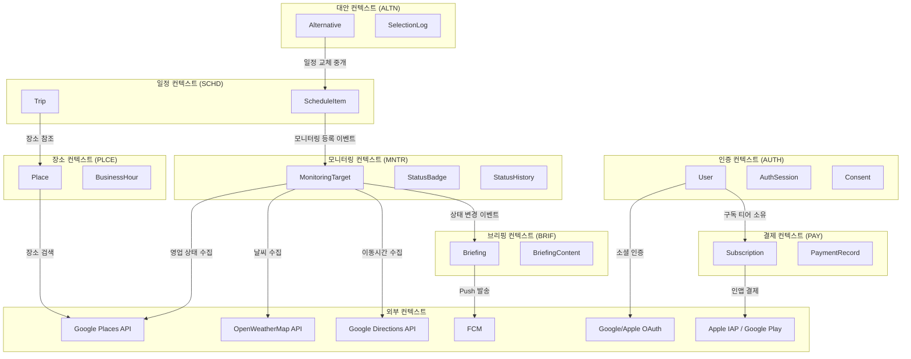
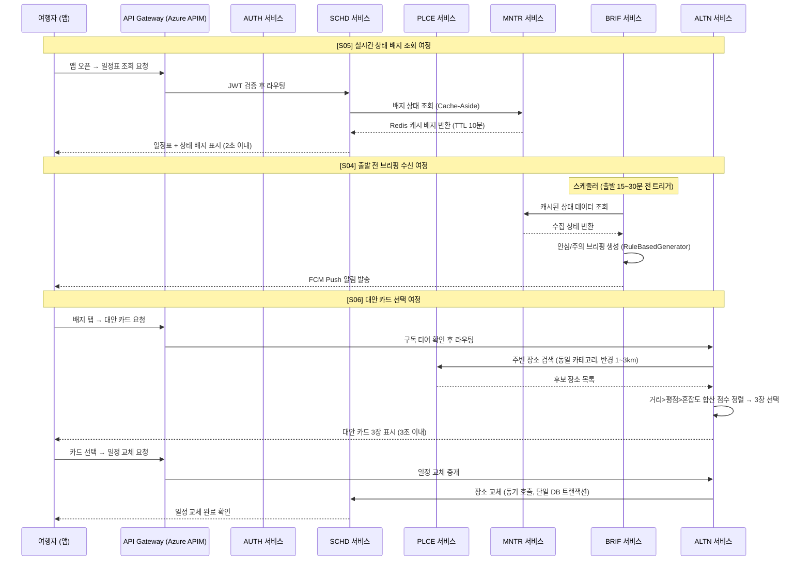
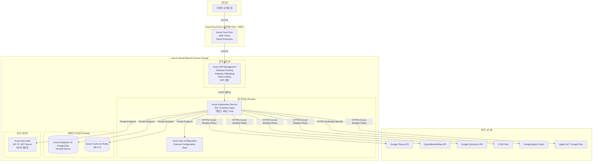
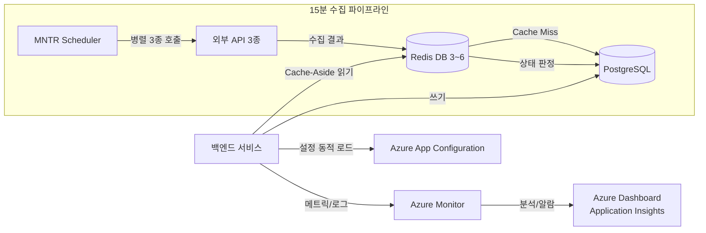
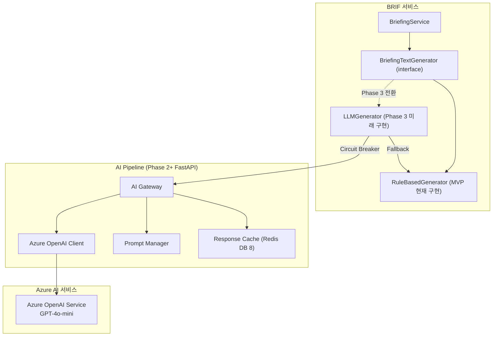

# High Level 아키텍처 정의서

> 작성자: 홍길동/아키 (소프트웨어 아키텍트)
> 작성일: 2026-02-23
> 프로젝트: travel-planner — 여행 중 실시간 일정 최적화 가이드 앱
> Cloud: Azure
> 참조: architecture.md, logical-architecture.md, 유저스토리, UI/UX 설계서

---

## 1. 개요 (Executive Summary)

### 1.1 프로젝트 개요
- **비즈니스 목적**: 해외 자유여행 중 예상치 못한 상황(날씨 악화, 영업 중단, 혼잡도 급증, 교통 지연)에서 실시간으로 일정을 재조정하고 AI 컨시어지 수준의 가이드를 제공하여 여행자의 스트레스를 제거한다.
- **핵심 솔루션**:
  - **S04 출발 전 브리핑**: 장소 출발 15~30분 전 상태 요약 Push 알림 자동 발송
  - **S05 실시간 상태 배지**: 일정표 장소마다 초록/노랑/빨강/회색 4단계 상태 배지 실시간 표시
  - **S06 맥락 맞춤 대안 카드**: 문제 장소에 대해 동일 카테고리 반경 1~3km 내 대안 3장 즉시 제공 및 탭 1회로 일정 반영
- **대상 사용자**: 해외 자유여행 중인 효율 추구형 솔로 트래블러 (25~34세)
- **예상 사용자 규모**: MVP 출시 초기 동시 모니터링 장소 200개, Phase 2에서 1,000개+ 대응

### 1.2 아키텍처 범위 및 경계
- **시스템 범위**: travel-planner 서비스 전체 (7개 마이크로서비스 + API Gateway)
- **포함되는 시스템**:
  - AUTH 서비스 (소셜 로그인, JWT 인증)
  - SCHD 서비스 (여행 일정 관리)
  - PLCE 서비스 (장소 검색)
  - MNTR 서비스 (실시간 상태 모니터링)
  - BRIF 서비스 (브리핑 생성 및 Push 알림)
  - ALTN 서비스 (대안 카드 생성 및 일정 교체)
  - PAY 서비스 (구독 결제)
  - Azure APIM (API Gateway), Azure Cache for Redis, Azure Database for PostgreSQL
- **제외되는 시스템**: 결제 게이트웨이(Apple IAP/Google Play IAP) 내부, Google/Apple OAuth 서버 내부
- **외부 시스템 연동**:
  - Google Places API (장소 검색, 영업 상태)
  - OpenWeatherMap API (날씨 데이터)
  - Google Directions API (이동시간)
  - FCM (Firebase Cloud Messaging, Push 알림)
  - Google OAuth 2.0 / Apple Sign In (소셜 로그인)
  - Apple IAP / Google Play IAP (인앱 결제)

### 1.3 문서 구성
이 문서는 4+1 뷰 모델을 기반으로 구성되며, 논리적/물리적/프로세스/개발 관점에서 아키텍처를 정의합니다.

---

## 2. 아키텍처 요구사항

### 2.1 기능 요구사항 요약
| 영역 | 주요 기능 | 우선순위 |
|------|-----------|----------|
| AUTH | Google/Apple OAuth 소셜 로그인, JWT 발급/갱신, 동의 이력 저장 | High |
| SCHD | 여행 일정 CRUD, 장소 추가/교체, 이동시간 재계산, 모니터링 이벤트 발행 | High |
| PLCE | 키워드 장소 검색, 반경 기반 주변 검색, Google Places API 연동 | High |
| MNTR | 15분 주기 외부 3종 API 수집, 4단계 상태 판정, 상태 변경 이벤트 발행 | High |
| BRIF | 출발 전 자동 브리핑 생성, FCM Push 발송, 구독 티어 분기 | High |
| ALTN | 대안 카드 3장 생성, 규칙 기반 정렬, 일정 교체 중개, Free 티어 Paywall | High |
| PAY | 구독 플랜 결제(Trip Pass, Pro), 결제 상태 관리, 환불 처리 | Medium |

### 2.2 비기능 요구사항 (NFRs)

#### 2.2.1 성능 요구사항
- **응답시간**: 일정표(배지 포함) 조회 2초 이내(P95), 대안 카드 응답 3초 이내
- **처리량**: API Gateway 충분한 TPS 대응 (Azure APIM 관리형)
- **동시사용자**: MVP 초기 동시 활성 사용자 수백 명 규모
- **데이터 처리량**: 15분 주기 외부 API 수집, 수집 타임아웃 2초 이내

#### 2.2.2 확장성 요구사항
- **수평 확장**: Azure AKS HPA 기반 서비스별 독립적 오토스케일링
- **수직 확장**: 모니터링 서비스 독립 분리 (Phase 2, 동시 모니터링 1,000개+ 조건 시)
- **글로벌 확장**: 단일 리전(Azure Korea Central) MVP, Phase 3 글로벌 확장 검토

#### 2.2.3 가용성 요구사항
- **목표 가용성**: 99.5% (브리핑 Push 알림 SLA), 전체 서비스 99%+
- **다운타임 허용**: 서비스 중단 최소화, 외부 API 장애 시 Fallback으로 핵심 기능 유지
- **재해복구 목표**: RTO 30분, RPO 1시간

#### 2.2.4 보안 요구사항
- **인증/인가**: Federated Identity (Google/Apple OAuth), JWT Access Token(30분) + Refresh Token
- **데이터 암호화**: TLS 1.3 전송 암호화, Azure Key Vault 키 관리
- **네트워크 보안**: Azure Virtual Network, Private Endpoint, WAF
- **컴플라이언스**: 개인정보보호법, 위치정보법(동의 이력 저장), GDPR 고려

### 2.3 아키텍처 제약사항
- **기술적 제약**: Java 21 / Spring Boot 3.4.x (백엔드), Python/FastAPI (AI 서비스 Phase 2+)
- **비용 제약**: 스타트업 예산 제약, Azure 관리형 서비스로 운영 부담 최소화
- **시간 제약**: MVP 5~8주 내 S04+S05+S06 출시
- **조직적 제약**: 8인 스쿼드, YAGNI 원칙 적용, 운영 오버헤드 최소화

---

## 3. 아키텍처 설계 원칙

### 3.1 핵심 설계 원칙
1. **지금 꼭 필요한 것만, 나중에 바꿀 수 있게**: MVP에서 과도한 아키텍처 선행 투자 지양, 인터페이스 추상화로 Phase 2 전환 비용 최소화
2. **외부 의존성 3중 방어**: Circuit Breaker(차단) + Retry(재시도) + Cache-Aside(Fallback) 조합으로 4개 외부 API 장애 격리
3. **단일 진입점 집중**: API Gateway에서 JWT 검증, 구독 티어 확인, Rate Limiting, 로깅 중앙화 (Gateway Offloading)
4. **부분 장애 허용**: 외부 API 일부 장애 시에도 일정 조회, 배지 표시, 브리핑 생성 핵심 기능 동작 보장
5. **이벤트 버스 추상화**: 인메모리 이벤트 버스(MVP) → Azure Service Bus(Phase 2) 코드 변경 없이 교체 가능
6. **AI 인터페이스 추상화**: `BriefingTextGenerator` 인터페이스로 규칙 기반(MVP) → Azure OpenAI(Phase 3) 전환 준비

### 3.2 아키텍처 품질 속성 우선순위
| 순위 | 품질 속성 | 중요도 | 전략 |
|------|-----------|--------|------|
| 1 | 가용성 | High | Circuit Breaker, Cache-Aside Fallback, Health Endpoint Monitoring |
| 2 | 기능 적합성 | High | MVP 핵심 기능 완성, YAGNI 원칙, Federated Identity |
| 3 | 운영 용이성 | High | External Configuration Store, Azure 관리형 서비스, 단순한 패턴 선택 |
| 4 | 보안 | Medium | JWT + Gateway Offloading, Azure Key Vault, 동의 이력 저장 |
| 5 | 성능 | Medium | Cache-Aside, Rate Limiting, 비동기 수집 파이프라인 |
| 6 | 확장성 | Low (Phase 2) | Publisher-Subscriber 추상화, Phase 2 서비스 분리 경로 확보 |

---

## 4. 논리 아키텍처 (Logical View)

### 4.1 시스템 컨텍스트 다이어그램
논리 아키텍처 다이어그램 파일: `docs/design/logical-architecture.md`

주요 구성 요소:
- **모바일 클라이언트** → HTTPS → **Azure APIM (API Gateway)**
- **API Gateway** → HTTP(내부망) → **7개 마이크로서비스**
- **마이크로서비스** ↔ **이벤트 버스** (비동기), **Redis 캐시**, **PostgreSQL DB**
- **마이크로서비스** → HTTPS → **외부 API 4종** (Google Places, OpenWeatherMap, Google Directions, FCM)

### 4.2 도메인 아키텍처
#### 4.2.1 도메인 모델
| 도메인 | 책임 | 주요 엔티티 |
|--------|------|-------------|
| AUTH | 소셜 인증, JWT 발급, 동의 이력 | User, AuthSession, Consent |
| SCHD | 여행 일정 원천 데이터, 모니터링 이벤트 발행 | Trip, ScheduleItem, TravelRoute |
| PLCE | 장소 데이터 단일 소유자, Google Places 격리 | Place, BusinessHour, Coordinates |
| MNTR | 실시간 상태 파이프라인, 4단계 판정 | MonitoringTarget, StatusBadge, CollectedData, StatusHistory |
| BRIF | 브리핑 생성, FCM Push, 총평 텍스트 생성 | Briefing, BriefingContent, BriefingLog |
| ALTN | 대안 카드 생성, 규칙 기반 정렬, 일정 교체 중개 | Alternative, ScoreWeights, SelectionLog |
| PAY | 구독 결제, 플랜 관리, 환불 | Subscription, PaymentRecord, SubscriptionPlan |

#### 4.2.2 바운디드 컨텍스트

### 4.3 서비스 아키텍처
#### 4.3.1 마이크로서비스 구성
| 서비스명 | 책임 |
|----------|------|
| AUTH Service | Federated Identity(Google/Apple OAuth), JWT Access/Refresh Token 발급, 구독 티어 클레임 포함, 위치정보 동의 이력 저장 |
| SCHD Service | 여행 일정 CRUD, 장소 추가/교체, IANA 현지시간 저장, 이동시간 재계산, 모니터링 이벤트 발행 |
| PLCE Service | 키워드/반경 장소 검색, Google Places API 연동(Circuit Breaker+Retry), 장소 데이터 Cache-Aside |
| MNTR Service | 15분 주기 외부 3종 API 병렬 수집, 4단계 상태 판정, External Config Store 임계값, 상태 변경 이벤트 발행 |
| BRIF Service | 출발 15~30분 전 브리핑 자동 생성, 멱등성 보장, FCM Push 발송, 구독 티어 분기(Free 1일 1회) |
| ALTN Service | 맥락 기반 대안 카드 3장 생성, 거리>평점>혼잡도 정렬, 일정 교체 중개, Free 티어 Paywall |
| PAY Service | 구독 플랜(Trip Pass/Pro) 결제, Apple IAP/Google Play IAP 연동, 구독 상태 관리 |

#### 4.3.2 서비스 간 통신 패턴
- **동기 통신**: REST API (JSON/HTTPS) — SCHD→PLCE, ALTN→PLCE, ALTN→SCHD, BRIF→MNTR
- **비동기 통신**: Publisher-Subscriber 이벤트 버스 — `ScheduleItemAdded/Replaced/Removed`(SCHD→MNTR), `PlaceStatusChanged`(MNTR→BRIF)
- **데이터 일관성**: MVP 모놀리스 단일 DB 트랜잭션(일정 교체), Phase 2 서비스 분리 후 Saga 패턴 도입

---

## 5. 프로세스 아키텍처 (Process View)

### 5.1 주요 비즈니스 프로세스
#### 5.1.1 핵심 사용자 여정

#### 5.1.2 시스템 간 통합 프로세스
외부 시퀀스 설계서 경로: `docs/design/sequence/outer/`

주요 시나리오:
- `01-소셜로그인.puml`: Google/Apple OAuth → JWT 발급 흐름
- `02-온보딩.puml`: 첫 실행 온보딩 3단계 가이드
- `03-여행일정등록.puml`: 일정 생성 → 모니터링 등록
- `05-외부데이터수집.puml`: 15분 주기 3종 API 병렬 수집
- `06-상태배지조회.puml`: 캐시 기반 배지 조회
- `07-출발전브리핑.puml`: 브리핑 생성 → FCM Push
- `09-대안장소검색.puml`: 맥락 기반 대안 카드 생성
- `10-대안카드선택및일정반영.puml`: 일정 교체 트랜잭션
- `11-구독결제.puml`: IAP 연동 결제 흐름

### 5.2 동시성 및 동기화
- **동시성 처리 전략**: Stateless 서비스 설계, Redis 기반 세션 공유, 스케줄러 내부 Rate Limit 예외 처리
- **락 관리**: 일정 교체 시 Optimistic Lock 적용 (version 컬럼), 브리핑 생성 멱등성 키(장소ID + 출발시간 해시)
- **이벤트 순서 보장**: MVP 인메모리 이벤트 버스 단순 순서 처리, Phase 2 Azure Service Bus Session 기반 순서 보장

---

## 6. 개발 아키텍처 (Development View)

### 6.1 개발 언어 및 프레임워크 선정
#### 6.1.1 백엔드 기술스택
| 서비스 | 언어 | 프레임워크 | 선정 이유 |
|----------|------|---------------|----------|
| AUTH | Java 21 | Spring Boot 3.4.x | 안정성, Spring Security OAuth2 생태계, 팀 역량 |
| SCHD | Java 21 | Spring Boot 3.4.x | 일관된 기술스택, 트랜잭션 관리 |
| PLCE | Java 21 | Spring Boot 3.4.x | WebClient Circuit Breaker 통합 용이 |
| MNTR | Java 21 | Spring Boot 3.4.x | @Scheduled 기반 수집 파이프라인, Resilience4j 통합 |
| BRIF | Java 21 | Spring Boot 3.4.x | 이벤트 리스너, FCM SDK 통합 |
| ALTN | Java 21 | Spring Boot 3.4.x | 정렬 로직 단순, 동기 호출 중심 |
| PAY | Java 21 | Spring Boot 3.4.x | 결제 안정성, 팀 역량 |
| AI 서비스 | Python 3.12 | FastAPI 0.115.x | Phase 2+ 도입. LLM API 통합, AI 생태계 |

#### 6.1.2 프론트엔드 기술스택
유저스토리(UFR)와 UI/UX 설계서 분석 결과:

- **플랫폼**: iOS + Android 크로스플랫폼 (모바일 전용)
- **언어**: Dart
- **프레임워크**: **Flutter 3.x** (권장)
- **선정 이유**:
  - UI/UX 설계서 핵심 원칙 "미디어 몰입(Media-Immersive)" — 다크 배경, 풀 블리드 장소 카드, 그라디언트 오버레이 등 커스텀 UI 구현 자유도가 React Native 대비 우수
  - "한눈에 파악(Glanceable)" 원칙 — 60fps 보장 네이티브 렌더링으로 배지 상태 즉각 갱신
  - 하단 탭 바 3탭 구조, 바텀시트 계층화 등 Material Design 기반 구현 일관성
  - Push 알림(FCM), OAuth(Google/Apple), 위치정보 권한 처리 등 네이티브 통합 플러그인 성숙도
  - Apple Sign In 필수 지원(UFR-AUTH-010) — Flutter 공식 플러그인 지원

- **주요 패키지**:
  - `firebase_messaging`: FCM Push 알림
  - `google_sign_in` / `sign_in_with_apple`: 소셜 로그인
  - `dio`: HTTP 클라이언트 (인터셉터 기반 JWT 자동 갱신)
  - `flutter_riverpod` 또는 `bloc`: 상태 관리
  - `go_router`: 네비게이션

### 6.2 서비스별 개발 아키텍처 패턴
| 서비스 | 아키텍처 패턴 | 선정 이유 |
|--------|---------------|-----------|
| AUTH | Layered Architecture | 인증 CRUD 중심, 명확한 계층 분리, 팀 역량 |
| SCHD | Layered Architecture | 일정 CRUD + 이벤트 발행, 단순한 비즈니스 로직 |
| PLCE | Layered Architecture | 외부 API 연동 중심, Client 클래스로 의존성 분리 |
| MNTR | Layered Architecture | 수집-판정-발행 파이프라인 명확한 계층 분리 |
| BRIF | Layered Architecture | generator 서브패키지로 총평 생성 인터페이스 추상화 |
| ALTN | Layered Architecture | scoring 서브패키지로 정렬 로직 분리 |
| PAY | Layered Architecture | 결제 CRUD 중심, 외부 IAP 클라이언트 분리 |

패키지 구조: `Controller → Service → Repository → Domain` (4계층)
외부 서비스 호출: `client/` 패키지로 분리, 서비스 간 크로스 참조 금지

패키지 구조도 파일: `docs/design/class/package-structure.md`

### 6.3 개발 가이드라인
- **코딩 표준**: [개발주석표준](https://github.com/unicorn-plugins/npd/blob/main/resources/standards/standard_comment.md)
- **테스트 전략**: [테스트코드표준](https://github.com/unicorn-plugins/npd/blob/main/resources/standards/standard_testcode.md)

---

## 7. 물리 아키텍처 (Physical View)

### 7.1 클라우드 아키텍처 패턴
#### 7.1.1 선정된 클라우드 패턴
- **패턴명**: Gateway Routing + Gateway Offloading + Cache-Aside + Circuit Breaker + Retry + Publisher-Subscriber + Rate Limiting + Federated Identity + External Configuration Store + Health Endpoint Monitoring
- **적용 이유**: 외부 API 4종 동시 의존 구조에서 장애 격리 필수(Circuit Breaker), 읽기/쓰기 불균형 해소(Cache-Aside), 비용 효율적 소셜 인증(Federated Identity)
- **예상 효과**: 외부 API 장애 시 Fallback 성공률 95%+, 배지 조회 응답 2초 이내(P95), 브리핑 Push SLA 99.5%+

#### 7.1.2 클라우드 제공자
- **주 클라우드**: Microsoft Azure (Korea Central 리전)
- **멀티 클라우드 전략**: 단일 클라우드 (운영 단순성 우선, 5~8인 팀)
- **하이브리드 구성**: 없음 (클라우드 네이티브 신규 서비스)

### 7.2 인프라스트럭처 구성
#### 7.2.1 컴퓨팅 리소스
| 구성요소 | 사양 | 스케일링 전략 |
|----------|------|---------------|
| API Gateway | Azure API Management (Consumption Tier → Standard Tier) | 자동 확장 (Azure 관리형) |
| 백엔드 서비스 (MVP) | Azure Container Apps 또는 AKS — 모놀리스 단일 배포 | HPA (CPU 70% 기준) |
| 백엔드 서비스 (Phase 2) | Azure Kubernetes Service (AKS) — MNTR 서비스 독립 분리 | HPA + VPA |
| 데이터베이스 | Azure Database for PostgreSQL Flexible Server (Standard_D2s_v3) | Read Replica (Phase 2) |
| 캐시 | Azure Cache for Redis (Standard C1 → Premium P1) | 클러스터 모드 (Phase 2) |
| 설정 스토어 | Azure App Configuration | 관리형 (고가용성 내장) |

#### 7.2.2 네트워크 구성

#### 7.2.3 보안 구성
- **방화벽**: Azure Firewall + Network Security Groups (NSG)
- **WAF**: Azure Front Door WAF (OWASP Top 10 보호 규칙셋)
- **DDoS 방어**: Azure DDoS Protection (Front Door 내장)
- **VPN/Private Link**: Azure Private Endpoint (PostgreSQL, Redis, Key Vault, App Configuration)

---

## 8. 기술 스택 아키텍처

### 8.1 API Gateway & Service Mesh
#### 8.1.1 API Gateway
- **제품**: Azure API Management (APIM)
- **주요 기능**: JWT 검증(Gateway Offloading), 경로 기반 라우팅(Gateway Routing), Rate Limiting(구독 티어별), 요청/응답 로깅, Health Check 집계
- **설정 전략**: Inbound Policy로 JWT 검증, Rate Limit 정책 적용; Outbound Policy로 응답 변환; subscription key 비활성화(JWT 단일 인증)

#### 8.1.2 Service Mesh
- **제품**: 미적용 (MVP 단계 단순성 우선)
- **적용 범위**: 없음 — 서비스 수가 7개로 Service Mesh 오버헤드 불필요
- **트래픽 관리**: Azure APIM + Kubernetes 네이티브 서비스 디스커버리로 처리

### 8.2 데이터 아키텍처
#### 8.2.1 데이터베이스 전략
| 용도 | 데이터베이스 | 타입 | 특징 |
|------|-------------|------|------|
| 트랜잭션 (전체 서비스) | Azure Database for PostgreSQL Flexible Server 17.x | RDBMS | ACID 보장, JSONB 지원, 서비스별 논리 스키마 분리 |
| 캐시 (전체 서비스) | Azure Cache for Redis 7.x | In-Memory | DB 0~8 논리 분리, TTL 기반 Cache-Aside |
| 설정 (MNTR 임계값) | Azure App Configuration | Key-Value Store | 재배포 없이 운영 중 임계값 변경 |
| 로그 & 메트릭 | Azure Monitor Logs (Log Analytics) | 관리형 | KQL 쿼리, Application Insights 연동 |
| AI 응답 캐시 (Phase 2+) | Azure Cache for Redis DB 8 | In-Memory | LLM API 비용 절감 |

#### 8.2.2 데이터 파이프라인

### 8.3 백킹 서비스 (Backing Services)
#### 8.3.1 메시징 & 이벤트 스트리밍
- **메시지 큐 (MVP)**: 인메모리 이벤트 버스 (Spring Application Event 기반)
  - 이벤트 종류: `ScheduleItemAdded`, `ScheduleItemReplaced`, `ScheduleItemRemoved`, `PlaceStatusChanged`
- **메시지 큐 (Phase 2)**: Azure Service Bus Standard Tier
  - 전환 조건: 동시 모니터링 장소 1,000개 초과 또는 인메모리 버스 안정성 이슈
  - Session 기반 메시지 순서 보장
- **이벤트 스트리밍**: 미적용 (MVP 규모에서 불필요)

#### 8.3.2 스토리지 서비스
- **객체 스토리지**: Azure Blob Storage (로그 아카이브, 브리핑 텍스트 이력 장기 보관)
- **블록 스토리지**: Azure Managed Disks (AKS 노드 OS 디스크)
- **파일 스토리지**: 미적용

### 8.4 관측 가능성 (Observability)
#### 8.4.1 로깅 전략
- **로그 수집**: Azure Monitor Agent + Spring Boot Actuator (logback → Azure Log Analytics)
- **로그 저장**: Azure Monitor Logs (Log Analytics Workspace, 30일 보관)
- **로그 분석**: KQL (Kusto Query Language) — 오류율, 외부 API Circuit Breaker 상태 추적

#### 8.4.2 모니터링 & 알람
- **메트릭 수집**: Azure Monitor Metrics + Spring Boot Micrometer → Prometheus 형식
- **시각화**: Azure Application Insights + Azure Dashboard (Grafana 연동 선택)
- **알람 정책**: CPU 70% 초과, 에러율 5% 초과, 배지 수집 파이프라인 실패, Circuit Breaker OPEN 상태 알림

#### 8.4.3 분산 추적
- **추적 도구**: Azure Application Insights (분산 추적, Spring Boot OpenTelemetry 연동)
- **샘플링 전략**: 적응형 샘플링 (Application Insights 기본값, 트래픽 증가 시 조정)
- **성능 분석**: End-to-end 요청 추적, 외부 API 호출 지연시간 분리 측정

---

## 9. AI/ML 아키텍처

### 9.1 AI API 통합 전략
#### 9.1.1 AI 서비스/모델 매핑
| 목적 | 서비스 | 모델/구현 | Input 데이터 | Output 데이터 | SLA | Phase |
|------|--------|-----------|-------------|-------------|-----|-------|
| 브리핑 총평 생성 | BRIF (RuleBasedGenerator) | 규칙 기반 템플릿 엔진 | 배지 상태, 위험 항목 | 안심/주의 텍스트 | N/A | MVP |
| 대안 카드 정렬 | ALTN (ScoreCalculator) | 규칙 기반 점수 계산 | 거리, 평점, 혼잡도 | 정렬된 3장 카드 | N/A | MVP |
| 브리핑 총평 생성 (AI) | BRIF (LLMGenerator) | Azure OpenAI GPT-4o-mini | 배지 상태, 위험 항목, 사용자 맥락 | 자연어 총평 | 99.9% | Phase 3 |
| 대안 추천 이유 (AI) | ALTN | Azure OpenAI GPT-4o-mini | 사용자 선호, 대안 후보 | 추천 이유 텍스트 | 99.9% | Phase 3 |
| 상태 판정 AI (미래) | MNTR | Azure Machine Learning | 수집 이력 데이터 | 상태 판정 모델 | - | Phase 3 |

#### 9.1.2 AI 서비스 아키텍처 개요 (Phase 3 목표)

**AI 아키텍처 핵심 원칙**:
- **MVP 인터페이스 추상화**: `BriefingTextGenerator` 인터페이스로 규칙 기반/LLM 구현체 교체 가능
- **Circuit Breaker 적용**: LLM API 장애 시 `RuleBasedGenerator` 자동 Fallback (3회/30초 실패 → OPEN)
- **AI 학습 데이터 MVP 수집**: 상태 판정 이력(MNTR), 대안 카드 선택 이력(ALTN), 브리핑 열람 여부(BRIF) 수집

### 9.2 프롬프트 관리 전략
- **MVP**: 프롬프트 없음 (규칙 기반 템플릿만 사용)
- **Phase 3 도입 시**:
  - 프롬프트 버전 관리: Azure App Configuration에 프롬프트 템플릿 외부화
  - 시스템 프롬프트: "여행 컨시어지" 페르소나, 간결하고 실용적인 한국어 응답
  - 사용자 맥락 주입: 방문 장소명, 현지 시간, 배지 상태, 위험 항목 목록

### 9.3 AI 비용/성능 최적화
- **Response Cache**: Azure Cache for Redis DB 8에 LLM 응답 캐시 (동일 맥락 요청 재사용, TTL 30분)
- **Rate Limiting**: Azure APIM Rate Limiting + 서비스 레이어 이중 방어 (LLM API 비용 폭발 방지)
- **모델 선택**: GPT-4o-mini (비용 효율, 짧은 텍스트 생성 충분)
- **토큰 최적화**: 입력 맥락 정보 최소화 (배지 상태 코드 축약 전달)

---

## 10. 개발 운영 (DevOps)

### 10.1 CI/CD 파이프라인
#### 10.1.1 지속적 통합 (CI)
- **도구**: GitHub Actions
- **빌드 전략**: Multi-stage Docker 빌드 (JDK 21 빌드 → JRE 21 런타임 이미지), 이미지 푸시 → Azure Container Registry (ACR)
- **테스트 자동화**:
  - Unit Test: JUnit 5 + Mockito (서비스 레이어)
  - Integration Test: Testcontainers (PostgreSQL, Redis 컨테이너)
  - API Test: Spring MVC Test (Controller 레이어)
  - 커버리지: JaCoCo (Line Coverage 80%+ 목표)
- **품질 게이트**: SonarQube 또는 GitHub Code Scanning

#### 10.1.2 지속적 배포 (CD)
- **배포 도구**: ArgoCD (GitOps 기반)
  - GitHub Actions CI → ACR 이미지 푸시 → Helm Chart values 업데이트 → ArgoCD 자동 Sync
- **배포 전략**: Rolling Update (MVP), Blue-Green 배포 (Phase 2 이후 무중단 배포 강화)
- **롤백 정책**: ArgoCD 이전 Revision 즉시 롤백, 헬스체크 `/actuator/health` 실패 시 자동 롤백

### 10.2 컨테이너 오케스트레이션
#### 10.2.1 Kubernetes 구성 (Azure AKS)
- **클러스터 전략**:
  - MVP: Azure Container Apps (단순 배포, AKS 관리 오버헤드 최소화) 또는 AKS Basic
  - Phase 2: Azure Kubernetes Service (AKS) Standard — MNTR 서비스 독립 분리
- **네임스페이스 설계**:
  - `travel-planner-dev`: 개발 환경
  - `travel-planner-staging`: 스테이징 환경
  - `travel-planner-prod`: 운영 환경
- **리소스 관리**: Resource Quota (네임스페이스별), Limit Range (Pod별 CPU/Memory 상한)

#### 10.2.2 헬름 차트 관리
- **차트 구조**: 단일 Helm Chart (모놀리스 MVP), 서비스별 개별 차트 (Phase 2 분리 시)
- **환경별 설정**: `values-dev.yaml`, `values-staging.yaml`, `values-prod.yaml`
- **의존성 관리**: PostgreSQL, Redis 의존 Chart (개발 환경), 운영 환경은 Azure 관리형 서비스 사용

---

## 11. 보안 아키텍처

### 11.1 보안 전략
#### 11.1.1 보안 원칙
- **Zero Trust**: 모든 요청을 신뢰하지 않음. API Gateway에서 JWT 검증 필수 (내부 서비스 간 통신은 VNet 내부로 신뢰)
- **Defense in Depth**: Front Door WAF → API Gateway Rate Limiting → JWT 검증 → 서비스 레이어 Paywall 확인 → DB Private Endpoint 다층 방어
- **Least Privilege**: Azure Managed Identity 기반 서비스-리소스 접근 권한 최소화, Key Vault 비밀 접근 Role 분리

#### 11.1.2 위협 모델링
| 위협 | 영향도 | 대응 방안 |
|------|--------|-----------|
| DDoS 공격 | High | Azure Front Door DDoS Protection, API Gateway Rate Limiting |
| JWT 토큰 탈취 | High | Access Token 30분 단기 만료, Redis 블랙리스트 즉시 무효화, TLS 1.3 전송 |
| 외부 API 키 유출 | High | Azure Key Vault 저장, 환경변수 직접 노출 금지, Managed Identity 사용 |
| 위치정보 무단 수집 | Medium | 동의 이력 저장 (consent_records), 위치정보법 준수, 수집 목적 명시 |
| 결제 정보 탈취 | High | PCI DSS 준수 IAP 게이트웨이 위임, 카드 정보 직접 저장 금지 |
| API 악용 (Free 티어 우회) | Medium | Gateway Offloading 구독 티어 검증, 서비스 레이어 이중 방어 |

### 11.2 보안 구현
#### 11.2.1 인증 & 인가
- **ID 제공자**: Google OAuth 2.0 + Apple Sign In (Federated Identity 패턴)
- **토큰 전략**:
  - Access Token: JWT (HS256), 만료 30분, 구독 티어 클레임 포함
  - Refresh Token: 불투명 토큰 (UUID), Redis DB 1 저장, 만료 30일
  - JWT 블랙리스트: Redis DB 0 (`auth:blacklist:{jti}`), 로그아웃 시 등록
- **권한 모델**: RBAC — `FREE`, `TRIP_PASS`, `PRO` 구독 티어 기반 기능 접근 제어

#### 11.2.2 데이터 보안
- **암호화 전략**:
  - 전송 중: TLS 1.3 (Front Door → APIM → 서비스 전 구간)
  - 저장 중: Azure Database for PostgreSQL 투명 데이터 암호화 (TDE), Redis AOF 암호화
- **키 관리**: Azure Key Vault (Google Places API 키, OpenWeatherMap API 키, JWT Secret, DB 자격증명, FCM 서비스 계정)
- **데이터 마스킹**: 로그에서 사용자 ID, 위치 좌표 마스킹 처리

---

## 12. 품질 속성 구현 전략

### 12.1 성능 최적화
#### 12.1.1 캐싱 전략
| 계층 | 캐시 유형 | TTL | 무효화 전략 | Redis DB |
|------|-----------|-----|-------------|----------|
| CDN | Azure Front Door | 24시간 | 정적 에셋 변경 시 | - |
| 세션/토큰 | Redis (AUTH) | 30분 (세션) / 30일 (Refresh) | 로그아웃 시 즉시 | DB 0, DB 1 |
| 장소 데이터 | Redis (PLCE) | 5분 | 구글 Places API 갱신 시 | DB 3 |
| 배지 상태 (읽기) | Redis (MNTR) | 10분 | PlaceStatusChanged 이벤트 수신 시 즉시 | DB 4 |
| 날씨 데이터 | Redis (MNTR) | 10분 | 수집 주기(15분)보다 짧게 설정 | DB 4 |
| 이동시간 | Redis (MNTR) | 30분 | 수집 갱신 시 | DB 4 |
| 대안 카드 | Redis (ALTN) | 5분 | ScheduleItemReplaced 이벤트 수신 시 | DB 6 |
| 구독 상태 | Redis (PAY) | 60분 | 결제 상태 변경 시 즉시 | DB 7 |
| LLM 응답 (Phase 3) | Redis (AI) | 30분 | 맥락 변경 시 | DB 8 |

**캐시 설계 원칙**: 배지 상태 캐시 TTL(10분)을 수집 주기(15분)보다 짧게 설정하여 Cache-Aside와 실시간 배지 요구 충돌 방지

#### 12.1.2 데이터베이스 최적화
- **인덱싱 전략**: 장소 ID + 상태 복합 인덱스(MNTR), 여행 ID + 일자 복합 인덱스(SCHD), 사용자 ID + 생성일시 인덱스(BRIF)
- **쿼리 최적화**: N+1 문제 해결 (JPA fetch join, DTO Projection), EXPLAIN ANALYZE 주기적 분석
- **커넥션 풀링**: HikariCP (최대 20 커넥션/서비스, Connection Timeout 30초)

### 12.2 확장성 구현
#### 12.2.1 오토스케일링
- **수평 확장**: Kubernetes HPA (CPU 70% 기준 Pod 스케일 아웃)
- **수직 확장**: Azure Kubernetes VPA (메모리 기반, Phase 2 도입)
- **예측적 스케일링**: Azure Monitor 메트릭 기반 사전 스케일링 (Phase 2)

#### 12.2.2 부하 분산
- **로드 밸런서**: Azure Front Door (글로벌) + Azure Load Balancer (AKS 내부)
- **트래픽 분산 정책**: Round Robin (기본), 헬스체크 기반 자동 제외
- **헬스체크**: `GET /actuator/health` — Spring Boot Actuator 기반, Liveness/Readiness Probe 분리

### 12.3 가용성 및 복원력
#### 12.3.1 장애 복구 전략
- **Circuit Breaker**: Resilience4j 적용
  - Google Places: 5회/1분 실패 → OPEN, Fallback: Redis 캐시값
  - OpenWeatherMap: 3회/1분 실패 → OPEN, Fallback: 마지막 캐시값
  - Google Directions: 3회/1분 실패 → OPEN, Fallback: 직선거리 추정값
  - FCM: 10회/1분 실패 → OPEN, Fallback: 인앱 알림
  - LLM API (Phase 3): 3회/30초 실패 → OPEN, Fallback: RuleBasedGenerator
- **Retry Pattern**: 지수 백오프 (1s → 2s → 4s, 최대 3회), 타임아웃 2초 이내 완료 불가 시 Cache-Aside Fallback
- **Bulkhead Pattern**: 서비스별 독립 스레드 풀 (MNTR 수집 전용 스레드 풀 분리)

#### 12.3.2 재해 복구
- **백업 전략**:
  - PostgreSQL: Azure 자동 백업 (7일 보관, Point-in-Time Restore)
  - Redis: RDB 스냅샷 (6시간 간격) + AOF 로그
  - App Configuration: Azure 자동 지역 복제
- **RTO/RPO**: RTO 30분, RPO 1시간
- **DR 사이트**: Azure Korea Central 다중 가용성 영역 (Zone-Redundant) 활용

---

## 13. 아키텍처 의사결정 기록 (ADR)

### 13.1 ADR 요약
| ID | 결정 사항 | 결정 일자 | 상태 |
|----|-----------|-----------|------|
| ADR-001 | 백엔드 프레임워크: Spring Boot 3.4.x (Java 21) 선택 | 2026-02-23 | 승인 |
| ADR-002 | 내부 아키텍처 패턴: 모든 서비스 Layered Architecture 적용 | 2026-02-23 | 승인 |
| ADR-003 | 클라우드 플랫폼: Azure 단일 클라우드 (Korea Central) | 2026-02-23 | 승인 |
| ADR-004 | 데이터베이스: PostgreSQL + Redis 이중 전략 | 2026-02-23 | 승인 |
| ADR-005 | 프론트엔드: Flutter 선택 | 2026-02-23 | 승인 |
| ADR-006 | MVP 배포 구조: 모놀리스 단일 배포 → Phase 2 MNTR 분리 | 2026-02-23 | 승인 |
| ADR-007 | AI 아키텍처: MVP 규칙 기반 → Phase 3 Azure OpenAI 전환 | 2026-02-23 | 승인 |
| ADR-008 | 이벤트 버스: 인메모리(MVP) → Azure Service Bus(Phase 2) 추상화 | 2026-02-23 | 승인 |

---

### 13.2 ADR-001: 백엔드 프레임워크 선정

#### 컨텍스트
여행 실시간 일정 최적화 서비스의 백엔드 개발을 위한 프레임워크를 선정해야 합니다. 5~8주 MVP 일정, 8인 팀, 외부 API 의존성 관리, 이벤트 기반 비동기 처리를 고려합니다.

#### 후보군
| 후보 | 설명 |
|------|------|
| **Spring Boot 3.4.x (Java 21)** | 엔터프라이즈급 Java 프레임워크, Virtual Thread 지원, GraalVM 네이티브 이미지 |
| **Quarkus (Java 21)** | 클라우드 네이티브 Java 프레임워크, 빠른 시작 시간, 낮은 메모리 |
| **Node.js (NestJS)** | 이벤트 기반 JavaScript 런타임, 높은 동시성 |
| **Go (Gin/Echo)** | 고성능 컴파일 언어, 낮은 메모리 |

#### 장단점 분석
| 후보 | 장점 | 단점 |
|------|------|------|
| **Spring Boot 3.4.x** | ✅ Resilience4j Circuit Breaker 네이티브 통합 ✅ @Scheduled 기반 15분 수집 파이프라인 간단 구현 ✅ Spring Application Event 인메모리 이벤트 버스 ✅ Spring Security OAuth2 Resource Server ✅ 팀 역량 집중, 한국 커뮤니티 | ❌ 초기 시작 시간, 메모리 상대적으로 큼 |
| **Quarkus** | ✅ 낮은 메모리, 빠른 시작 | ❌ 팀 경험 부족, 생태계 작음 |
| **NestJS** | ✅ 높은 동시성, 빠른 개발 | ❌ 타입 안전성 약함, 팀 경험 부족 |
| **Go** | ✅ 최고 성능 | ❌ 팀 경험 없음, ORM 미성숙 |

#### 결정
**Spring Boot 3.4.x (Java 21) 채택**

#### 의사결정 사유
1. **도전과제 직접 해결**: Resilience4j Circuit Breaker + Spring WebClient로 C1(외부 API 장애 격리) 즉시 구현
2. **이벤트 버스 내장**: Spring Application Event로 인메모리 이벤트 버스 구현, Phase 2 Azure Service Bus 교체 시 인터페이스 유지
3. **수집 파이프라인**: `@Scheduled` + `CompletableFuture` 병렬 처리로 15분 주기 3종 API 수집 단순 구현
4. **5~8주 일정**: 학습 시간 없이 즉시 개발 착수 가능
5. **Java 21 Virtual Thread**: 높은 동시 요청 처리 성능 개선 (수집 파이프라인 병렬 처리)

#### 결과 및 영향
- 패키지 구조: Layered Architecture (Controller → Service → Repository → Domain)
- 외부 의존성: `client/` 패키지로 격리, Circuit Breaker + Retry 적용
- AI 서비스(Phase 2+): Python/FastAPI 별도 서비스로 분리 (LLM 생태계 최적화)

---

### 13.3 ADR-002: 내부 아키텍처 패턴 선정

#### 컨텍스트
7개 마이크로서비스 각각의 내부 아키텍처 패턴을 통일해야 합니다. 서비스 복잡도, 5~8주 MVP 일정, 팀 역량을 고려합니다.

#### 후보군
| 후보 | 설명 |
|------|------|
| **Layered Architecture** | 전통적 계층형 (Controller-Service-Repository) |
| **Hexagonal Architecture** | 포트와 어댑터, 도메인 중심 |
| **Clean Architecture** | 의존성 역전, 엔티티 중심 |
| **CQRS** | 명령과 조회 분리 (읽기/쓰기 모델 분리) |

#### 장단점 분석
| 후보 | 장점 | 단점 |
|------|------|------|
| **Layered Architecture** | ✅ 팀 전원 익숙, 빠른 개발 ✅ 클래스 설계서와 직접 매핑 용이 ✅ 디버깅 단순 | ❌ 도메인 로직 분산 가능성, 대규모 한계 |
| **Hexagonal** | ✅ 도메인 순수성, 테스트 용이 | ❌ 초기 설계 복잡, 팀 경험 부족 |
| **Clean Architecture** | ✅ 의존성 명확 | ❌ 과도한 추상화, 코드량 증가 |
| **CQRS** | ✅ 읽기/쓰기 최적화 | ❌ 운영 복잡도 높음, MVP 과도함 |

#### 결정
**Layered Architecture 전 서비스 통일 적용**

#### 의사결정 사유
1. **YAGNI 원칙**: 7개 서비스 모두 현재 규모에서 Hexagonal/Clean의 복잡도 불필요
2. **BRIF 예외 적용**: `generator/` 서브패키지로 `BriefingTextGenerator` 인터페이스 추상화 — Phase 3 LLM 교체 비용 최소화
3. **ALTN 예외 적용**: `scoring/` 서브패키지로 `ScoreWeightsProvider` 인터페이스 — 가중치 전략 교체 가능
4. **CQRS 제외**: 배지 조회 읽기 트래픽 증가는 Cache-Aside로 먼저 대응 (CQRS 도입 조건: 100 RPS 초과)

#### 결과 및 영향
- 패키지 구조: `controller/ → service/ → repository/ → domain/ + client/`
- 전체 패키지 구조도: `docs/design/class/package-structure.md`

---

### 13.4 ADR-003: 클라우드 플랫폼 선정

#### 컨텍스트
서비스 배포 및 운영을 위한 클라우드 플랫폼을 선정해야 합니다. 스타트업 예산, 8인 팀 운영 역량, Azure 전문성을 고려합니다.

#### 후보군
| 후보 | 설명 |
|------|------|
| **Azure 단일 클라우드** | Microsoft Azure 서비스만 사용 |
| **AWS 단일 클라우드** | Amazon Web Services만 사용 |
| **멀티 클라우드 (Azure+AWS)** | 두 클라우드 병행 |
| **온프레미스 + 클라우드 하이브리드** | 자체 인프라 + 클라우드 혼합 |

#### 결정
**Azure 단일 클라우드 (Korea Central)**

#### 의사결정 사유
1. **팀 역량**: DevOps 담당자(파이프) Azure CKA/CKS 인증, Azure 전문성 보유
2. **서비스 통합**: Azure APIM + AKS + PostgreSQL + Redis + Key Vault + App Configuration + Monitor 통합 모니터링
3. **AI 연동 준비**: Phase 3 Azure OpenAI Service 자연스러운 연동 (동일 클라우드, Private Endpoint)
4. **한국 리전**: Azure Korea Central로 낮은 레이턴시 (대상 사용자 한국인)
5. **비용 효율**: 스타트업 예산 내 단일 클라우드 최적화 용이

#### 결과 및 영향
- 핵심 서비스: AKS, Azure Database for PostgreSQL, Azure Cache for Redis, Azure APIM
- 보안: Azure Key Vault, Azure AD Managed Identity
- 모니터링: Azure Monitor, Application Insights
- AI (Phase 3): Azure OpenAI Service

---

### 13.5 ADR-004: 데이터베이스 전략 선정

#### 컨텍스트
7개 마이크로서비스의 영속성 저장소와 캐시 전략을 결정해야 합니다. ACID 보장, 실시간 상태 배지 읽기 성능, 외부 API Fallback을 고려합니다.

#### 후보군
| 후보 | 설명 |
|------|------|
| **PostgreSQL + Redis** | 관계형 DB + 인메모리 캐시 이중 전략 |
| **PostgreSQL 단독** | 캐시 없이 PostgreSQL만 사용 |
| **MongoDB + Redis** | NoSQL 문서 DB + 캐시 |
| **Azure Cosmos DB** | 글로벌 분산 다중 모델 DB |

#### 결정
**PostgreSQL 17.x (Azure Database for PostgreSQL Flexible Server) + Redis 7.x (Azure Cache for Redis)**

#### 의사결정 사유
1. **ACID 필수**: 일정 교체 + 모니터링 대상 변경 복합 트랜잭션(C6) — 관계형 DB 필수
2. **Cache-Aside 필수**: MNTR P3 정책(3회 실패 시 캐시 사용) — Redis 없이는 구현 불가
3. **논리 분리**: Redis DB 0~8 논리 분리로 서비스별 캐시 격리, 단일 Redis 인스턴스 비용 효율
4. **PostgreSQL JSONB**: 외부 API 응답 데이터를 JSONB로 유연하게 저장 (status_history)
5. **관리형 서비스**: Azure 자동 백업, HA, 패치 관리로 운영 부담 최소화

#### 결과 및 영향
- 서비스별 논리 스키마 분리 (auth, schedule, place, monitor, briefing, alternative, payment)
- Redis DB 할당: DB 0(공통/블랙리스트), DB 1(AUTH), DB 2(SCHD), DB 3(PLCE), DB 4(MNTR), DB 5(BRIF), DB 6(ALTN), DB 7(PAY), DB 8(AI Phase 3)
- 커넥션 풀: HikariCP (최대 20 커넥션/서비스)

---

### 13.6 ADR-005: 프론트엔드 기술스택 선정

#### 컨텍스트
모바일 앱(iOS + Android) 개발을 위한 프론트엔드 기술스택을 선정해야 합니다. UI/UX 설계서의 "미디어 몰입" 원칙, Push 알림, 소셜 로그인(특히 Apple Sign In 필수) 지원을 고려합니다.

#### 후보군
| 후보 | 설명 |
|------|------|
| **Flutter 3.x** | Google Dart 기반 크로스플랫폼, 네이티브 렌더링 |
| **React Native 0.76+** | JavaScript/TypeScript 기반 크로스플랫폼 |
| **iOS Native (Swift) + Android Native (Kotlin)** | 네이티브 이중 개발 |

#### 결정
**Flutter 3.x (Dart)**

#### 의사결정 사유
1. **커스텀 UI 자유도**: "미디어 몰입" 원칙 — 다크 배경, 풀 블리드 장소 카드, 그라디언트 오버레이 등 커스텀 UI가 Skia 엔진 기반 Flutter에서 React Native 대비 자유로움
2. **성능**: 60fps 보장 네이티브 렌더링 — "한눈에 파악" 원칙, 상태 배지 즉각 갱신
3. **Apple Sign In 필수 지원**: `sign_in_with_apple` Flutter 공식 플러그인
4. **FCM Push 알림**: `firebase_messaging` Flutter 공식 플러그인, S04 브리핑 Push 핵심 기능
5. **단일 코드베이스**: iOS + Android 동시 개발, 스타트업 개발 효율

#### 결과 및 영향
- 상태관리: Flutter Riverpod 또는 BLoC 패턴
- HTTP: Dio (JWT 자동 갱신 인터셉터)
- 라우팅: go_router (딥링크, Push 알림 탭 시 화면 이동)

---

### 13.7 ADR-006: MVP 배포 구조 결정

#### 컨텍스트
7개 서비스를 어떤 배포 단위로 묶어서 출시할지 결정해야 합니다. 5~8주 MVP 일정, 운영 복잡도, Phase 2 서비스 분리 경로를 고려합니다.

#### 후보군
| 후보 | 설명 |
|------|------|
| **모놀리스 단일 배포** | 7개 서비스를 하나의 Spring Boot 애플리케이션으로 패키징 |
| **완전 마이크로서비스** | 7개 서비스 각각 독립 배포 |
| **MNTR 분리 + 나머지 모놀리스** | MNTR만 독립, 나머지 6개 모놀리스 |

#### 결정
**MVP: 모놀리스 단일 배포 → Phase 2: MNTR 서비스 우선 독립 분리**

#### 의사결정 사유
1. **5~8주 일정**: 7개 서비스 독립 배포 운영 복잡도 감당 불가
2. **인메모리 이벤트 버스**: 모놀리스 내부 Spring Application Event — 네트워크 호출 없는 단순한 이벤트 버스
3. **단일 DB 트랜잭션**: C6(일정 교체 분산 트랜잭션) — 모놀리스에서 단일 DB 트랜잭션으로 Saga 패턴 불필요
4. **Phase 2 분리 준비**: 서비스 간 크로스 참조 금지 (`client/` 패키지 경유만 허용) — 물리적 분리 시 코드 변경 최소화

#### 결과 및 영향
- 배포 단위: 단일 Docker 이미지 (MVP), MNTR 독립 이미지 (Phase 2)
- 이벤트 버스: 인터페이스 추상화 `EventPublisher` — Azure Service Bus로 교체 시 구현체만 변경
- Phase 2 전환 조건: 동시 모니터링 장소 1,000개 초과 또는 인메모리 버스 안정성 이슈

---

### 13.8 ADR-007: AI 아키텍처 결정

#### 컨텍스트
브리핑 총평 텍스트 생성, 대안 추천 이유 생성에 AI/LLM을 어떻게 도입할지 결정해야 합니다. MVP 비용, Phase 3 AI 고도화 준비, LLM 장애 대응을 고려합니다.

#### 결정
**MVP: 규칙 기반 템플릿 엔진 + BriefingTextGenerator 인터페이스 추상화 → Phase 3: Azure OpenAI GPT-4o-mini 교체**

#### 의사결정 사유
1. **비용**: MVP 출시 초기 LLM API 비용 발생 방지
2. **안정성**: LLM API 장애 시 서비스 전체 영향 방지 (규칙 기반 Fallback 보장)
3. **Phase 3 준비**: `BriefingTextGenerator` 인터페이스로 추상화 — LLM 전환 시 서비스 코드 무변경
4. **AI 학습 데이터 수집**: MVP 단계부터 상태 판정 이력, 대안 선택 이력, 브리핑 열람 이력 수집

#### 결과 및 영향
- MVP: `RuleBasedBriefingGenerator` 구현체 (안심/주의 분기 템플릿)
- Phase 3: `LLMBriefingGenerator` 구현체 추가, Circuit Breaker → `RuleBasedBriefingGenerator` Fallback
- AI 서비스 언어: Python/FastAPI (Phase 2+ 별도 서비스, LLM 생태계 최적화)

---

### 13.9 ADR-008: 이벤트 버스 추상화 전략

#### 컨텍스트
서비스 간 비동기 이벤트 통신을 위한 이벤트 버스를 선택해야 합니다. MVP 단순성, Phase 2 서비스 분리 후에도 이벤트 연동 유지가 필요합니다.

#### 결정
**MVP: Spring Application Event (인메모리) + EventPublisher 인터페이스 추상화 → Phase 2: Azure Service Bus Standard**

#### 의사결정 사유
1. **MVP 단순성**: 인메모리 이벤트 버스 — 네트워크 없음, 설정 없음, 즉시 사용
2. **인터페이스 추상화**: `EventPublisher` 인터페이스 — Azure Service Bus 교체 시 서비스 코드 무변경
3. **Phase 2 준비**: Azure Service Bus Session 기반 이벤트 순서 보장 (MNTR 서비스 분리 후)

#### 결과 및 영향
- 이벤트 인터페이스: `EventPublisher.publish(event)` 단일 메서드
- MVP 구현: `InMemoryEventPublisher` (Spring ApplicationEventPublisher 위임)
- Phase 2 구현: `ServiceBusEventPublisher` (Azure SDK)
- 이벤트 종류: `ScheduleItemAdded`, `ScheduleItemReplaced`, `ScheduleItemRemoved`, `PlaceStatusChanged`

---

### 13.10 트레이드오프 분석

#### 13.10.1 성능 vs 일관성 (Cache-Aside TTL)
- **고려사항**: 배지 상태 캐시 TTL을 짧게 → 실시간성 향상, 캐시 HIT율 저하 / 길게 → 성능 향상, 지연된 배지 표시
- **선택**: 배지 상태 TTL 10분 (수집 주기 15분보다 짧게)
- **근거**: 상태 변경 이벤트 수신 시 즉시 캐시 무효화 (Cache Invalidation) 병행 → 최악의 경우 10분 지연 수용

#### 13.10.2 단순성 vs 유연성 (모놀리스 vs 마이크로서비스)
- **고려사항**: 모놀리스 → 개발 속도 우선, 마이크로서비스 → 확장성 우선
- **선택**: MVP 모놀리스 (단순성 우선), Phase 2 MNTR 분리 (확장성 대응)
- **근거**: C2(주기적 대량 수집) 도전과제는 MNTR 단독 스케일링이 필요한 유일한 서비스 — 나머지 6개 서비스는 모놀리스 유지로 운영 단순성 확보

#### 13.10.3 일관성 vs 가용성 (CAP 정리)
- **선택**: AP (Availability + Partition tolerance)
- **근거**: 여행 중 앱 사용 특성 상 일정 조회, 배지 표시는 실시간 완벽 일관성보다 가용성(항상 응답 가능)이 우선. 캐시 Fallback으로 다소 지연된 데이터 제공 수용.

---

## 14. 구현 로드맵

### 14.1 개발 단계
| 단계 | 기간 | 주요 산출물 | 마일스톤 |
|------|------|-------------|-----------|
| Phase 1 (MVP) | 5~8주 | S04+S05+S06 핵심 기능 출시 | 일정 등록, 배지 표시, 브리핑 Push, 대안 카드 3장 |
| Phase 2 (확장) | MVP 이후 3~4개월 | MNTR 서비스 분리, Azure Service Bus 전환 | 동시 모니터링 1,000개+, MAU 확장 |
| Phase 3 (고도화) | Phase 2 이후 6개월+ | Azure OpenAI 연동, AI 자동 재조정(S03), 글로벌 확장 | LLM 브리핑 총평, 완전 마이크로서비스 |

### 14.2 Sprint별 패턴 구현 계획
| Sprint | 구현 패턴 | 적용 서비스 | 주요 산출물 |
|:------:|---------|:----------:|-----------|
| Sprint 1 | Gateway Routing, Federated Identity, Health Endpoint Monitoring, Cache-Aside (장소), Retry | API Gateway, AUTH, PLCE | JWT 인증, 서비스 라우팅, 장소 검색 캐싱 |
| Sprint 2 | Publisher-Subscriber (인메모리), External Configuration Store, Circuit Breaker + Cache-Aside (수집) | SCHD, MNTR | 이벤트 버스, 임계값 설정, 외부 API 장애 격리 |
| Sprint 3 | Gateway Offloading (JWT 검증), Rate Limiting (구독 티어), Circuit Breaker (FCM), Cache-Aside (대안) | API Gateway, BRIF, ALTN, PAY | 브리핑 Push, 대안 카드, 구독 결제 |

---

## 15. 위험 관리

### 15.1 아키텍처 위험
| 위험 | 영향도 | 확률 | 완화 방안 |
|------|--------|------|-----------|
| Google Places API 정책 변경/비용 급증 | High | Medium | Circuit Breaker Fallback 캐시, 대체 API(Foursquare, Kakao Maps) 전환 고려 |
| 모니터링 수집 파이프라인 타임아웃 초과 | High | Medium | 수집 타임아웃 2초 하드 리밋, Circuit Breaker OPEN 시 회색 배지 Fallback |
| FCM Push 알림 지연/미도달 | High | Low | Circuit Breaker + 인앱 알림 Fallback, 브리핑 목록 탭에서 직접 확인 경로 보장 |
| Azure 리전 장애 | High | Low | Azure 다중 가용성 영역, Azure SLA 99.9% 이상 서비스 선택 |
| Apple Sign In 정책 변경 | Medium | Low | Federated Identity 추상화로 대체 OAuth 공급자 교체 가능 |
| MVP 모놀리스 메모리 부족 (15분 수집 + 서비스 동시 처리) | Medium | Medium | MNTR 수집 전용 Bulkhead 스레드 풀 분리, 수직 스케일링 준비 |

### 15.2 기술 부채 관리
- **식별된 기술 부채**:
  - MVP 모놀리스: Phase 2 서비스 분리 시 배포 파이프라인 재구성 필요
  - 인메모리 이벤트 버스: 서비스 재시작 시 미처리 이벤트 손실 가능 (수용 가능 리스크)
  - Layered Architecture: MNTR 서비스 도메인 로직 증가 시 계층 비대화 가능
- **해결 우선순위**:
  1. Phase 2: MNTR 분리 + Azure Service Bus 전환 (확장성)
  2. Phase 2: Read Replica 도입 (배지 조회 읽기 부하)
  3. Phase 3: Azure OpenAI LLM 연동 (AI 고도화)
- **해결 계획**: Phase별 전환 조건 지표(모니터링 장소 수, 응답시간, RPS) 기반 의사결정

---

## 16. 부록

### 16.1 참조 아키텍처
- **업계 표준**:
  - Microsoft Azure Well-Architected Framework
  - 12-Factor App
  - Cloud Design Patterns (Microsoft)
- **내부 표준**:
  - 개발주석표준: https://github.com/unicorn-plugins/npd/blob/main/resources/standards/standard_comment.md
  - 테스트코드표준: https://github.com/unicorn-plugins/npd/blob/main/resources/standards/standard_testcode.md
- **외부 참조**:
  - Spring Boot Best Practices (spring.io)
  - Resilience4j Circuit Breaker 공식 문서
  - Azure API Management 정책 레퍼런스

### 16.2 용어집
| 용어 | 정의 |
|------|------|
| S04 | 출발 전 브리핑 솔루션 — 장소 출발 15~30분 전 Push 알림 자동 발송 |
| S05 | 실시간 상태 배지 솔루션 — 일정표 장소마다 4단계 색상 배지 실시간 표시 |
| S06 | 맥락 맞춤 대안 카드 솔루션 — 문제 장소 대안 3장 즉시 제공 및 탭 1회 일정 반영 |
| SCHD | Schedule 서비스 — 여행 일정 관리 |
| PLCE | Place 서비스 — 장소 검색 및 데이터 관리 |
| MNTR | Monitor 서비스 — 실시간 상태 모니터링 파이프라인 |
| BRIF | Briefing 서비스 — 브리핑 생성 및 Push 알림 |
| ALTN | Alternative 서비스 — 대안 카드 생성 및 일정 교체 |
| PAY | Payment 서비스 — 구독 결제 |
| Circuit Breaker | 외부 API 연속 실패 시 호출 차단, Fallback 응답 반환하는 복원력 패턴 |
| Cache-Aside | 캐시 조회 → Miss 시 원본 조회 → 캐시 저장 패턴 |
| Federated Identity | 외부 OAuth 공급자에 인증을 위임하는 패턴 |
| Gateway Offloading | JWT 검증, Rate Limiting 등 횡단관심사를 API Gateway에 집중하는 패턴 |
| YAGNI | You Aren't Gonna Need It — 지금 당장 필요하지 않은 기능/설계는 구현하지 않는 원칙 |
| BriefingTextGenerator | 브리핑 총평 생성 인터페이스 — 규칙 기반(MVP)/LLM(Phase 3) 구현체 교체 가능 |
| IAP | In-App Purchase — Apple App Store / Google Play Store 인앱 결제 |

### 16.3 관련 문서
- 아키텍처 패턴 선정 설계서: `docs/design/architecture.md`
- 논리 아키텍처 설계서: `docs/design/logical-architecture.md`
- 논리 아키텍처 다이어그램: `docs/design/logical-architecture.mmd`
- 외부 시퀀스 설계서: `docs/design/sequence/outer/`
- 내부 시퀀스 설계서: `docs/design/sequence/inner/`
- 패키지 구조도: `docs/design/class/package-structure.md`
- 클래스 설계서 (서비스별): `docs/design/class/{service-name}-simple.puml`
- 데이터 설계서 (서비스별): `docs/design/database/{service-name}.md`
- 캐시 DB 설계서: `docs/design/database/cache-db-design.md`
- 유저스토리: `docs/plan/design/userstory.md`
- UI/UX 설계서: `docs/plan/design/uiux/uiux.md`

---

## 문서 이력
| 버전 | 일자 | 작성자 | 변경 내용 | 승인자 |
|------|------|--------|-----------|-------|
| v1.0 | 2026-02-23 | 홍길동/아키 (소프트웨어 아키텍트) | 초기 작성 — 전체 설계 산출물 종합 | 팀 전체 |
