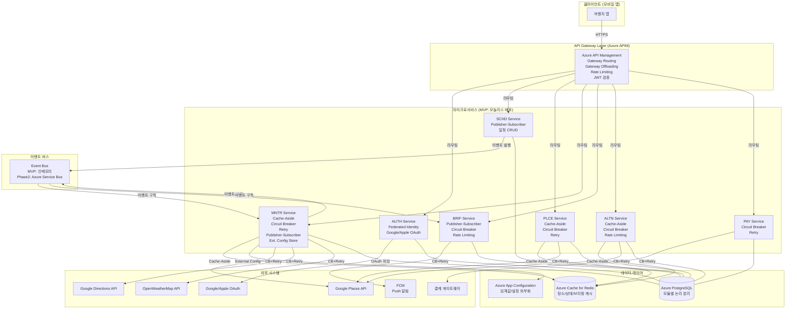
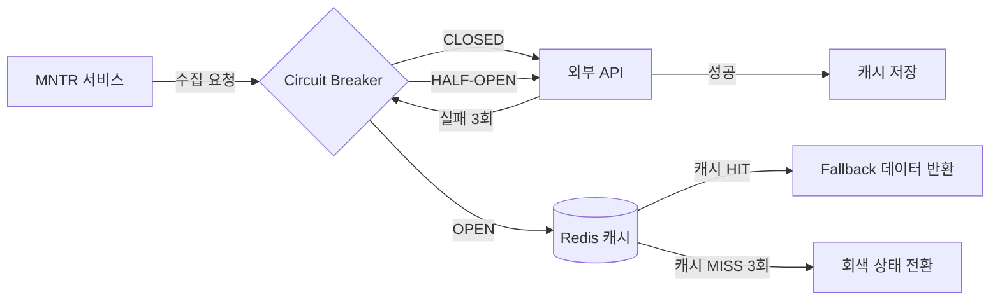
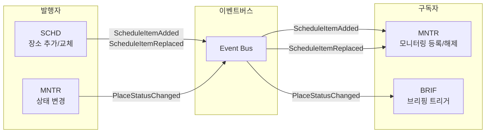

# 아키텍처 패턴 정의서

> 작성자: 아키 (소프트웨어 아키텍트)
> 작성일: 2026-02-23
> 프로젝트: travel-planner — 여행 중 실시간 일정 최적화 가이드 앱
> 프로파일: MVP/스타트업
> Cloud: Azure

---

## 1. 요구사항 분석 결과

### 1.1 기능적 요구사항

유저스토리(UFR)와 이벤트 스토밍 결과에서 도출한 서비스별 핵심 기능 요구사항이다.

| 서비스 | 핵심 기능 요구사항 |
|--------|------------------|
| **AUTH** | Google/Apple OAuth 소셜 로그인, JWT Access Token(30분) + Refresh Token 발급, API Gateway 레벨 토큰 검증, 구독 티어 정보 토큰 클레임 포함 |
| **SCHD** | 여행 일정 CRUD, 장소 추가/교체, 방문 시간 현지 시간(IANA) 저장, 후속 이동시간 자동 재계산, 모니터링 등록/해제 이벤트 발행 |
| **PLCE** | 키워드 기반 장소 검색, 반경 기반 주변 장소 검색, Google Places API 연동, 장소 데이터 캐싱 |
| **MNTR** | 방문 2시간 전부터 15분 주기 데이터 수집(병렬 3개 외부 API), 초록/노랑/빨강/회색 4단계 상태 판정, 부분 실패 시 캐시 Fallback, 상태 변경 감지 및 이벤트 발행 |
| **BRIF** | 출발 15~30분 전 브리핑 자동 생성, 안심/주의 브리핑 분기, Push 알림(FCM) 발송, 브리핑 멱등성 보장, 구독 티어 분기(Free: 1일 1회) |
| **ALTN** | 맥락 기반 대안 장소 검색(동일 카테고리, 반경 1~3km, 영업 중), 대안 카드 3장 생성(거리>평점>혼잡도), 일정 교체 중개, Free 티어 Paywall |
| **PAY** | 구독 결제(Trip Pass, Pro), 결제 상태 관리, 환불 처리 |

### 1.2 비기능적 요구사항

| 요구사항 유형 | 세부 내용 |
|-------------|---------|
| **성능** | 일정표 조회 응답 < 2초, 외부 API 수집 타임아웃 2초, 대안 카드 응답 < 3초 |
| **가용성** | 브리핑 Push 알림 SLA 99.5%+, 상태 수집 파이프라인 15분 주기 보장 |
| **확장성** | MVP 모놀리스 → 모니터링 서비스 우선 분리, 동시 모니터링 장소 1,000개+ 대응 |
| **보안** | JWT 기반 인증/인가, 구독 티어 접근 제어, GDPR/위치정보법 동의 이력 저장 |
| **유지보수** | 상태 판정 임계값 설정 파일 외부화(재배포 없이 변경), 분석 이벤트 4종 수집 |
| **접근성** | 색상 + 아이콘 조합 배지(WCAG 2.1 색약 지원) |

### 1.3 기술적 도전과제 식별

이벤트 스토밍 및 핵심 솔루션에서 도출한 6대 기술적 도전과제다.

| # | 도전과제 | 설명 | 관련 서비스 |
|:-:|---------|------|:----------:|
| C1 | **외부 API 의존성 및 장애 격리** | Google Places, OpenWeatherMap, Google Directions, FCM 등 4개 외부 API 동시 의존. 부분 실패 시 캐시 Fallback 필요. 3회 연속 실패 시 회색 전환 | MNTR, PLCE |
| C2 | **주기적 대량 데이터 수집** | 15분 주기, 병렬 3개 API 호출, 수집 타임아웃 2초 이내. 장소 수 증가에 따른 스케일링 필요 | MNTR |
| C3 | **비동기 이벤트 기반 서비스 연동** | 일정 등록/변경 → 모니터링 대상 등록, 상태 변경 → 브리핑 트리거, 대안 선택 → 모니터링 교체. MVP는 인메모리 이벤트 버스, 이후 메시지 브로커로 전환 | SCHD, MNTR, BRIF, ALTN |
| C4 | **AI/LLM 호출 안정성** | 브리핑 생성 및 대안 추천 이유 생성 시 LLM API 호출. 높은 지연시간, 간헐적 실패, 비용 제어 필요. MVP는 규칙 기반, Phase 2+에서 LLM 연동 | BRIF, ALTN |
| C5 | **읽기/쓰기 비율 불균형** | 일정표 조회(배지 포함)가 쓰기 대비 압도적으로 높음. 배지 상태 조회는 매 앱 오픈 시 발생 | MNTR, SCHD |
| C6 | **분산 트랜잭션 (일정 교체)** | 대안 선택 시 일정 교체 + 모니터링 대상 변경 + 이동시간 재계산이 복합 처리. 일부 실패 시 롤백 또는 보상 필요 | ALTN, SCHD, MNTR |

---

## 2. 패턴 후보 스크리닝

### 2.1 카테고리-도전과제 매핑

6개 도전과제를 8개 카테고리에 매핑하여 관련 패턴 후보를 선별한다.

| 도전과제 | 관련 카테고리 | 후보 패턴 |
|---------|------------|---------|
| C1 외부 API 장애 격리 | 안정성 | Circuit Breaker, Retry, Bulkhead |
| C1 캐시 Fallback | 읽기 최적화 | Cache-Aside |
| C2 주기적 대량 수집 | 효율적 분산처리 | Queue-Based Load Leveling, Competing Consumers, Asynchronous Request-Reply |
| C3 비동기 서비스 연동 | 효율적 분산처리 | Publisher-Subscriber, Choreography, Saga |
| C4 AI/LLM 호출 안정성 | 안정성 / 읽기 최적화 | Circuit Breaker, Rate Limiting, Cache-Aside |
| C5 읽기/쓰기 불균형 | 읽기 최적화 / DB 성능 | Cache-Aside, CQRS, Materialized View |
| C6 분산 트랜잭션 | 효율적 분산처리 | Saga, Compensating Transaction |
| 공통 인증/인가 진입점 | 핵심업무 집중 / 보안 | Gateway Offloading, Gateway Routing, Federated Identity |
| 설정 외부화 | 운영 | External Configuration Store |
| 서비스 상태 모니터링 | 운영 | Health Endpoint Monitoring |

### 2.2 스크리닝 결과

**제외된 카테고리 및 근거**:

| 카테고리 | 제외 근거 |
|---------|---------|
| 안정적 현대화 (Strangler Fig, Anti-Corruption Layer) | 레거시 시스템 없음. 신규 개발 프로젝트 |
| DB 성능개선 (Sharding) | MVP 규모에서 단일 DB로 충분. 수평 분할 불필요 |
| 운영 - Geodes | MVP 단계에서 글로벌 다중 리전 불필요 |
| 운영 - Deployment Stamps | 멀티 테넌트 구조 없음 |
| 운영 - Edge Workload Configuration | 엣지 컴퓨팅 시나리오 없음 |
| 효율적 분산처리 - Leader Election, Sequential Convoy | MVP 규모에서 분산 조정 불필요 |
| 효율적 분산처리 - Priority Queue | 브리핑/수집 우선순위 분기 없음 (균일 처리) |
| 효율적 분산처리 - Claim Check | 메시지 페이로드 크기 이슈 없음 (경량 이벤트) |
| 보안 - Valet Key | 클라이언트 직접 스토리지 접근 시나리오 없음 |
| 운영 - Compute Resource Consolidation | MVP는 모놀리스로 이미 통합 운영 |

- **후보 패턴 수**: 42개 → **13개**
- **선정 평가 대상**: Gateway Routing, Gateway Offloading, Federated Identity, Cache-Aside, CQRS, Publisher-Subscriber, Choreography, Saga, Compensating Transaction, Asynchronous Request-Reply, Circuit Breaker, Retry, Rate Limiting, External Configuration Store, Health Endpoint Monitoring

---

## 3. 패턴 선정 매트릭스 (평가표)

### 3.1 적용 가중치: MVP/스타트업 프로파일

| 기준 | 가중치 | 적용 근거 |
|------|:------:|---------|
| 기능 적합성 | **35%** | 핵심 기능(브리핑, 배지, 대안 카드) 구현 속도 최우선 |
| 성능 효과 | **10%** | MVP 초기 트래픽 규모에서 성능 최적화보다 기능 완성이 우선 |
| 운영 용이성 | **25%** | 8인 팀, 5~8주 MVP 일정. 운영 오버헤드 최소화 필수 |
| 확장성 | **5%** | MVP 이후 확장은 로드맵에 반영. 지금은 불필요한 선행 설계 지양 |
| 보안 적합성 | **10%** | 사용자 개인정보(위치, 결제) 처리로 기본 보안 요구사항 필수 |
| 비용 효율성 | **15%** | 스타트업 예산 제약. 외부 API 비용, Azure 인프라 비용 최소화 |

### 3.2 정량적 평가 매트릭스

채점 rubric (1~10점): 탁월(9~10), 우수(7~8), 보통(5~6), 미흡(3~4), 부적합(1~2)

| 패턴 | 기능 적합성 (35%) | 성능 효과 (10%) | 운영 용이성 (25%) | 확장성 (5%) | 보안 적합성 (10%) | 비용 효율성 (15%) | **총점** |
|------|:---:|:---:|:---:|:---:|:---:|:---:|:---:|
| Gateway Routing | 9×0.35=3.15 | 7×0.10=0.70 | 9×0.25=2.25 | 9×0.05=0.45 | 8×0.10=0.80 | 8×0.15=1.20 | **8.55** |
| Gateway Offloading | 8×0.35=2.80 | 6×0.10=0.60 | 9×0.25=2.25 | 8×0.05=0.40 | 9×0.10=0.90 | 8×0.15=1.20 | **8.15** |
| Federated Identity | 9×0.35=3.15 | 5×0.10=0.50 | 9×0.25=2.25 | 7×0.05=0.35 | 10×0.10=1.00 | 9×0.15=1.35 | **8.60** |
| Cache-Aside | 9×0.35=3.15 | 9×0.10=0.90 | 8×0.25=2.00 | 7×0.05=0.35 | 6×0.10=0.60 | 9×0.15=1.35 | **8.35** |
| CQRS | 6×0.35=2.10 | 8×0.10=0.80 | 4×0.25=1.00 | 8×0.05=0.40 | 6×0.10=0.60 | 5×0.15=0.75 | **5.65** |
| Publisher-Subscriber | 9×0.35=3.15 | 7×0.10=0.70 | 7×0.25=1.75 | 9×0.05=0.45 | 6×0.10=0.60 | 7×0.15=1.05 | **7.70** |
| Choreography | 7×0.35=2.45 | 6×0.10=0.60 | 5×0.25=1.25 | 8×0.05=0.40 | 6×0.10=0.60 | 6×0.15=0.90 | **6.20** |
| Saga | 8×0.35=2.80 | 5×0.10=0.50 | 5×0.25=1.25 | 7×0.05=0.35 | 6×0.10=0.60 | 5×0.15=0.75 | **6.25** |
| Compensating Transaction | 7×0.35=2.45 | 4×0.10=0.40 | 5×0.25=1.25 | 6×0.05=0.30 | 5×0.10=0.50 | 5×0.15=0.75 | **5.65** |
| Asynchronous Request-Reply | 7×0.35=2.45 | 8×0.10=0.80 | 6×0.25=1.50 | 7×0.05=0.35 | 5×0.10=0.50 | 6×0.15=0.90 | **6.50** |
| Circuit Breaker | 9×0.35=3.15 | 7×0.10=0.70 | 8×0.25=2.00 | 7×0.05=0.35 | 7×0.10=0.70 | 8×0.15=1.20 | **8.10** |
| Retry | 8×0.35=2.80 | 6×0.10=0.60 | 9×0.25=2.25 | 6×0.05=0.30 | 6×0.10=0.60 | 9×0.15=1.35 | **7.90** |
| Rate Limiting | 7×0.35=2.45 | 6×0.10=0.60 | 8×0.25=2.00 | 7×0.05=0.35 | 8×0.10=0.80 | 9×0.15=1.35 | **7.55** |
| External Configuration Store | 7×0.35=2.45 | 4×0.10=0.40 | 9×0.25=2.25 | 7×0.05=0.35 | 6×0.10=0.60 | 8×0.15=1.20 | **7.25** |
| Health Endpoint Monitoring | 6×0.35=2.10 | 4×0.10=0.40 | 9×0.25=2.25 | 6×0.05=0.30 | 5×0.10=0.50 | 8×0.15=1.20 | **6.75** |

### 3.3 채점 근거 요약

**Gateway Routing (8.55점)**: 단일 진입점으로 7개 마이크로서비스 라우팅 통합. Azure API Management 표준 도구로 즉시 운영 가능. 기능 적합성 만점에 가까운 9점.

**Federated Identity (8.60점)**: Google/Apple OAuth 위임 인증은 이 패턴의 교과서적 적용. 사용자 관리 비용 제거, 보안 10점. 소셜 로그인 구현 비용 대비 효과 최고.

**Cache-Aside (8.35점)**: 장소 데이터 캐싱(PLCE), 외부 API 실패 시 Fallback(MNTR), LLM 응답 캐싱(BRIF/ALTN Phase 2). 3개 서비스에 직접 적용. 성능 효과 9점.

**Gateway Offloading (8.15점)**: JWT 검증, 구독 티어 확인, 로깅, Rate Limiting을 게이트웨이로 집중. 각 서비스가 핵심 비즈니스 로직에 집중 가능.

**Circuit Breaker (8.10점)**: 4개 외부 API(Google Places, OpenWeatherMap, Google Directions, FCM) 의존. 외부 장애 시 전체 시스템 다운 방지. C1 도전과제 직접 해결.

**Retry (7.90점)**: Circuit Breaker와 조합. 일시적 외부 API 오류 자동 재시도(지수 백오프). 구현 난이도 최저, 운영 용이성 9점.

**Publisher-Subscriber (7.70점)**: C3 비동기 이벤트 연동의 핵심. MVP 인메모리 이벤트 버스 → Phase 2 Azure Service Bus 전환 경로 확보.

**Rate Limiting (7.55점)**: LLM API 비용 제어(C4), 외부 API 쿼터 보호(C1), 무료 티어 브리핑 1일 1회 제한(P19). 게이트웨이와 서비스 레이어 양쪽 적용.

**External Configuration Store (7.25점)**: 상태 판정 임계값(UFR-MNTR-020 U5), 수집 주기, 타임아웃 등을 Azure App Configuration으로 외부화. 재배포 없이 운영 중 조정 가능.

**Health Endpoint Monitoring (6.75점)**: /health 엔드포인트 표준화. Azure Monitor 연동으로 서비스 가용성 추적.

**탈락 패턴**:
- **CQRS (5.65점)**: 운영 용이성 4점(미흡). MVP 8인 팀에서 읽기/쓰기 모델 분리 운영 오버헤드 과도. Phase 2에서 MNTR 서비스 분리 시 재검토.
- **Compensating Transaction (5.65점)**: Saga에 보상 트랜잭션이 포함되므로 별도 패턴으로 관리할 실익 없음.
- **Choreography (6.20점)**: Publisher-Subscriber로 이벤트 발행/구독을 처리하면 충분. 순수 Choreography 패턴은 서비스 간 흐름 추적이 어려워 MVP 디버깅 비용 증가.
- **Saga (6.25점)**: C6 분산 트랜잭션(일정 교체)에 필요하나, MVP v0 모놀리스에서는 단일 DB 트랜잭션으로 처리 가능. v1 서비스 분리 시 Saga 도입.
- **Asynchronous Request-Reply (6.50점)**: 브리핑 생성 등 장시간 작업에 적합하나 Publisher-Subscriber로 대체 가능. MVP에서 중복 패턴.

### 3.4 최종 선정 패턴 (8개)

| 순위 | 패턴 | 총점 | 적용 범위 |
|:----:|------|:----:|---------|
| 1 | **Federated Identity** | 8.60 | AUTH 전체 |
| 2 | **Gateway Routing** | 8.55 | API Gateway → 전체 서비스 |
| 3 | **Cache-Aside** | 8.35 | PLCE, MNTR, BRIF(Phase 2) |
| 4 | **Gateway Offloading** | 8.15 | API Gateway 횡단관심사 처리 |
| 5 | **Circuit Breaker** | 8.10 | MNTR, PLCE, BRIF 외부 API 호출 |
| 6 | **Retry** | 7.90 | 외부 API 호출 전체 |
| 7 | **Publisher-Subscriber** | 7.70 | SCHD→MNTR, MNTR→BRIF 이벤트 연동 |
| 8 | **Rate Limiting** | 7.55 | API Gateway + 서비스 레이어 |
| 9 | **External Configuration Store** | 7.25 | MNTR 임계값, 전체 서비스 설정 |
| 10 | **Health Endpoint Monitoring** | 6.75 | 전체 서비스 |

---

## 4. 패턴 조합 검증

### 4.1 시너지 분석

| 조합 | 시너지 효과 | 적용 포인트 |
|------|-----------|-----------|
| **Gateway Routing + Gateway Offloading** | 단일 진입점에서 라우팅과 횡단관심사를 동시 처리. Azure APIM 하나로 구현 | API Gateway 레이어 |
| **Gateway Offloading + Federated Identity** | OAuth 토큰 발급은 AUTH, 이후 검증은 Gateway Offloading이 담당. 각 서비스 인증 코드 제거 | AUTH + Gateway |
| **Circuit Breaker + Retry** | Retry가 일시적 오류를 재시도하고, Circuit Breaker가 반복 실패 시 차단. 두 패턴이 상호 보완하여 외부 API 의존성 완전 커버 | MNTR 외부 API 호출 |
| **Circuit Breaker + Cache-Aside** | 외부 API 장애 시 Circuit Breaker가 차단하고, Cache-Aside가 캐시된 마지막 성공값을 반환. P3, P20 정책 직접 구현 | MNTR 데이터 수집 |
| **Publisher-Subscriber + External Configuration Store** | 상태 판정 임계값 변경 시 설정 스토어에서 동적 로드, 브리핑 트리거 조건도 설정으로 관리 | MNTR 상태 판정 |
| **Rate Limiting + Circuit Breaker** | Rate Limiting이 호출 수 상한을 제어하고, Circuit Breaker가 연속 실패를 차단. LLM API 비용 폭발 방지 | BRIF/ALTN LLM 호출(Phase 2) |
| **Gateway Routing + Rate Limiting** | API Gateway에서 구독 티어별 Rate Limit 적용. Free 1일 1회 브리핑(P19) 게이트웨이 레벨에서 선제 차단 | API Gateway |

### 4.2 충돌 분석

| 잠재 충돌 | 충돌 원인 | 대응 방안 |
|---------|---------|---------|
| **Publisher-Subscriber + 강한 일관성 요구** | 비동기 이벤트 발행은 최종 일관성만 보장. 일정 교체(C6)의 즉각적 일관성과 충돌 가능 | 일정 교체는 동기 API 호출로 처리. 모니터링 대상 변경만 비동기 이벤트로 발행. SCHD-ALTN 간 직접 동기 통신 유지 |
| **Cache-Aside + 실시간 배지 요구** | 캐시 TTL 동안 배지 상태가 지연될 수 있음. 15분 수집 주기와 캐시 TTL 설정 충돌 | 배지 상태 캐시 TTL을 수집 주기(15분)보다 짧게 설정(10분). 상태 변경 이벤트 수신 시 캐시 즉시 무효화(Cache Invalidation) |
| **Retry + 멱등성 없는 API** | 재시도 시 중복 브리핑 생성 가능(P21 멱등성 정책 위반) | 브리핑 생성 API에 멱등성 키(장소 ID + 출발 시간 해시) 적용. Retry 전 멱등성 키 체크 |
| **Rate Limiting + 스케줄러 일괄 수집** | 모니터링 서비스의 15분 주기 일괄 수집이 Rate Limiting에 걸릴 수 있음 | 스케줄러 내부 호출은 Rate Limiting 예외 처리(내부 서비스 토큰 사용). 외부 API Rate Limit는 서비스 레이어에서 별도 관리 |

### 4.3 검증 결론

선정된 8개 패턴 조합은 충돌 없이 상호 보완적으로 작동한다. 식별된 4개 잠재 충돌은 모두 대응 방안이 확보되었으며 구현 가능 수준이다. 특히 Circuit Breaker + Retry + Cache-Aside 3중 조합이 C1(외부 API 장애 격리)을 완전히 커버한다.

---

## 5. 트레이드오프 분석

| 패턴 | 얻는 것 (Gains) | 잃는 것 (Costs) | 수용 근거 |
|------|----------------|----------------|---------|
| **Federated Identity** | 사용자 관리 완전 위임, 보안 취약점 감소, SSO 즉시 제공 | OAuth 제공자 의존성(Google/Apple 정책 변경 리스크) | MVP에서 자체 인증 시스템 구현보다 압도적 비용 절감. 소셜 로그인 없으면 타겟 사용자(25~34세) 이탈 |
| **Gateway Routing + Offloading** | 횡단관심사 중앙화, 각 서비스 단순화, 진입점 단일화 | API Gateway가 단일 장애점(SPOF), Gateway 도입 비용 | Azure APIM 관리형 서비스로 SPOF 리스크 완화. 7개 서비스 각각 인증/로깅 구현 비용이 더 큼 |
| **Cache-Aside** | 외부 API 호출 횟수 감소, 장애 시 Fallback, 응답 속도 개선 | 캐시 일관성 관리 복잡도, 캐시 스토어(Redis) 추가 비용 | MNTR P3 정책(3회 실패 시 캐시 사용)이 설계상 캐시를 요구. 선택이 아닌 필수 |
| **Circuit Breaker** | 외부 API 장애 격리, Fail-fast으로 응답시간 유지, 시스템 안정성 | Open/Half-open 상태 관리 복잡도, 임계값 튜닝 필요 | 4개 외부 API 동시 의존 구조에서 Circuit Breaker 없이는 외부 장애가 전체 시스템 다운 유발. 수용 불가 리스크 |
| **Retry** | 일시적 오류 자동 복구, 사용자 경험 개선 | 재시도로 인한 지연시간 증가, 목적지 서버 부하 가중 | 지수 백오프(1s, 2s, 4s) + 최대 3회로 제한. 타임아웃 2초 내 완료 불가 시 캐시 Fallback으로 전환 |
| **Publisher-Subscriber** | 서비스 간 결합도 감소, 이벤트 기반 확장성, 비동기 처리 | 최종 일관성, 디버깅 복잡도 증가, 이벤트 순서 보장 어려움 | MVP 인메모리 이벤트 버스로 시작하여 복잡도 최소화. 이벤트 인터페이스 추상화로 Phase 2에서 Azure Service Bus 교체 용이 |
| **Rate Limiting** | LLM API 비용 제어, 외부 API 쿼터 보호, 티어별 접근 제어 | 정상 트래픽도 제한될 수 있음, 임계값 관리 필요 | External Configuration Store와 조합으로 임계값 동적 관리. 구독 티어 분기(P19)는 제품 요구사항으로 필수 |
| **External Configuration Store** | 재배포 없이 임계값 변경, 환경별 설정 분리, 운영 유연성 | 설정 스토어 의존성 추가, 설정 변경 감사 체계 필요 | UFR-MNTR-020에서 임계값 운영 중 조정을 명시적으로 요구. Azure App Configuration은 관리형 서비스로 운영 부담 최소 |

---

## 6. 서비스별 패턴 적용 매핑

| 서비스 | 적용 패턴 | 적용 이유 | 관련 유저스토리 |
|--------|---------|---------|--------------|
| **AUTH** | Federated Identity | Google/Apple OAuth 위임 인증, JWT 발급 | UFR-AUTH-010 |
| **API Gateway** | Gateway Routing, Gateway Offloading, Rate Limiting | 단일 진입점, JWT 검증 중앙화, 구독 티어별 제한 | UFR-AUTH-010, P19 |
| **SCHD** | Publisher-Subscriber (발행) | 장소 추가/교체 시 모니터링 등록/해제 이벤트 발행 | UFR-SCHD-030, UFR-SCHD-040 |
| **PLCE** | Cache-Aside, Circuit Breaker, Retry | Google Places API 결과 캐싱, API 장애 격리, 재시도 | UFR-PLCE-010, UFR-PLCE-020, UFR-PLCE-030 |
| **MNTR** | Cache-Aside, Circuit Breaker, Retry, Publisher-Subscriber (발행/구독), External Configuration Store | 수집 데이터 캐싱/Fallback, 외부 API 장애 격리, 상태 변경 이벤트 발행, 임계값 외부화 | UFR-MNTR-010, UFR-MNTR-020, P2, P3, P20 |
| **BRIF** | Publisher-Subscriber (구독), Circuit Breaker, Rate Limiting | 상태 변경 이벤트 수신, FCM 장애 격리, LLM 호출 제어(Phase 2) | UFR-BRIF-010, UFR-BRIF-020, P7, P8, P19, P21 |
| **ALTN** | Cache-Aside, Circuit Breaker, Rate Limiting | 대안 카드 캐싱, 외부 API 장애 격리, LLM 호출 비용 제어(Phase 2) | UFR-ALTN-010, UFR-ALTN-020, P10, P11, P22 |
| **PAY** | Circuit Breaker, Retry | 결제 게이트웨이 장애 격리, 일시적 실패 재시도 | UFR-PAY-010 |
| **전체** | Health Endpoint Monitoring | /health 엔드포인트, Azure Monitor 연동 | 운영 공통 |

---

## 7. 서비스별 패턴 적용 설계 (Mermaid)

### 7.1 전체 아키텍처 구조

### 7.2 Circuit Breaker + Cache-Aside Fallback 흐름 (MNTR)

### 7.3 Publisher-Subscriber 이벤트 흐름

---

## 8. Phase별 구현 로드맵

### Phase 1: MVP (Sprint 1~3, 5~8주)

**목표**: 핵심 솔루션 S04+S05+S06 빠른 출시. 단순하고 안정적인 패턴 우선.

| Sprint | 구현 패턴 | 적용 서비스 | 주요 산출물 |
|:------:|---------|:----------:|-----------|
| **Sprint 1** | Gateway Routing, Federated Identity, Health Endpoint Monitoring | API Gateway, AUTH | JWT 인증, 서비스 라우팅, /health 엔드포인트 |
| **Sprint 1** | Cache-Aside (장소), Retry | PLCE | Google Places 캐싱, API 재시도 |
| **Sprint 2** | Publisher-Subscriber (인메모리), External Configuration Store | SCHD, MNTR | 이벤트 버스, 임계값 설정 외부화 |
| **Sprint 2** | Circuit Breaker, Cache-Aside (수집), Retry | MNTR | 외부 API 장애 격리, 수집 Fallback |
| **Sprint 3** | Gateway Offloading (JWT 검증), Rate Limiting (구독 티어) | API Gateway | 구독 티어 분기, Free 1일 1회 제한 |
| **Sprint 3** | Circuit Breaker (FCM), Cache-Aside (대안) | BRIF, ALTN | 브리핑 Push 알림, 대안 카드 캐싱 |

**Phase 1 배포 구조**: 모놀리스 단일 배포 (Azure App Service). 서비스 간 인메모리 이벤트 버스.

**Phase 1 미적용 패턴 (의도적 제외)**:
- CQRS: 운영 복잡도 과도. 읽기 트래픽 임계점(초당 100 RPS) 미달 예상
- Saga: v0 모놀리스에서 단일 DB 트랜잭션으로 분산 트랜잭션 대체
- Choreography: Publisher-Subscriber로 충분. 추가 추상화 불필요

### Phase 2: 확장 (v1, MVP 이후 3~4개월)

**목표**: 사용자 증가에 따른 모니터링 서비스 분리, 이벤트 버스 고도화.

| 도입 패턴 | 적용 서비스 | 전환 조건 | 기대 효과 |
|---------|:----------:|---------|---------|
| **Publisher-Subscriber** (Azure Service Bus) | MNTR → BRIF | 동시 모니터링 장소 1,000개 초과 또는 인메모리 이벤트 버스 안정성 이슈 | 서비스 분리 후에도 비동기 이벤트 연동 유지 |
| **CQRS** (읽기 모델 분리) | MNTR | 배지 조회 응답 2초 초과 지속 또는 읽기 트래픽 100 RPS 초과 | 배지 조회 전용 읽기 DB 분리로 쓰기 부하 격리 |
| **Cache-Aside** (LLM 응답) | BRIF, ALTN | LLM 연동 시 | AI 응답 캐싱으로 API 비용 절감, 응답 속도 개선 |
| **Rate Limiting** (LLM 호출) | BRIF, ALTN | LLM 연동 시 | LLM API 비용 폭발 방지, 토큰 사용량 제어 |
| **Saga** (일정 교체) | ALTN, SCHD | 마이크로서비스 분리 완료 시 | 서비스 분리 후 분산 트랜잭션 데이터 일관성 보장 |

**Phase 2 배포 구조**: MNTR 서비스 독립 분리 (Azure Container Apps). 나머지는 모놀리스 유지.

### Phase 3: 고도화 (v2+, Phase 2 이후 6개월+)

**목표**: AI 자동 일정 재조정(S03), 글로벌 확장 대비, 완전한 마이크로서비스 전환.

| 도입 패턴 | 적용 서비스 | 전환 조건 | 기대 효과 |
|---------|:----------:|---------|---------|
| **Choreography** | 전체 서비스 | 완전 마이크로서비스 전환 시 | 서비스 자율성 극대화, 중앙 오케스트레이터 제거 |
| **Saga** (AI 재조정) | AI 재조정 서비스 | S03 AI 자동 재조정 구현 시 | AI 재조정과 일정/모니터링 서비스 간 분산 트랜잭션 |
| **Materialized View** | MNTR, SCHD | 복잡한 집계 쿼리 성능 이슈 시 | 일정표+배지 통합 뷰 사전 계산으로 조회 성능 극대화 |
| **Backends for Frontends** | API Gateway | 웹 클라이언트 추가 시 | 모바일/웹 전용 API 분리 |

---

## 9. 기대 효과 및 검증 계획

| 지표 | Phase 1 목표 | Phase 2 목표 | 검증 방법 |
|------|:----------:|:----------:|---------|
| 배지 포함 일정표 조회 응답시간 | < 2초 (P95) | < 1초 (P95) | Azure Monitor 응답시간 추적, k6 부하 테스트 |
| 외부 API 실패 시 Fallback 성공률 | > 95% | > 99% | Circuit Breaker 상태 메트릭, 에러율 모니터링 |
| 브리핑 Push 알림 발송 성공률 | > 99% | > 99.5% | FCM 전송 성공률 로깅, 알림 도달률 추적 |
| 동시 모니터링 장소 처리량 | 200개/수집주기 | 1,000개/수집주기 | 스케줄러 실행 시간 모니터링, 타임아웃 발생률 |
| 외부 API 호출 횟수 감소 (Cache-Aside) | - 30% 절감 목표 | - 50% 절감 목표 | Redis 캐시 HIT율 측정 (목표 HIT율 70%+) |
| LLM API 월 비용 (Phase 2+) | - | 예산 이내 | Rate Limiting 차단 횟수, 토큰 사용량 대시보드 |
| 서비스 가용성 | > 99% | > 99.5% | Health Endpoint Monitoring, Azure SLA 추적 |

---

## 10. 설계 결정 총평

아키 관점에서 이번 패턴 선정의 핵심 철학은 **"지금 꼭 필요한 것만, 나중에 바꿀 수 있게"**다.

MVP/스타트업 프로파일에서 운영 용이성(25%)을 두 번째로 높은 가중치로 설정한 이유가 있다. 8인 팀이 5~8주 안에 S04+S05+S06을 출시하려면, 패턴이 팀의 속도를 늦추면 안 된다. CQRS와 Saga를 의도적으로 제외한 것이 이 판단의 핵심이다. 두 패턴 모두 미래에 필요하지만 지금은 아니다.

반면 Circuit Breaker + Retry + Cache-Aside 3중 조합은 선택이 아닌 필수다. 모니터링 서비스는 Google Places, OpenWeatherMap, Google Directions 3개 외부 API를 동시에 의존하며, 이 중 하나라도 장애가 발생하면 15분 주기 수집이 중단된다. 이 리스크를 감수하는 것은 MVP 출시 후 신뢰도 위기로 직결된다.

Publisher-Subscriber를 MVP부터 적용하는 이유는 Phase 2 모니터링 서비스 분리를 위한 선제 투자다. 인메모리 이벤트 버스로 시작하지만, 이벤트 인터페이스를 처음부터 추상화하면 Azure Service Bus 전환 시 서비스 코드 변경 없이 교체 가능하다. 이것이 "지금 꼭 필요한 것만, 나중에 바꿀 수 있게"의 실천이다.
