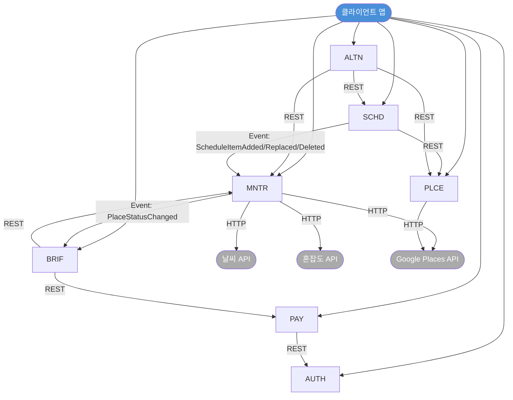

# 종합 개발 계획서

> 작성자: 홍길동/아키 (소프트웨어 아키텍트)
> 작성일: 2026-02-24
> 프로젝트: travel-planner — 여행 중 실시간 일정 최적화 가이드 앱

---

## 0. 개발 범위

- **선택된 개발 단계**: Phase 1 (MVP) — S04+S05+S06 핵심 기능 출시 (5~8주)
- **마일스톤**: 일정 등록, 배지 표시, 브리핑 Push, 대안 카드 3장
- **제외 범위**: Phase 2 (MNTR 독립 배포, Azure Service Bus 전환, LLM 연동), Phase 3 (Azure OpenAI, AI 자동 재조정, 글로벌 확장)

---

## 1. 마이크로서비스 목록

| # | 서비스 ID | 서비스명 | 핵심 책임 | 클라이언트 API | 내부 API |
|---|-----------|----------|-----------|---------------|---------|
| 1 | AUTH | 인증 서비스 | OAuth 소셜 로그인, JWT 발급/갱신/검증 | 4개 | 1개 |
| 2 | SCHD | 일정 서비스 | 여행 CRUD, 장소 추가/교체/삭제, 일정표 조회 | 5개 | — |
| 3 | PLCE | 장소 서비스 | 장소 검색, Google Places API 연동, 장소 상세 | 3개 | — |
| 4 | MNTR | 모니터링 서비스 | 15분 주기 외부 데이터 수집, 4단계 상태 판정, 배지 | 2개 | 1개 |
| 5 | BRIF | 브리핑 서비스 | 브리핑 생성, FCM Push 발송, 브리핑 목록/상세 조회 | 2개 | 1개 |
| 6 | ALTN | 대안 서비스 | 대안 장소 카드 3장 생성, 점수 계산, 대안 조회 | 2개 | — |
| 7 | PAY | 결제 서비스 | 구독 플랜 조회, IAP 영수증 검증, 구독 상태 관리 | 3개 | — |
| — | **합계** | | | **21개** | **3개** |

> **배포 전략**: Phase 1은 7개 서비스를 단일 NestJS 모놀리스로 배포. 서비스 경계는 모듈 단위로 유지하여 Phase 2 분리에 대비한다.

---

## 2. 서비스 간 의존관계

### 2-1. 동기 의존관계 (REST 내부 호출)

| 호출 서비스 | 피호출 서비스 | 목적 |
|------------|-------------|------|
| SCHD | PLCE | 장소 추가 시 장소 유효성 및 영업시간 조회 |
| ALTN | PLCE | 대안 장소 후보 검색 |
| ALTN | MNTR | 대안 장소 현재 상태 조회 |
| ALTN | SCHD | 기존 일정 컨텍스트 조회 (위치, 시간) |
| BRIF | MNTR | 상태 변화 이벤트 기반 브리핑 생성 시 상태 상세 조회 |
| BRIF | PAY | 브리핑 Push 전 구독 등급 확인 |
| PAY | AUTH | 사용자 인증 정보 검증 |

### 2-2. 비동기 의존관계 (InMemoryEventBus)

| 발행 서비스 | 이벤트 | 구독 서비스 | 처리 내용 |
|------------|--------|------------|---------|
| SCHD | `ScheduleItemAdded` | MNTR | 신규 장소 모니터링 등록 |
| SCHD | `ScheduleItemReplaced` | MNTR | 기존 장소 모니터링 해제 + 신규 등록 |
| SCHD | `ScheduleItemDeleted` | MNTR | 장소 모니터링 해제 |
| MNTR | `PlaceStatusChanged` | BRIF | 상태 변화 감지 시 브리핑 생성 트리거 |

### 2-3. 의존관계 다이어그램



---

## 3. 백킹서비스 요구사항

### 3-1. PostgreSQL (단일 인스턴스, 서비스별 논리 스키마)

| 서비스 | 주요 테이블 | 비고 |
|--------|-----------|------|
| AUTH | users, oauth_accounts, refresh_tokens | 소셜 로그인 계정 연결 |
| SCHD | trips, schedule_items | 여행/일정 CRUD |
| PLCE | places (캐시 테이블) | Google Places 응답 캐싱 |
| MNTR | monitoring_targets, status_history, place_statuses | append-only 이력 (ML 데이터 수집용) |
| BRIF | briefings, briefing_items | 브리핑 내용 저장 |
| ALTN | alternative_cards, alternative_selections | 대안 선택/미선택 이벤트 (ML 레이블 수집용) |
| PAY | subscriptions, iap_receipts, subscription_plans | 구독 상태 관리 |

> 총 테이블: 16개 / Phase 1은 단일 인스턴스. Phase 2에서 서비스별 DB 분리 검토.

### 3-2. Redis (논리 DB 분리)

| DB 번호 | 용도 | 담당 서비스 | 주요 키 패턴 |
|---------|------|-----------|------------|
| DB0 | JWT Refresh Token 블랙리스트 | AUTH | `blacklist:{jti}` |
| DB1 | Google Places 캐시 | PLCE | `place:{place_id}` |
| DB2 | 모니터링 상태 캐시 | MNTR | `status:{place_id}` |
| DB3 | 브리핑 중복 발송 방지 | BRIF | `brif_sent:{trip_id}:{date}` |
| DB4 | 대안 카드 캐시 | ALTN | `altn:{trip_id}:{item_id}` |
| DB5 | 구독 상태 캐시 | PAY | `sub:{user_id}` |
| DB6~7 | 예약 (Phase 1 미사용) | — | — |
| DB8 | 예약 (Phase 2+) | — | — |

### 3-3. 메시지 큐 (MQ)

| 구분 | Phase 1 | Phase 2 |
|------|---------|---------|
| 구현체 | InMemoryEventPublisher (NestJS 내부 이벤트버스) | Azure Service Bus |
| 특성 | 동일 프로세스 내 비동기, 재시도 없음 | 영속화, 재시도, Dead Letter Queue |
| 전환 조건 | 모놀리스 → 마이크로서비스 분리 시점 | MNTR 독립 배포 시 |

---

## 4. AI 서비스 범위

### 4-1. Phase 1 결정: SKIP

- **AI 서비스 배포 없음** — Python/FastAPI AI Pipeline 미포함
- **BRIF**: `RuleBasedBriefingGenerator` 구현체 사용 (규칙 기반 텍스트 생성)
- **ALTN**: `FixedScoreWeightsProvider` 구현체 사용 (고정 가중치: w1=0.5, w2=0.3, w3=0.2)

### 4-2. Phase 2 전환 준비 항목 (백엔드에 포함)

| 항목 | 위치 | 목적 |
|------|------|------|
| `BriefingTextGenerator` 인터페이스 정의 | BRIF 모듈 | LLMBriefingGenerator 교체 준비 |
| `BriefingTextGenerator` Mock 단위테스트 | BRIF 모듈 | 인터페이스 계약 검증 |
| `ScoreWeightsProvider` 인터페이스 정의 | ALTN 모듈 | MLScoreWeightsProvider 교체 준비 |
| `ScoreWeightsProvider` Mock 단위테스트 | ALTN 모듈 | 인터페이스 계약 검증 |
| `status_history` append-only 테이블 | MNTR DB | ML 학습 데이터 수집 |
| `confidence_score` 컬럼 NULL 초기화 | MNTR DB | Phase 2 ML 신뢰도 점수 수용 준비 |
| 대안 카드 선택/미선택 이벤트 기록 | ALTN DB | ML 레이블 수집 (alternative_selections) |

### 4-3. Phase 2+ 예정

- `LLMBriefingGenerator`: Azure OpenAI GPT-4o 연동 브리핑 자연어 생성
- `MLScoreWeightsProvider`: 사용자 선택 데이터 기반 동적 가중치 학습
- AI Pipeline (FastAPI): 별도 서비스로 분리 배포

### 4-4. Phase 3 예정

- 일정 최적화 AI (자동 재조정)
- 상태 판정 ML (규칙 기반 → 모델 기반)
- RAG 파이프라인 (장소 컨텍스트 벡터 검색)

---

## 5. 프론트엔드 범위

### 5-1. 기술 스택

| 구분 | 기술 | 버전 | 선택 이유 |
|------|------|------|----------|
| 프레임워크 | Flutter | 3.x | iOS/Android 단일 코드베이스, MVP 개발 속도 |
| 언어 | Dart | 3.x | Flutter 기본 언어, Null Safety |
| 상태관리 | Riverpod | 2.x | 컴파일 타임 안전성, 테스트 용이성 |
| 라우팅 | go_router | — | 선언적 라우팅, Deep Link 지원 |
| HTTP 클라이언트 | Dio | — | 인터셉터, 재시도, 취소 지원 |
| 보안 저장소 | flutter_secure_storage | — | JWT 토큰 안전 저장 |
| 소셜 로그인 | google_sign_in + sign_in_with_apple | — | iOS/Android 양 플랫폼 대응 |
| Push 알림 | firebase_messaging | — | FCM 기반 브리핑 Push 수신 |
| 인앱 결제 | in_app_purchase | — | App Store / Play Store IAP |

### 5-2. 페이지 목록

| 우선순위 | 페이지 ID | 페이지명 | 연관 기능 | 연동 API |
|---------|----------|---------|----------|---------|
| **P0 — 핵심 필수** | | | | |
| P0 | SplashPage | 스플래시 | 앱 초기화, 토큰 검증 | — |
| P0 | LoginPage | 소셜 로그인 | OAuth 로그인 | AUTH-01 |
| P0 | OnboardingPage | 온보딩 | 위치정보 동의 | AUTH-02 |
| P0 | TripListPage | 여행 목록 | 여행 목록 조회 | **SCHD-00 (누락 — 협의 필요)** |
| P0 | TripCreatePage | 여행 생성 | 여행 등록 | SCHD-01 |
| P0 | ScheduleDetailPage | 일정표 (배지 포함) | S05 배지 표시 | SCHD-03, MNTR-01 |
| **P1 — S05/S06 핵심** | | | | |
| P1 | StatusDetailSheet | 상태 상세 바텀시트 | 상태 배지 상세 | MNTR-01 |
| P1 | AlternativeCardPage | 대안 카드 3장 | S06 대안 선택 | ALTN-01 |
| P1 | ScheduleChangeResultPage | 일정 교체 결과 | 교체 완료 확인 | SCHD-05 |
| P1 | PlaceSearchPage | 장소 검색 | S04 장소 추가 | PLCE-01, PLCE-02 |
| P1 | PlaceTimePickerPage | 방문 일시 선택 | 장소 추가 시간 설정 | SCHD-04 |
| P1 | BriefingListPage | 브리핑 목록 | S05 브리핑 히스토리 | BRIF-01 |
| P1 | BriefingDetailPage | 브리핑 상세 | 브리핑 내용 확인 | BRIF-02 |
| **P2 — 결제** | | | | |
| P2 | PaywallPage | 페이월 | 구독 유도 | PAY-01 |
| P2 | PaymentCheckoutPage | 결제 진행 | IAP 결제 | PAY-02 |
| P2 | PaymentSuccessPage | 결제 완료 | 구독 확인 | PAY-03 |
| P2 | PermissionPage | 권한 설정 | 위치/알림 권한 | — |
| **P3 — 마이페이지** | | | | |
| P3 | ProfilePage | 프로필 | 사용자 정보 | AUTH-03 |
| P3 | SubscriptionPage | 구독 관리 | 구독 상태/취소 | PAY-01 |
| P3 | NotificationSettingsPage | 알림 설정 | FCM 토픽 관리 | AUTH-04 |
| P3 | LocationConsentPage | 위치 동의 | 동의 재설정 | AUTH-05 |
| **바텀시트** | | | | |
| — | StatusDetailSheet | 상태 상세 | 배지 상세 정보 | MNTR-01 |
| — | AlternativeFilterSheet | 대안 필터 | 대안 카드 필터링 | ALTN-01 |
| — | BusinessHoursWarningSheet | 영업시간 경고 | 강제 추가 확인 | SCHD-04 |
| — | BriefingActionSheet | 브리핑 액션 | 대안 탐색 진입 | ALTN-01 |

---

## 6. 개발 순서 (Phase별)

### Phase 1: 환경 구성 (Sprint 0 — 1주차)

| 구분 | 항목 | 담당 | 완료 기준 |
|------|------|------|---------|
| 공통 | Git 브랜치 전략 수립 (main/develop/feature/*) | 아키+파이프 | 브랜치 보호 규칙 설정 완료 |
| 공통 | CI/CD 파이프라인 구성 (GitHub Actions) | 파이프 | PR 머지 시 자동 빌드/테스트 통과 |
| 공통 | 개발/스테이징 환경 프로비저닝 | 파이프 | Docker Compose 로컬 실행 확인 |
| 백엔드 | NestJS 모놀리스 프로젝트 초기화 | 데브-백 | 헬스체크 엔드포인트 응답 확인 |
| 백엔드 | common 모듈 구현 (예외, 응답 래퍼, 로거, 이벤트버스) | 데브-백 | 단위테스트 80% 이상 |
| 백엔드 | PostgreSQL 마이그레이션 환경 구성 (TypeORM) | 데브-백 | 16개 테이블 생성 스크립트 확인 |
| 백엔드 | Redis 연결 및 DB 논리 분리 확인 | 데브-백 | DB0~7 연결 테스트 통과 |
| 프론트 | Flutter 프로젝트 초기화 (iOS/Android 타겟) | 데브-프론트 | 양 플랫폼 빌드 성공 |
| 프론트 | 폴더 구조 확립 (feature-first: auth/trip/place/monitor/brief/altn/pay) | 데브-프론트 | 구조 문서화 완료 |
| 프론트 | Dio + Riverpod + go_router 기본 설정 | 데브-프론트 | Mock API 호출 테스트 통과 |
| 프론트 | Firebase 프로젝트 연동 (FCM 설정) | 데브-프론트 | FCM 토큰 발급 확인 |
| 프론트 | Mock API 서버 연동 준비 (OpenAPI 기반 Mock) | 데브-프론트 | 전체 21개 API Mock 응답 확인 |

---

### Phase 2: API 계약 기반 병렬 개발 (Sprint 1~3 — 2~6주차)

#### 백엔드 개발 순서

**Sprint 1 (2~3주차): 기반 서비스**

| 병렬 트랙 | 서비스 | 구현 항목 | 완료 기준 |
|----------|--------|---------|---------|
| 트랙 B | AUTH | OAuth(Google/Apple), JWT 발급/갱신/검증, 내부 검증 API | 소셜 로그인 E2E 테스트 통과 |
| 트랙 C | PLCE | 장소 검색(Google Places), 장소 상세 조회, Redis 캐싱 | 장소 검색 응답 200ms 이내 |

**Sprint 2 (3~4주차): 핵심 도메인**

| 병렬 트랙 | 서비스 | 구현 항목 | 완료 기준 |
|----------|--------|---------|---------|
| 공통 | EventBus | InMemoryEventPublisher 구현 및 이벤트 스키마 정의 | 이벤트 발행/구독 단위테스트 통과 |
| 트랙 D | SCHD | 여행 CRUD, 장소 추가/교체/삭제, 일정표 조회, 이벤트 발행 | SCHD API 5개 통합테스트 통과 |
| 트랙 E | MNTR | 15분 스케줄러, 상태 판정(4단계), 배지 조회 API, 이벤트 구독 | 상태 판정 로직 단위테스트 통과 |

**Sprint 3 (4~6주차): 부가 서비스**

| 병렬 트랙 | 서비스 | 구현 항목 | 완료 기준 |
|----------|--------|---------|---------|
| 트랙 F | BRIF | RuleBasedBriefingGenerator, FCM Push, 브리핑 목록/상세 | 브리핑 Push E2E 테스트 통과 |
| 트랙 G | ALTN | FixedScoreWeightsProvider, 대안 카드 3장 생성, 점수 계산 | 대안 카드 응답 구조 검증 |
| 트랙 H | PAY | 구독 플랜 조회, IAP 영수증 검증, 구독 상태 관리 | IAP Mock 검증 테스트 통과 |

#### 프론트엔드 개발 순서

**Sprint 1 (2~3주차): 인증 + 일정표 골격**

| 페이지/컴포넌트 | 우선순위 | API 연동 | 완료 기준 |
|--------------|---------|---------|---------|
| SplashPage | P0 | — (Mock) | 토큰 유효성 분기 처리 |
| LoginPage | P0 | AUTH-01 (Mock) | Google/Apple 로그인 UI 완성 |
| OnboardingPage | P0 | AUTH-02 (Mock) | 위치정보 동의 플로우 완성 |
| TripListPage | P0 | SCHD-00 (Mock) | 여행 목록 카드 UI 완성 |
| TripCreatePage | P0 | SCHD-01 (Mock) | 여행 생성 폼 완성 |
| ScheduleDetailPage (배지 포함) | P0 | SCHD-03, MNTR-01 (Mock) | 배지 4단계 색상 UI 완성 |

**Sprint 2 (3~5주차): S04/S05/S06 핵심 기능**

| 페이지/컴포넌트 | 우선순위 | API 연동 | 완료 기준 |
|--------------|---------|---------|---------|
| StatusDetailSheet | P1 | MNTR-01 (Mock) | 상태 상세 바텀시트 완성 |
| PlaceSearchPage | P1 | PLCE-01, PLCE-02 (Mock) | 검색 결과 리스트 UI 완성 |
| PlaceTimePickerPage | P1 | SCHD-04 (Mock) | 날짜/시간 픽커 완성 |
| BriefingListPage | P1 | BRIF-01 (Mock) | 브리핑 목록 카드 UI 완성 |
| BriefingDetailPage | P1 | BRIF-02 (Mock) | 브리핑 상세 + 액션 버튼 완성 |
| AlternativeCardPage | P1 | ALTN-01 (Mock) | 대안 카드 3장 UI 완성 |
| ScheduleChangeResultPage | P1 | SCHD-05 (Mock) | 교체 결과 화면 완성 |
| FCM Push 수신 처리 | — | BRIF Push | 포그라운드/백그라운드 수신 처리 |

**Sprint 3 (5~7주차): 결제 + 마이페이지 + 품질**

| 페이지/컴포넌트 | 우선순위 | API 연동 | 완료 기준 |
|--------------|---------|---------|---------|
| PaywallPage | P2 | PAY-01 (Mock) | 구독 플랜 UI 완성 |
| PaymentCheckoutPage | P2 | PAY-02 (Mock) | IAP 결제 플로우 완성 |
| PaymentSuccessPage | P2 | PAY-03 (Mock) | 결제 완료 화면 완성 |
| PermissionPage | P2 | — | 권한 요청 UI 완성 |
| ProfilePage | P3 | AUTH-03 (Mock) | 프로필 정보 표시 완성 |
| SubscriptionPage | P3 | PAY-01 (Mock) | 구독 상태/취소 UI 완성 |
| NotificationSettingsPage | P3 | AUTH-04 (Mock) | 알림 설정 토글 완성 |
| LocationConsentPage | P3 | AUTH-05 (Mock) | 위치 동의 재설정 완성 |

---

### Phase 3: 통합 연동 (Sprint 2~3 — 5~7주차)

| 항목 | 작업 내용 | 담당 | 완료 기준 |
|------|---------|------|---------|
| 프론트 실제 API 전환 | Mock → 실제 백엔드 API 순차 전환 (인증→일정→모니터링→브리핑→대안→결제) | 데브-프론트 | 전체 23개 엔드포인트 실제 연동 완료 |
| API 계약 검증 | OpenAPI 스펙과 실제 응답 구조 일치 여부 확인 | 데브-백+데브-프론트 | Contract Test 전체 통과 |
| 이벤트 플로우 검증 | SCHD→MNTR→BRIF 이벤트 체인 E2E 테스트 | 데브-백 | E2E 시나리오 3건 통과 |
| FCM Push E2E | 상태 변화 → 브리핑 생성 → FCM 수신 전체 플로우 | 데브-백+데브-프론트 | 실기기 Push 수신 확인 |
| IAP 샌드박스 테스트 | Apple Sandbox / Google Test 결제 전체 플로우 | 데브-프론트 | 양 플랫폼 IAP 검증 통과 |

---

### Phase 4: 테스트 및 QA (Sprint 3 — 7~8주차)

#### 테스트 시나리오 (가디언 주도)

| 시나리오 ID | 시나리오명 | 검증 항목 | 유형 |
|------------|---------|---------|------|
| TC-01 | 신규 사용자 소셜 로그인 | Google/Apple 로그인, JWT 발급, 온보딩 플로우 | E2E |
| TC-02 | 여행 일정 생성 및 장소 추가 | 위치동의 → 여행 생성 → 장소 검색 → 영업시간 경고 → 강제 추가 | E2E |
| TC-03 | 배지 상태 표시 (S05) | 15분 주기 수집 → 4단계 상태 판정 → 배지 색상 변경 | 통합 |
| TC-04 | 브리핑 Push 수신 (S05) | 상태 변화 → 브리핑 생성 → FCM Push → 앱 수신 | E2E |
| TC-05 | 대안 카드 3장 조회 (S06) | 브리핑 → 대안 탐색 → 카드 3장 표시 → 점수 정렬 | 통합 |
| TC-06 | 대안 선택 후 일정 교체 (S04/S06) | 대안 카드 선택 → 일정 교체 → 모니터링 전환 → 결과 화면 | E2E |
| TC-07 | 구독 결제 (IAP) | 페이월 진입 → IAP 결제 → 영수증 검증 → 구독 활성화 | E2E |
| TC-08 | 인증 토큰 갱신 | Access Token 만료 → Refresh Token으로 자동 갱신 | 단위+통합 |
| TC-09 | 비정상 입력 검증 | 빈 여행명, 과거 날짜, 지원 외 도시, 잘못된 JWT | 경계값 |
| TC-10 | 오프라인 상태 처리 | 네트워크 끊김 시 에러 메시지 표시 및 재시도 | 예외 |

---

## 7. 미결 사항 및 협의 필요 항목

| # | 항목 | 발견자 | 영향 | 협의 대상 | 우선순위 |
|---|------|--------|------|---------|---------|
| 1 | **GET /trips 목록 조회 API 누락** | 데브-프론트 | TripListPage 구현 불가 — `schedule-service-api.yaml`의 `/trips` 경로에 `GET` 메서드가 정의되지 않음. POST(생성)만 존재 | 데브-백 | **긴급** |
| 2 | 여행 목록 응답 스키마 미정의 | 아키 | GET /trips 추가 시 페이지네이션 방식(커서/오프셋), 정렬 기준(생성일/여행 시작일) 결정 필요 | 도그냥+데브-백 | 높음 |
| 3 | 모니터링 15분 주기 외부 API 비용 | 아키 | 날씨/혼잡도 API 유료 한도 초과 시 처리 방안 (캐싱 정책, fallback 기준) 미결 | 마법사+데브-백 | 높음 |
| 4 | IAP 영수증 검증 서버 시크릿 관리 | 파이프 | Apple shared_secret, Google service_account_json 키 관리 방안 (Azure Key Vault 또는 환경변수) | 파이프+데브-백 | 높음 |
| 5 | 대안 카드 거리 계산 기준 | 마법사 | 현재 위치 기반인지 일정 장소 기준인지 FixedScoreWeightsProvider의 w3(거리) 계산 입력값 미결 | 마법사+데브-백 | 중간 |

---

## 8. Phase 1 제외 항목

### 백엔드 제외

| 항목 | 제외 이유 | 예정 단계 |
|------|---------|---------|
| Azure Service Bus 전환 | InMemoryEventBus로 충분, 분리 배포 전 불필요 | Phase 2 |
| MNTR 서비스 독립 배포 | 모놀리스로 운영 후 부하 확인 후 분리 | Phase 2 |
| Redis Cluster | 단일 인스턴스로 MVP 운영 가능 | Phase 2 |
| LLM 연동 (Azure OpenAI) | 규칙 기반으로 MVP 검증 후 도입 | Phase 2 |

### 프론트엔드 제외

| 항목 | 제외 이유 | 예정 단계 |
|------|---------|---------|
| PlaceDetailSheet (지도 연동) | Google Maps SDK 연동 복잡도, MVP 범위 초과 | Phase 2 |
| AI 컨시어지 채팅 (LLM) | AI 서비스 미포함으로 연동 불가 | Phase 2 |
| S03 자동 재조정 | AI 의존 기능, Phase 1 제외 | Phase 2 |
| 다국어 지원 (i18n) | 초기 타겟 한국어 사용자, 확장 시 도입 | Phase 3 |
| 오프라인 캐시 (Hive/Isar) | 네트워크 의존 MVP 우선, 오프라인 지원은 이후 | Phase 3 |

### AI 제외

| 항목 | 제외 이유 | 예정 단계 |
|------|---------|---------|
| Python/FastAPI AI Pipeline | 규칙 기반 구현체로 대체, 배포 복잡도 제거 | Phase 2 |
| LLMBriefingGenerator | Azure OpenAI 의존, 비용 검증 필요 | Phase 2 |
| MLScoreWeightsProvider | 학습 데이터 수집 후 도입 | Phase 2 |
| 일정 최적화 AI | 도메인 복잡도 높음, 데이터 축적 후 도입 | Phase 3 |
| 상태 판정 ML | 규칙 기반 먼저 검증 | Phase 3 |
| RAG 파이프라인 | 벡터 DB 인프라 준비 후 도입 | Phase 3 |

---

## 9. 전체 일정 요약

```
Sprint 0  | W1       | 환경 구성, 프로젝트 초기화, CI/CD
Sprint 1  | W2~W3    | AUTH + PLCE (백엔드) / 인증 + 일정표 골격 (프론트)
Sprint 2  | W3~W5    | SCHD + MNTR + EventBus (백엔드) / S04/S05/S06 핵심 (프론트)
Sprint 3  | W4~W7    | BRIF + ALTN + PAY (백엔드) / 결제 + 마이페이지 (프론트)
통합/QA   | W6~W8    | 실제 API 전환, E2E 통합 테스트, QA 시나리오 10건
```

> **총 기간**: 5~8주 (MVP 기준 6주 목표)
> **병목 리스크**: GET /trips API 누락 협의 지연 시 프론트 Sprint 1 TripListPage 개발 차단 가능 — 즉시 처리 필요.
